# eKYC Challenges & Limitations

## Overview

Despite its transformative impact, eKYC is far from perfect. From sophisticated spoofing attacks to demographic bias in AI models, from regulatory fragmentation to digital exclusion — the challenges are real, significant, and often underestimated. Understanding these limitations is critical for building robust systems, setting realistic expectations, and identifying areas for innovation.

---

## Challenge Categories

```mermaid
graph TD
    A[eKYC Challenges] --> B[🤖 Technical]
    A --> C[🔒 Security & Fraud]
    A --> D[📜 Regulatory]
    A --> E[👥 Inclusivity & Bias]
    A --> F[⚡ Operational]
    A --> G[🌍 Global Scalability]

    B --> B1[AI accuracy limitations]
    B --> B2[Edge cases in capture]
    B --> B3[Cross-age matching]

    C --> C1[Deepfakes & injection attacks]
    C --> C2[Synthetic identity fraud]
    C --> C3[Document forgery evolution]

    D --> D1[Regulatory fragmentation]
    D --> D2[Data privacy conflicts]
    D --> D3[Cross-border complexity]

    E --> E1[Demographic bias]
    E --> E2[Digital divide]
    E --> E3[Accessibility]

    style A fill:#4051B5,color:#fff
    style C fill:#e53935,color:#fff
    style E fill:#F57F17,color:#000
```

---

## 1. Technical Challenges

### Cross-Age Face Matching

One of the most persistent challenges: the photo on an ID document can be **5-15 years old**, making face matching difficult.

| Age Gap | Typical Face Match Score Impact |
|---------|-------------------------------|
| 0-2 years | Minimal impact (< 2% drop) |
| 2-5 years | Slight impact (2-5% drop) |
| 5-10 years | Moderate impact (5-15% drop) |
| 10-15 years | Significant impact (15-30% drop) |
| 15+ years | Severe — often fails threshold |

**Why it's hard:**

- Facial structure changes (especially ages 18-30)
- Weight gain/loss
- Facial hair changes
- Hair loss / color change
- Glasses, cosmetic changes
- Image quality difference (old ID photo vs modern selfie)

**Mitigations:**

- Use models trained specifically on cross-age datasets (MORPH, CACD, FG-NET)
- Lower matching threshold for older documents (with compensating liveness rigor)
- Allow manual review path for edge cases
- Encourage periodic document renewal

### Poor Capture Conditions

Real-world conditions are nothing like lab conditions:

| Condition | Impact | Frequency |
|-----------|--------|-----------|
| **Low light** | Poor face/document quality | 15-25% of attempts |
| **Backlighting** | Face silhouette, glare on document | 10-15% |
| **Motion blur** | Unreadable text, unclear face | 5-10% |
| **Damaged document** | Missing text, cracked lamination | 3-5% |
| **Screen glare** | Hides document content | 5-10% |
| **Low-quality camera** | Insufficient resolution | 5-15% (budget phones) |
| **Shaky hands** | Blur, multiple captures needed | 10-20% (elderly users) |

### Document Diversity

| Challenge | Scale |
|-----------|-------|
| Countries with eKYC need | 190+ |
| Unique document types globally | 6,000+ |
| Languages / scripts on documents | 100+ |
| Document format changes per year | Hundreds (countries update designs) |
| Documents without standardized layout | Many (especially older formats) |

Every new document format requires training data, template creation, and testing. Supporting "global coverage" is an ongoing, never-ending effort.

### OCR Accuracy Limitations

| Scenario | Typical OCR Accuracy | Challenge |
|----------|---------------------|-----------|
| Clean, modern document | 98-99.5% | Minimal |
| Handwritten fields | 70-85% | Handwriting variation |
| Non-Latin scripts (Arabic, Thai, Devanagari) | 90-96% | Less training data |
| Damaged/faded text | 60-80% | Missing information |
| Embossed text (older cards) | 75-90% | 3D texture confuses OCR |
| Multiple languages on one document | 85-95% | Script switching |

---

## 2. Security & Fraud Challenges

### The Attack Taxonomy

### Deepfakes — The Escalating Threat

Deepfake technology is advancing faster than detection:

| Year | Deepfake Capability | eKYC Impact |
|------|-------------------|-------------|
| 2018 | Basic face swap (obvious artifacts) | Easy to detect |
| 2020 | Convincing face swap in video | Started defeating basic liveness |
| 2022 | Real-time face swap (DeepFaceLive) | Defeats many active liveness checks |
| 2024 | AI-generated faces indistinguishable from real | Challenges even advanced PAD |
| 2025+ | Full head synthesis with expressions | Major threat to all current systems |

**Why deepfakes are particularly dangerous for eKYC:**

- **Real-time generation**: Attacker can respond to active liveness challenges (blink, smile, turn) in real-time
- **Injection path**: Virtual cameras or API injection bypass device-level checks
- **Commodity tools**: Free/cheap tools (DeepFaceLab, FaceSwap, Roop) make attacks accessible
- **Scale**: Once a deepfake pipeline is built, it can be used thousands of times

### Synthetic Identity Fraud

A growing threat where attackers combine **real and fake data** to create entirely new identities:

Synthetic identities are extremely difficult to detect because the individual components may each appear legitimate — only the combination is fraudulent.

### Injection Attacks — The New Frontier

| Attack Method | How It Works | Detection Difficulty |
|--------------|-------------|---------------------|
| **Virtual camera** | OBS Virtual Camera, ManyCam feed pre-recorded/deepfake video | Medium (device integrity checks) |
| **Emulator** | Android emulator with virtual camera | Medium (emulator detection) |
| **API injection** | Directly send images/video to API bypassing the SDK entirely | Hard (requires server-side checks) |
| **App hooking** | Frida/Xposed framework modifies SDK behavior | Hard (runtime integrity checks) |
| **Camera API hijack** | Intercept camera feed at OS level | Very Hard (requires OS-level protection) |

!!! warning "The Industry's Biggest Gap"
    Most eKYC providers have invested heavily in **presentation attack detection** (detecting photos/screens held in front of camera) but are still catching up on **injection attack detection** (fake data inserted directly into the pipeline). This is currently the most exploited vulnerability in the eKYC ecosystem.

---

## 3. Regulatory Challenges

### Fragmentation Across Jurisdictions

| Regulatory Aspect | Example of Fragmentation |
|-------------------|-------------------------|
| **Accepted documents** | India: Aadhaar/PAN. US: State-issued DL. EU: National ID. Each with different formats |
| **Biometric rules** | EU: Explicit consent required. India: Aadhaar biometric optional. China: Mandatory |
| **Data storage** | GDPR: Minimize storage. RBI: Store for 5 years. Some: Data must stay in-country |
| **Video KYC rules** | India: Specific V-KYC guidelines. Germany: VideoIdent rules. US: No specific framework |
| **eKYC legal equivalence** | Some countries fully accept eKYC. Others require in-person for certain products |
| **AI regulation** | EU AI Act: Biometrics classified as high-risk. Others: No specific AI rules yet |

### Data Privacy vs AML Tension

A fundamental conflict exists between two regulatory goals:

| AML/KYC Says | Data Protection Says |
|-------------|---------------------|
| Collect full identity data | Minimize data collection |
| Store records for 5-10 years | Delete data when purpose is fulfilled |
| Share suspicious activity with FIU | Don't share personal data without consent |
| Monitor all transactions | Don't conduct mass surveillance |
| Use biometrics for authentication | Biometrics require explicit consent + DPIA |

### Cross-Border KYC Complexity

Verifying an Indian passport holder opening an account in Singapore, funded from a UAE bank, with a UK address — every step involves different regulations, different document formats, and different verification APIs.

---

## 4. Inclusivity & Bias Challenges

### Demographic Bias in Face Recognition

Multiple studies have documented that face recognition systems perform unequally across demographics:

| Demographic Factor | Impact on Accuracy | Root Cause |
|-------------------|-------------------|------------|
| **Skin tone** | Higher error rates for darker skin tones | Training data imbalance, lighting bias |
| **Gender** | Some models less accurate for women | Training data ratio, makeup variation |
| **Age** | Higher error rates for elderly | Fewer elderly faces in training data |
| **Facial features** | Performance varies by ethnicity | Training data geographic bias |

!!! warning "The Fairness Imperative"
    NIST FRVT FATE (Face Analysis Technology Evaluation) found that many commercial face recognition algorithms had **10-100x higher false positive rates** for certain demographics. For eKYC, this means some people are systematically more likely to be incorrectly rejected, creating a discriminatory experience.

**Mitigations:**

- Balanced training datasets across demographics
- Separate threshold tuning per demographic group
- Regular bias audits using NIST FATE methodology
- Diverse test datasets representing target user population
- Fallback paths (manual review, video KYC) for rejected users

### The Digital Divide

| Barrier | Affected Population | Scale |
|---------|-------------------|-------|
| **No smartphone** | Rural populations, elderly, low-income | ~3 billion people globally |
| **No internet** | Remote areas | ~2.6 billion people globally |
| **Low-quality camera** | Budget phone users | Hundreds of millions |
| **Digital illiteracy** | Elderly, first-time smartphone users | Significant in developing countries |
| **No ID document** | Stateless, refugees, undocumented | ~1 billion people globally |
| **Language barriers** | Non-English speakers with English-only apps | Billions |

### Accessibility Challenges

| Disability | eKYC Challenge |
|-----------|----------------|
| **Visual impairment** | Cannot follow visual guidance for document capture/selfie |
| **Motor impairment** | Difficulty holding phone steady for capture |
| **Cognitive impairment** | Complex multi-step process may be confusing |
| **Hearing impairment** | Audio guidance not accessible (though eKYC is primarily visual) |
| **Facial differences** | Face matching may fail for people with facial burns, prosthetics, or conditions affecting facial structure |

---

## 5. Operational Challenges

### False Rejection Rate Problem

Even a 5% false rejection rate has massive impact at scale:

| Volume | 5% False Rejection | Impact |
|--------|-------------------|--------|
| 100K verifications/month | 5,000 wrongly rejected | 5,000 frustrated customers, support tickets |
| 1M verifications/month | 50,000 wrongly rejected | Massive support burden, lost revenue |
| 10M verifications/month | 500,000 wrongly rejected | Millions in lost revenue, brand damage |

The tension: **lowering thresholds reduces false rejections but increases fraud risk. Raising thresholds reduces fraud but rejects more legitimate users.**

### Manual Review Bottleneck

| Challenge | Impact |
|-----------|--------|
| **Volume spikes** | Marketing campaigns or crypto bull markets cause 5-10x verification volume |
| **Reviewer quality** | Human reviewers make inconsistent decisions |
| **Cost scaling** | Each manual reviewer handles 50-100 cases/day at $15-25/hour |
| **24/7 coverage** | Global platforms need round-the-clock review teams |
| **Reviewer fatigue** | Quality drops after hours of repetitive review |

### Model Maintenance

AI models degrade over time as attacks evolve and populations change:

| Maintenance Need | Frequency | Effort |
|-----------------|-----------|--------|
| **Attack pattern updates** | Quarterly | Retrain liveness models with new attack data |
| **Document template updates** | Monthly | New document formats, design changes |
| **Demographic drift** | Semi-annual | Ensure continued fairness as user base changes |
| **Regulatory changes** | As needed | Update workflows, data handling, consent flows |
| **Model retraining** | Quarterly | Full retraining cycle with fresh data |

---

## 6. Global Scalability Challenges

### Document Coverage Gap

No single eKYC provider supports every document from every country:

| Provider | Claimed Coverage | Practical Reality |
|----------|-----------------|-------------------|
| Major vendors | "190+ countries, 6000+ documents" | Core accuracy for ~50 countries, basic for rest |
| Actual high-accuracy support | ~30-50 countries | Where they have deep training data |
| Frequent failures | Rare document types, older formats | Requires manual review fallback |

### Infrastructure Variations

| Region | Connectivity | Typical Latency | Impact on eKYC |
|--------|-------------|-----------------|----------------|
| North America / Europe | Excellent | 20-50ms to server | No issues |
| Urban India / China | Good | 50-200ms | Manageable |
| Rural India / SEA | Variable | 200-2000ms | Requires optimization |
| Sub-Saharan Africa | Poor in many areas | 500-5000ms | Needs offline capability |

---

## The Improvement Roadmap

Despite these challenges, the industry is rapidly innovating:

| Challenge | Current State | Near-Future Solution |
|-----------|--------------|---------------------|
| Deepfakes | Arms race, defenders slightly behind | Multi-modal detection, device attestation |
| Bias | Improving but persistent | Fairer training data, per-demographic thresholds |
| Injection attacks | Major gap for many providers | Device integrity APIs (Android, iOS), secure enclaves |
| Cross-border | Fragmented | EU Digital Identity Wallet, W3C Verifiable Credentials |
| Digital divide | ~3 billion excluded | Agent-assisted models, offline-capable eKYC, voice-based |
| Document coverage | 30-50 countries well-covered | Generalized document AI, fewer template dependencies |
| Cost | $0.50-$5 per check | On-device processing, open-source models |

---

## Key Takeaways

!!! success "Summary"
    - **Deepfakes and injection attacks** are the most serious and rapidly growing threats to eKYC
    - **Demographic bias** in face recognition is real and documented — requires active mitigation
    - **Regulatory fragmentation** makes global eKYC extremely complex
    - **The digital divide** excludes billions — eKYC must be designed for inclusion
    - **False rejections at scale** are a massive operational and business problem
    - The **tension between AML and privacy** creates conflicting compliance obligations
    - Despite challenges, the industry is innovating rapidly — every problem is also an opportunity
    - Understanding these limitations is essential for **building robust systems** and **setting realistic expectations** with clients

---

## Related Articles

- **Previous**: [← Global Adoption](ekyc-global-adoption.md)
- **Next**: [Future Trends →](ekyc-future-trends.md)
- [Deepfake Detection](../02-biometrics-face/deepfake-detection.md)
- [Injection Attack](../02-biometrics-face/injection-attack.md)
- [Model Fairness & Bias](../02-biometrics-face/biometric-fairness-bias.md)
- [Face Liveness Detection](../02-biometrics-face/face-liveness-detection-overview.md)
- [GDPR and eKYC](../07-regulations-standards/gdpr-ekyc.md)
