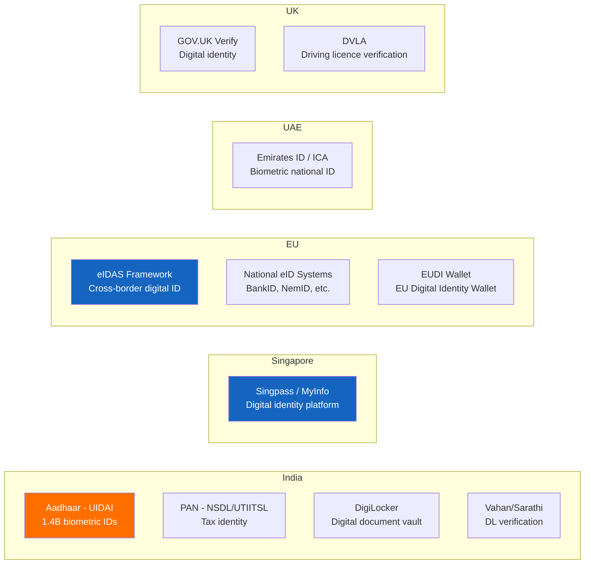
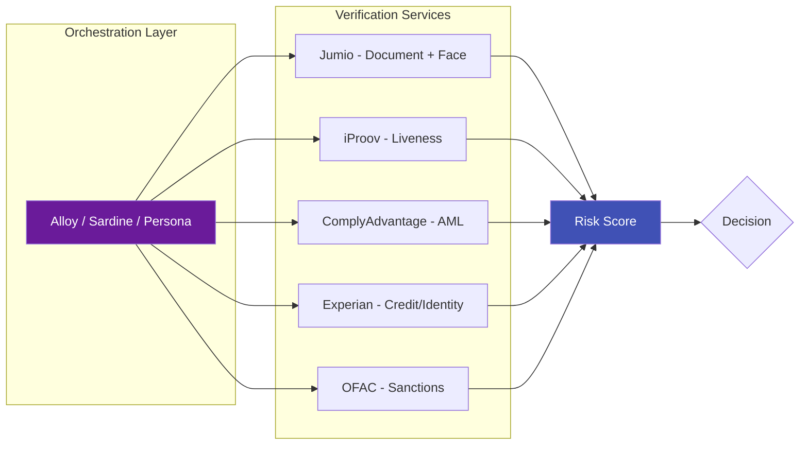
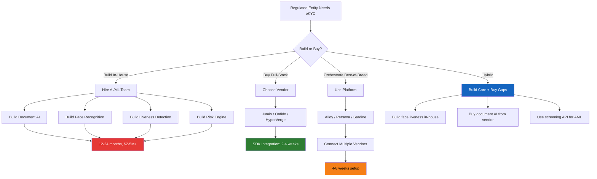
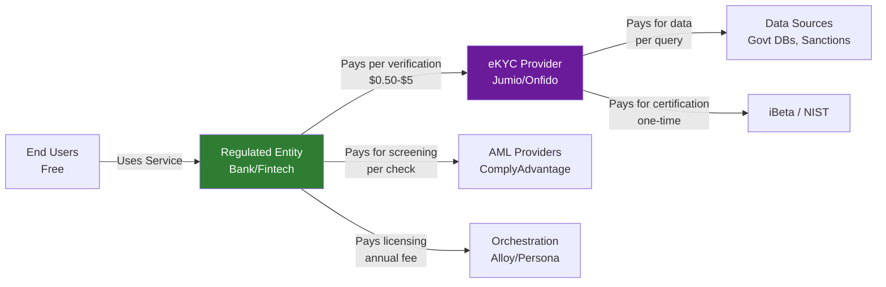

# eKYC Ecosystem Overview

## Overview

The eKYC ecosystem is a complex network of **regulators, technology providers, data sources, financial institutions, and end users** working together to enable secure digital identity verification. Understanding who the players are, how they interact, and where value flows is essential for anyone building, buying, or consulting on eKYC solutions.

---

## The Complete Ecosystem Map

```mermaid
graph TB
    subgraph "🏛️ Regulators & Standards Bodies"
        R1[Central Banks<br/>RBI, FCA, MAS, OCC]
        R2[AML Authorities<br/>FATF, FinCEN, AMLA]
        R3[Data Protection<br/>GDPR, DPDP, CCPA]
        R4[Standards Bodies<br/>ISO, NIST, iBeta]
    end

    subgraph "🪪 Identity Infrastructure"
        I1[Government ID Systems<br/>Aadhaar, Singpass, eIDAS]
        I2[Credit Bureaus<br/>CIBIL, Experian, Equifax]
        I3[Sanctions Databases<br/>OFAC, UN, EU, UK HMT]
        I4[PEP Databases<br/>Dow Jones, Refinitiv]
    end

    subgraph "🤖 eKYC Technology Providers"
        T1[Full-Stack Providers<br/>Jumio, Onfido, HyperVerge]
        T2[Biometric Specialists<br/>iProov, FacePhi, Aware]
        T3[Document AI<br/>Microblink, Regula, Anyline]
        T4[AML/Screening<br/>ComplyAdvantage, Chainalysis]
        T5[Orchestration Platforms<br/>Alloy, Sardine, Unit21]
    end

    subgraph "🏦 Customers (Regulated Entities)"
        C1[Banks & NBFCs]
        C2[Fintechs & Neobanks]
        C3[Insurance Companies]
        C4[Crypto Exchanges]
        C5[Telecom Operators]
        C6[Gaming Platforms]
    end

    subgraph "👤 End Users"
        U1[Individual Customers]
        U2[Business Entities]
    end

    R1 & R2 & R3 -->|Regulations & Mandates| C1 & C2 & C3 & C4 & C5 & C6
    R4 -->|Certification & Testing| T1 & T2 & T3
    I1 & I2 & I3 & I4 -->|Data & Verification APIs| T1 & T5
    T1 & T2 & T3 & T4 & T5 -->|eKYC Solutions| C1 & C2 & C3 & C4 & C5 & C6
    C1 & C2 & C3 & C4 & C5 & C6 -->|Onboarding Experience| U1 & U2

    style R1 fill:#1565C0,color:#fff
    style T1 fill:#6A1B9A,color:#fff
    style C1 fill:#2E7D32,color:#fff
    style U1 fill:#E65100,color:#fff
```

---

## Layer 1: Regulators & Standards Bodies

These entities define the **rules of the game** — what KYC must achieve, how data must be handled, and what security levels are acceptable.

### Financial Regulators (Mandate KYC)

| Regulator | Country/Region | Key Mandate |
|-----------|---------------|-------------|
| **RBI** (Reserve Bank of India) | India | KYC Master Direction, V-KYC guidelines, Aadhaar eKYC rules |
| **FCA** (Financial Conduct Authority) | UK | Money Laundering Regulations, digital identity guidance |
| **MAS** (Monetary Authority of Singapore) | Singapore | Notice on AML/CFT, MyInfo integration |
| **OCC** (Office of the Comptroller) | USA | BSA/AML compliance for national banks |
| **BaFin** | Germany | AML Act implementation, video identification rules |
| **CBUAE** | UAE | Emirates ID-based KYC, AML regulations |
| **AUSTRAC** | Australia | AML/CTF Act, digital identity verification rules |
| **SEBI** | India | KYC for securities market participants |
| **IRDAI** | India | KYC for insurance onboarding |

### AML / Compliance Bodies

| Body | Scope | Role |
|------|-------|------|
| **FATF** | Global (39 member countries) | Sets international AML/CFT standards (40 Recommendations) |
| **FinCEN** | USA | Financial intelligence unit, manages BSA compliance |
| **AMLA** | EU | New EU-wide AML authority (from 2025) |
| **FIU-IND** | India | Receives and analyzes suspicious transaction reports |
| **NCA** | UK | National Crime Agency — financial intelligence |
| **Egmont Group** | Global (166 FIUs) | International cooperation between financial intelligence units |

### Data Protection Authorities

| Authority | Regulation | Key eKYC Impact |
|-----------|-----------|-----------------|
| **EU DPAs** | GDPR | Biometric data = "special category" — requires explicit consent, DPIA, data minimization |
| **MEITY / DPA India** | DPDP Act 2023 | Consent-based processing, data localization discussions |
| **CCPA / CPRA** | California | Consumer rights over biometric data |
| **PDPA** | Singapore | Consent and purpose limitation for personal data |

### Standards & Certification Bodies

| Body | Standard | What It Covers |
|------|----------|----------------|
| **ISO/IEC** | ISO 30107 | Presentation Attack Detection (PAD) testing methodology |
| **ISO/IEC** | ISO 19795 | Biometric performance testing and reporting |
| **NIST** | FRVT | Face Recognition Vendor Test — accuracy benchmarks |
| **NIST** | FATE | Face Analysis Technology Evaluation — demographic fairness |
| **iBeta** | Level 1 & 2 | Independent PAD testing lab — ISO 30107-3 certification |
| **BixeLab** | PAD Testing | Alternative PAD testing laboratory |
| **FIDO Alliance** | FIDO2/WebAuthn | Passwordless authentication standards |

!!! info "Why Standards Matter"
    Enterprise clients (especially banks) increasingly require **iBeta Level 1/2 certification** and **NIST FRVT rankings** before purchasing eKYC solutions. These act as objective proof of a vendor's face recognition and liveness detection capabilities.

---

## Layer 2: Identity Infrastructure

These are the **data sources** that eKYC systems verify against — the ground truth.

### Government Identity Systems

| System | Country | Records | API Access | eKYC Role |
|--------|---------|---------|------------|-----------|
| **Aadhaar (UIDAI)** | India | 1.4 billion | Yes (biometric + OTP) | Primary eKYC source for India |
| **PAN (NSDL)** | India | 600+ million | Yes (name/DOB match) | Tax ID verification |
| **Singpass / MyInfo** | Singapore | 5.5 million | Yes (OAuth-based) | Pre-verified data auto-fill |
| **eIDAS / National eIDs** | EU | Varies by country | Yes (qualified trust services) | Cross-border identity |
| **Emirates ID** | UAE | 10+ million | Yes | Universal KYC document |
| **SSN / DMV** | USA | 300+ million | Limited (varies by state) | Identity cross-check |

### Credit Bureaus & Data Aggregators

| Provider | Coverage | eKYC Role |
|----------|----------|-----------|
| **CIBIL (TransUnion)** | India | Identity cross-reference, credit history |
| **Experian** | Global | Identity verification, fraud signals |
| **Equifax** | Global | Identity data, address verification |
| **CRIF** | Europe/India | Alternative data, identity verification |

### Sanctions & Watchlist Databases

| Database | Maintained By | Scope |
|----------|--------------|-------|
| **OFAC SDN List** | US Treasury | US sanctions — blocked persons/entities |
| **UN Consolidated List** | United Nations | Global sanctions |
| **EU Sanctions List** | European Commission | EU-wide sanctions |
| **UK HMT Sanctions** | HM Treasury | UK sanctions |
| **Interpol Notices** | Interpol | International wanted persons |
| **FBI Most Wanted** | FBI | US law enforcement |

### PEP & Adverse Media Data

| Provider | What They Provide |
|----------|-------------------|
| **Dow Jones Risk & Compliance** | PEP lists, sanctions, adverse media |
| **Refinitiv World-Check** | PEP screening, sanctions, adverse media |
| **ComplyAdvantage** | AI-powered real-time AML data |
| **LexisNexis** | Identity verification + risk data |
| **Moody's (Bureau van Dijk)** | Corporate ownership (Orbis), PEP/sanctions |

---

## Layer 3: eKYC Technology Providers

These companies build the **actual technology** that performs identity verification.

### Full-Stack eKYC Providers

These offer end-to-end solutions covering document verification, biometrics, liveness, and screening:

| Provider | HQ | Key Strengths | Notable Clients |
|----------|-----|---------------|----------------|
| **Jumio** | USA | Pioneer in AI-based ID verification, strong global coverage | HSBC, United Airlines, Monzo |
| **Onfido** | UK (Entrust) | Strong document coverage (2500+ ID types), Atlas AI | Revolut, Bitstamp, Zipcar |
| **HyperVerge** | India/USA | Fast, high-accuracy, strong in India/SEA | Jio, SBI, CRED |
| **Veriff** | Estonia | Video-based verification, European strength | Bolt, Wise, Blockchain.com |
| **IDenfy** | Lithuania | Affordable, good EU coverage | Fintechs, crypto |
| **Sumsub** | UK | All-in-one compliance platform | Binance, OKX, Mercuryo |
| **Shufti Pro** | UK | Global coverage, multi-language | Banks, fintechs |
| **Regula** | USA | Strong document forensics, on-premise option | Border control, enterprises |
| **Au10tix** | Israel | High-speed, patented forensic technology | PayPal, Google, Uber |
| **Socure** | USA | ML-driven identity decisioning | Chime, SoFi, DraftKings |

### Biometric Specialists

Focused specifically on face/biometric technology:

| Provider | Specialty | Notable Feature |
|----------|-----------|-----------------|
| **iProov** | Face liveness | Patented Flashmark active liveness, NIST FRVT ranked |
| **FacePhi** | Face recognition | Strong in Latin America banking |
| **Aware** | Multi-modal biometrics | Face + fingerprint + iris |
| **Innovatrics** | Face recognition | NIST FRVT top performer, edge deployment |
| **Daon** | Biometric authentication | Multi-factor biometric MFA |
| **BioID** | Liveness detection | Anti-spoofing specialist |
| **ID R&D** | Voice + face biometrics | Passive liveness, voice anti-spoofing |

### Document AI Specialists

Focused on document capture, OCR, and classification:

| Provider | Specialty | Notable Feature |
|----------|-----------|-----------------|
| **Microblink** | Mobile document scanning | BlinkID — fast on-device OCR |
| **Anyline** | Mobile OCR | Works offline on-device |
| **ABBYY** | Enterprise OCR | FlexiCapture — advanced document AI |
| **Google Document AI** | Cloud OCR | Part of Google Cloud platform |
| **AWS Textract** | Cloud OCR | Amazon's document extraction service |
| **Azure AI Document Intelligence** | Cloud OCR | Microsoft's document processing |

### AML & Screening Specialists

| Provider | Specialty |
|----------|-----------|
| **ComplyAdvantage** | Real-time AML data + screening |
| **Chainalysis** | Crypto transaction monitoring + KYT |
| **Elliptic** | Crypto compliance + blockchain analytics |
| **Napier AI** | AML transaction monitoring |
| **Featurespace** | Adaptive behavioral analytics for fraud/AML |
| **NICE Actimize** | Enterprise AML + fraud management |

### Orchestration & Decision Platforms

These don't build AI models — they **connect and orchestrate** multiple verification services:

| Provider | What It Does |
|----------|-------------|
| **Alloy** | Orchestrates multiple identity/fraud vendors into workflows |
| **Sardine** | Fraud prevention + KYC orchestration |
| **Unit21** | Risk & compliance operations platform |
| **Persona** | Identity verification infrastructure (API-first) |
| **Plaid** | Financial data connectivity + identity verification |
| **Trulioo** | Global identity verification network (500+ data sources) |

!!! tip "Build vs Orchestrate"
    Many fintechs don't build their own eKYC — they use an **orchestration platform** like Alloy or Persona to connect best-of-breed services (Jumio for documents, iProov for liveness, ComplyAdvantage for AML) into a single workflow. This allows swapping vendors without code changes.

---

## Layer 4: Customers (Regulated Entities)

These are the organizations that **buy and deploy** eKYC solutions:

| Sector | Example Companies | Why They Need eKYC |
|--------|-------------------|-------------------|
| **Traditional Banks** | HDFC, SBI, HSBC, JPMorgan | Regulatory mandate, digital transformation |
| **Neobanks** | Revolut, Nubank, Razorpay RizeUp | 100% digital — eKYC is the only option |
| **Fintech / Lending** | CRED, Slice, LendingClub | Fast loan disbursement requires fast KYC |
| **Payments** | PayPal, Paytm, PhonePe | User onboarding at scale |
| **Insurance** | PolicyBazaar, Lemonade | Policy issuance and claims verification |
| **Crypto Exchanges** | Binance, CoinDCX, Coinbase | Regulatory compliance (FATF Travel Rule) |
| **Telecom** | Jio, Airtel, Vodafone | SIM activation requires identity verification |
| **Gaming** | Dream11, MPL, DraftKings | Age verification + identity for real-money gaming |
| **Gig Economy** | Uber, Ola, Swiggy | Driver/partner verification |
| **Real Estate** | NoBroker, Zillow | Tenant/buyer identity verification |

### How They Typically Buy eKYC

---

## Layer 5: End Users

The people and businesses being verified:

### Individual Customers
- Open bank accounts, apply for loans, activate SIM cards
- Experience: capture ID + selfie in 2-5 minutes
- Expectations: fast, seamless, mobile-first, minimal retries

### Business Entities (KYB)
- Open business accounts, apply for business loans
- More complex: requires company registration documents, UBO identification, director verification
- Often involves multiple stakeholders being verified

---

## The Money Flow

Understanding who pays whom in the ecosystem:

### Typical Pricing Models

| Model | How It Works | Typical Range |
|-------|-------------|---------------|
| **Per-verification** | Pay for each identity check | $0.50 - $5 per check |
| **Tiered volume** | Price decreases with volume | $2 at 10K/mo → $0.50 at 1M/mo |
| **Platform fee + per-check** | Monthly platform fee + usage | $500-$5000/mo + $0.30-$2/check |
| **Annual license** | Flat annual fee for unlimited use | $50K-$500K/year (enterprise) |
| **Revenue share** | Percentage of customer's revenue | 0.1%-1% of transaction value |

---

## Emerging Ecosystem Trends

### 1. Consolidation
Large players are acquiring specialists to build full-stack offerings:
- **Entrust acquired Onfido** (2024) — combined identity + digital certificates
- **Thales acquired Gemalto** — combined biometrics + smart cards + digital security
- **LexisNexis acquired ThreatMetrix** — combined identity + device intelligence

### 2. Decentralized Identity
New players building self-sovereign identity (SSI) infrastructure:
- Users verify once, carry credentials in a digital wallet
- Reduces repeated eKYC — verify once, reuse everywhere
- EU Digital Identity Wallet (EUDI) expected to drive this from 2026

### 3. Embedded eKYC
eKYC becoming invisible — embedded directly into product flows:
- "Verify your identity" is becoming as seamless as "enter your email"
- API-first providers (Persona, Plaid) enabling this

### 4. AI Arms Race
Attackers and defenders continuously escalating:
- Deepfakes getting more realistic → detection models getting more sophisticated
- Injection attacks becoming common → device integrity checks becoming standard
- Synthetic identity fraud growing → cross-institution deduplication emerging

---

## Key Takeaways

!!! success "Summary"
    - The eKYC ecosystem has **5 layers**: Regulators, Identity Infrastructure, Technology Providers, Regulated Entities, and End Users
    - **Regulators drive demand** — every new AML directive or data protection law expands the eKYC market
    - **Technology providers** range from full-stack platforms to narrow specialists (biometrics, documents, AML)
    - **Orchestration platforms** are becoming the preferred integration pattern — connect best-of-breed services without vendor lock-in
    - The ecosystem is **consolidating** — large acquisitions are creating mega-platforms
    - **Decentralized identity** is the next frontier — will reshape how eKYC works fundamentally
    - Understanding the ecosystem is critical for **positioning** as a consultant or vendor in the space

---

## Related Articles

- **Previous**: [← Why eKYC Matters](why-ekyc-matters.md)
- **Next**: [eKYC End-to-End Flow →](ekyc-end-to-end-flow.md)
- [eKYC Vendor Landscape](ekyc-vendor-landscape.md) — Detailed vendor comparison
- [Build vs Buy](../11-business-strategy/build-vs-buy.md)
- [eKYC System Architecture](../09-infrastructure/ekyc-system-architecture.md)
