# eKYC End-to-End Flow

## Overview

This article walks through the **complete technical flow** of an eKYC verification — from the moment a user opens the app to the final decision. Every step, every AI model, every API call, and every decision point is mapped out in detail.

---

## The High-Level Flow

```mermaid
graph TD
    A["1️⃣ User Initiates KYC"] --> B["2️⃣ Device & Environment Check"]
    B --> C["3️⃣ Document Capture"]
    C --> D["4️⃣ Document Processing"]
    D --> E["5️⃣ Selfie Capture"]
    E --> F["6️⃣ Face Processing"]
    F --> G["7️⃣ Data Verification"]
    G --> H["8️⃣ Risk Scoring"]
    H --> I["9️⃣ Decision & Routing"]
    I --> J["🔟 Post-Decision"]

    style A fill:#4051B5,color:#fff
    style D fill:#6A1B9A,color:#fff
    style F fill:#6A1B9A,color:#fff
    style H fill:#F57F17,color:#000
    style I fill:#2E7D32,color:#fff
```



---

## Step 1: User Initiates KYC

### What Happens
The user clicks "Verify Identity" or "Complete KYC" in the client's app or website.

### Technical Flow


### What's Configured
The backend returns a **session configuration** specifying:

| Parameter | Example | Purpose |
|-----------|---------|---------|
| `accepted_documents` | `["passport", "driving_license", "national_id"]` | Which ID types are allowed |
| `accepted_countries` | `["IN", "US", "GB", "SG"]` | Which country documents are accepted |
| `liveness_type` | `"passive"` or `"active"` | Type of liveness check |
| `face_match_threshold` | `0.65` | Minimum similarity score for face match |
| `require_address_proof` | `true/false` | Whether address document is needed |
| `max_retries` | `3` | How many attempts the user gets |
| `session_ttl` | `1800` (seconds) | Session timeout |

---

## Step 2: Device & Environment Check

### What Happens
Before any capture begins, the SDK performs security and environment checks.

### Checks Performed


!!! warning "Why This Step Matters"
    **Injection attacks** are one of the fastest-growing threats in eKYC. Attackers use virtual cameras, emulators, or app hooking tools to feed pre-recorded or deepfake videos directly into the verification pipeline. Device integrity checks are the first line of defense.

| Check | What It Detects | Risk If Skipped |
|-------|----------------|-----------------|
| **Root/Jailbreak** | Compromised OS with elevated privileges | Attacker can modify app behavior |
| **Emulator** | Android/iOS emulators (BlueStacks, etc.) | Automated attacks at scale |
| **Virtual camera** | OBS Virtual Camera, ManyCam, etc. | Deepfake injection |
| **App tampering** | Modified APK/IPA, Frida hooks | Bypassed security checks |
| **Screen recording** | Active screen capture | Privacy violation, replay attacks |

---

## Step 3: Document Capture

### What Happens
The user is guided to capture a photo of their identity document using the phone's camera.

### User Experience Flow


### Technical Details — Image Quality Assessment

The SDK performs real-time quality assessment before capturing:

| Quality Check | Method | Threshold |
|--------------|--------|-----------|
| **Blur detection** | Laplacian variance | Variance > 100 |
| **Glare detection** | Highlight region analysis | Glare area < 5% of document |
| **Document detection** | Edge detection + contour analysis | 4 corners detected |
| **Alignment** | Perspective transform estimation | Angle deviation < 15° |
| **Resolution** | Pixel density in document region | > 300 DPI equivalent |
| **Lighting** | Histogram analysis | Mean brightness 80-200 |
| **Occlusion** | Expected region coverage | > 95% of document visible |
| **Distance** | Document size relative to frame | 50-90% of frame width |

### What's Captured

| Data | Format | Typical Size |
|------|--------|-------------|
| Document front image | JPEG (quality 90) | 500KB - 2MB |
| Document back image | JPEG (quality 90) | 500KB - 2MB |
| Capture metadata | JSON | ~1KB |

**Capture metadata includes:**
```json
{
  "capture_time": "2025-01-15T10:30:45Z",
  "device_model": "Samsung Galaxy S24",
  "os_version": "Android 14",
  "camera": "rear",
  "resolution": "4032x3024",
  "focus_score": 0.92,
  "brightness_score": 0.78,
  "glare_score": 0.05,
  "geo_location": { "lat": 18.52, "lng": 73.85 },
  "capture_duration_ms": 3200
}
```

---

## Step 4: Document Processing

### What Happens
The captured document image goes through multiple AI/ML pipelines simultaneously.

### Processing Pipeline



```mermaid
graph TD
    A[Document Image] --> B[Preprocessing]
    B --> B1[Perspective correction]
    B --> B2[Cropping & alignment]
    B --> B3[Resolution normalization]
    B --> B4[Color/contrast enhancement]

    B1 & B2 & B3 & B4 --> C[Parallel Processing Pipelines]

    C --> D["📋 Document Classification<br/>(What type of ID is this?)"]
    C --> E["🔤 OCR & Data Extraction<br/>(Extract text fields)"]
    C --> F["🔍 Document Forensics<br/>(Is it authentic?)"]
    C --> G["📱 Document Liveness<br/>(Real card or screen/print?)"]
    C --> H["🔒 Security Features<br/>(Holograms, MRZ, barcode)"]

    D --> I[Document Type + Country]
    E --> J[Extracted Fields]
    F --> K[Authenticity Score]
    G --> L[Liveness Score]
    H --> M[Security Score]

    I & J & K & L & M --> N[Document Result Bundle]

    style A fill:#4051B5,color:#fff
    style N fill:#2E7D32,color:#fff
```

### Pipeline 1: Document Classification

**Purpose**: Identify what type of document was captured and from which country.

| Model/Approach | Details |
|---------------|---------|
| **Architecture** | CNN classifier (EfficientNet/ResNet) or ViT |
| **Classes** | 500+ document types from 190+ countries |
| **Output** | Document type, country, confidence score |
| **Accuracy** | > 99% on supported documents |
| **Inference time** | 20-50ms |

**Example output:**
```json
{
  "document_type": "driving_license",
  "country": "IN",
  "state": "Maharashtra",
  "confidence": 0.97,
  "version": "2019_smartcard"
}
```

### Pipeline 2: OCR & Data Extraction

**Purpose**: Extract all text fields from the document into structured data.


| Field | Example (Indian DL) | Extraction Method |
|-------|---------------------|-------------------|
| Name | "NIVESH KUMAR" | OCR + field mapping |
| DOB | "15/03/1990" | OCR + date parsing |
| DL Number | "MH-12-2019-0012345" | OCR + regex validation |
| Address | "123 MG Road, Pune 411001" | OCR + NER |
| Issue Date | "01/01/2019" | OCR + date parsing |
| Expiry Date | "31/12/2039" | OCR + date parsing |
| Blood Group | "B+" | OCR |
| Vehicle Classes | "LMV, MCWG" | OCR + classification |
| Photo | [Face image extracted] | Face detection + crop |

**MRZ Parsing (for passports):**
```
P<INDKUMAR<<NIVESH<<<<<<<<<<<<<<<<<<<<<<<<<<
L1234567<8IND9003155M2912315<<<<<<<<<<<<<<<4
```
Decoded to:
```json
{
  "type": "passport",
  "country": "IND",
  "surname": "KUMAR",
  "given_names": "NIVESH",
  "passport_number": "L1234567",
  "nationality": "IND",
  "dob": "1990-03-15",
  "sex": "M",
  "expiry": "2029-12-31",
  "check_digits_valid": true
}
```

### Pipeline 3: Document Forensics

**Purpose**: Detect if the document has been tampered with or is fraudulent.

| Check | What It Detects | Technology |
|-------|----------------|------------|
| **Digital tampering** | Photoshop edits, font replacement, field modification | Error Level Analysis (ELA), noise analysis |
| **Copy-move forgery** | Duplicated regions within the document | Feature matching (SIFT/ORB) |
| **Splicing** | Content pasted from another image | Edge inconsistency analysis |
| **Font consistency** | Mixed fonts indicating text replacement | Font classification model |
| **Compression artifacts** | JPEG double-compression indicating editing | DCT coefficient analysis |
| **Metadata analysis** | EXIF data inconsistencies | Software fingerprinting |

### Pipeline 4: Document Liveness

**Purpose**: Determine if the captured image is of a real, physical document — not a screen display, photocopy, or printed reproduction.

| Attack Type | How It's Detected |
|-------------|-------------------|
| **Screen display** | Moiré patterns, pixel grid, refresh rate artifacts, screen bezel |
| **Photocopy** | Halftone patterns, toner artifacts, paper texture |
| **Printed photo** | Printer dot patterns, color banding, paper edge |
| **Digital file** | Missing 3D features, perfect uniformity, no shadows |

### Pipeline 5: Security Features

| Feature | Document Types | Detection Method |
|---------|---------------|-----------------|
| **MRZ validation** | Passports, some national IDs | OCR + check digit computation |
| **Barcode/QR data** | Many modern IDs | Decode + cross-reference with OCR data |
| **NFC chip** | e-Passports, smart IDs | Cryptographic challenge-response |
| **Hologram** | Most modern IDs | Light reflection analysis (limited without hardware) |
| **Microprint** | High-security documents | High-resolution analysis |

---

## Step 5: Selfie Capture

### What Happens
The user is guided to take a selfie using the front-facing camera.

### User Experience

```mermaid
graph TD
    A[Switch to front camera] --> B[Show face oval guide]
    B --> C{Real-time face checks}

    C -->|Face detected + centered| D[Check face quality]
    C -->|No face| E[Guide: Position your face in the oval]
    C -->|Multiple faces| F[Guide: Only one face should be visible]
    C -->|Face too far| G[Guide: Move closer]
    C -->|Face too close| H[Guide: Move further away]

    E & F & G & H --> B

    D -->|Eyes closed| I[Guide: Keep your eyes open]
    D -->|Too much angle| J[Guide: Face the camera directly]
    D -->|Occluded| K[Guide: Remove sunglasses/mask]
    D -->|Quality OK| L[Capture selfie]

    I & J & K --> B

    L --> M{Liveness type?}
    M -->|Passive| N[✅ Single frame captured]
    M -->|Active| O[Perform challenges]

    O --> O1[Turn head left]
    O1 --> O2[Turn head right]
    O2 --> O3[Blink]
    O3 --> O4[Smile]
    O4 --> P[✅ Video/frames captured]

    N --> Q[Proceed to face processing]
    P --> Q

    style N fill:#2E7D32,color:#fff
    style P fill:#2E7D32,color:#fff
```



### Active vs Passive Liveness Capture

| Aspect | Passive Liveness | Active Liveness |
|--------|-----------------|-----------------|
| **User action** | None — just look at camera | Perform 2-4 challenges (blink, turn, smile) |
| **Capture type** | Single frame or short clip (1-2 sec) | 3-10 second video |
| **User experience** | Seamless, fast | More friction, 5-10 seconds |
| **Spoofing resistance** | Good (with strong models) | Higher (harder to spoof dynamic actions) |
| **Deepfake resistance** | Moderate | Higher (dynamic expressions harder to fake) |
| **Accessibility** | Better (works for people with mobility limitations) | Challenging for some disabilities |

---

## Step 6: Face Processing

### What Happens
The selfie goes through face detection, liveness verification, and face matching against the ID photo.

### Processing Pipeline



```mermaid
graph TD
    A[Selfie Image/Video] --> B[Face Detection<br/>SCRFD / RetinaFace]
    B --> C{Face found?}
    C -->|No| D[❌ Reject: No face detected]
    C -->|Multiple| E[❌ Reject: Multiple faces]
    C -->|Yes, single face| F[Face Quality Assessment]

    F --> G{Quality OK?}
    G -->|No| H[❌ Reject: Poor quality]
    G -->|Yes| I[Face Liveness / PAD]

    I --> J{Live face?}
    J -->|No - Spoof detected| K[❌ Reject: Presentation attack]
    J -->|Yes - Live| L[Generate Face Embedding]

    L --> M[Compare with ID Photo]

    subgraph "ID Photo Processing"
        N[ID Document Image] --> O[Detect face on ID]
        O --> P[Extract & align face]
        P --> Q[Generate ID Face Embedding]
    end

    M --> R["Cosine Similarity<br/>selfie_embedding · id_embedding"]
    Q --> R

    R --> S{Similarity > threshold?}
    S -->|Yes: > 0.65| T[✅ Face Match Confirmed]
    S -->|No: < 0.65| U[❌ Face Match Failed]

    style T fill:#2E7D32,color:#fff
    style K fill:#e53935,color:#fff
    style U fill:#e53935,color:#fff
    style D fill:#e53935,color:#fff
```

### Face Detection Details

| Component | Details |
|-----------|---------|
| **Model** | SCRFD (Sample and Computation Redistribution) or RetinaFace |
| **Output** | Bounding box, 5 facial landmarks (eyes, nose, mouth corners), confidence score |
| **Face alignment** | Affine transform using landmarks to normalize face to 112x112 |
| **Inference time** | 5-15ms on GPU, 30-80ms on mobile |

### Face Liveness (PAD) Details

| Attack Vector | Detection Method | Model Type |
|--------------|------------------|------------|
| **Print attack** | Texture analysis, moiré detection, color distribution | CNN binary classifier |
| **Screen replay** | Moiré patterns, screen artifacts, reflection | CNN binary classifier |
| **3D mask** | Material analysis, skin texture, depth cues | Multi-task model |
| **Deepfake** | GAN artifacts, temporal inconsistencies, blending boundaries | Deepfake detector |
| **Injection** | Device integrity + frame consistency | Meta-analysis |

**Typical liveness model stack:**

```
Input (face image 224x224)
    → Backbone (EfficientNet-B0 / MobileNetV3 / ViT-Small)
    → Classification head
    → Output: [real_probability, spoof_probability]
    → Threshold: spoof if real_probability < 0.5
```

### Face Matching Details

| Component | Details |
|-----------|---------|
| **Model** | ArcFace (ResNet-100) or AdaFace |
| **Embedding size** | 512-dimensional vector |
| **Similarity metric** | Cosine similarity |
| **Threshold** | 0.60-0.70 (configurable per client/risk level) |
| **Cross-age handling** | Model trained on cross-age datasets (ID photos can be years old) |
| **Cross-quality handling** | AdaFace specifically handles quality variation (ID photo vs selfie) |

**Matching score interpretation:**

| Score Range | Interpretation | Action |
|-------------|---------------|--------|
| > 0.80 | Very high confidence — same person | Auto-approve |
| 0.65 - 0.80 | High confidence — likely same person | Auto-approve (most configs) |
| 0.50 - 0.65 | Moderate confidence — possible match | Manual review |
| < 0.50 | Low confidence — likely different person | Reject or manual review |

---

## Step 7: Data Verification

### What Happens
Extracted document data is verified against authoritative government and third-party databases.

### Verification Flow

```mermaid
graph TD
    A[Extracted Document Data] --> B[Data Normalization]
    B --> C[Parallel API Calls]

    C --> D["🏛️ Government Database<br/>Aadhaar/PAN/DL verification"]
    C --> E["🔍 Sanctions Screening<br/>OFAC, UN, EU lists"]
    C --> F["👔 PEP Screening<br/>Politically Exposed Persons"]
    C --> G["📰 Adverse Media<br/>Negative news check"]
    C --> H["💳 Credit Bureau<br/>Identity cross-reference"]
    C --> I["📞 Phone Verification<br/>OTP or database check"]
    C --> J["🏦 Bank Account<br/>Penny drop verification"]

    D --> K[Verification Results Bundle]
    E --> K
    F --> K
    G --> K
    H --> K
    I --> K
    J --> K

    style A fill:#4051B5,color:#fff
    style K fill:#2E7D32,color:#fff
```



### API Checks in Detail

#### Government Database Verification (India Example)

| Database | API Provider | What's Verified | Response Time |
|----------|-------------|-----------------|---------------|
| **Aadhaar** | UIDAI (via ASA/KUA) | Name, DOB, address, photo match | 1-3 sec |
| **PAN** | NSDL/UTIITSL | Name, DOB, PAN status | 1-2 sec |
| **Driving License** | Vahan/Sarathi (via DigiLocker) | Name, DOB, DL number, validity | 2-5 sec |
| **Voter ID** | NVSP | Name, DOB, constituency | 2-5 sec |
| **Passport** | MEA (limited) | Passport validity | 3-10 sec |

#### Sanctions & PEP Screening


!!! note "Fuzzy Matching is Critical"
    Sanctions screening uses **fuzzy name matching** (Jaro-Winkler, Soundex, Levenshtein) because:
    
    - Names are transliterated differently from non-Latin scripts ("Muhammad" = "Mohammed" = "محمد")
    - Typos in databases and documents
    - Name ordering varies by culture (family name first vs last)
    - Aliases and name changes
    
    A good screening system balances **recall** (catching all true matches) against **precision** (minimizing false alerts that burden manual review).

---

## Step 8: Risk Scoring

### What Happens
All signals from every previous step are aggregated into a single risk score.

### Risk Scoring Model

```mermaid
graph TD
    subgraph "Input Signals"
        S1["Document confidence: 0.95"]
        S2["Document forensics: 0.88"]
        S3["Document liveness: 0.92"]
        S4["Face match: 0.78"]
        S5["Face liveness: 0.96"]
        S6["Database match: ✅"]
        S7["Sanctions: Clear"]
        S8["PEP: Clear"]
        S9["Device integrity: ✅"]
        S10["IP risk: Low"]
        S11["Velocity: Normal"]
        S12["Geo consistency: ✅"]
    end

    subgraph "Risk Engine"
        RE[Weighted Scoring Model<br/>or ML-based scorer]
    end

    subgraph "Output"
        O1["Risk Score: 87/100"]
        O2["Risk Level: LOW"]
        O3["Recommendation: AUTO-APPROVE"]
    end

    S1 & S2 & S3 & S4 & S5 & S6 & S7 & S8 & S9 & S10 & S11 & S12 --> RE
    RE --> O1 & O2 & O3

    style RE fill:#4051B5,color:#fff
    style O3 fill:#2E7D32,color:#fff
```



### Typical Scoring Weights

| Signal | Weight | Rationale |
|--------|--------|-----------|
| Face liveness | 25% | Critical — if spoofed, everything else is meaningless |
| Face match | 20% | Core identity confirmation |
| Document authenticity | 15% | Forged docs mean forged identity |
| Document liveness | 10% | Prevents screen/print attacks |
| Database verification | 15% | Ground truth validation |
| Sanctions/PEP | 5% | Binary — hit or no hit (but hit = immediate escalation) |
| Device/IP/Velocity | 10% | Fraud signals |

!!! info "Rules vs ML"
    **Rules-based** scoring: Weighted sum with configurable thresholds. Transparent, easy to audit, but rigid.
    
    **ML-based** scoring: Gradient boosting (XGBoost) or neural network trained on historical approve/reject decisions. More accurate, adapts to patterns, but harder to explain.
    
    Most production systems use a **hybrid**: ML scoring + business rules overlay.

---

## Step 9: Decision & Routing

### Decision Matrix

```mermaid
graph TD
    A[Risk Score Calculated] --> B{Score Range}

    B -->|85-100: LOW RISK| C[✅ Auto-Approve]
    B -->|50-84: MEDIUM RISK| D[🔍 Manual Review Queue]
    B -->|0-49: HIGH RISK| E[❌ Auto-Reject]

    B -->|Sanctions/PEP Hit| F[🚨 Compliance Escalation]

    C --> G[Account Opened<br/>Webhook notification sent]
    D --> H[Ops Agent Reviews<br/>Additional checks if needed]
    E --> I[Rejection notification<br/>Reason provided to user]
    F --> J[MLRO/Compliance Officer<br/>SAR filing if needed]

    H -->|Approved| G
    H -->|Rejected| I
    H -->|Needs more info| K[Request re-submission]

    style C fill:#2E7D32,color:#fff
    style E fill:#e53935,color:#fff
    style D fill:#F57F17,color:#000
    style F fill:#e53935,color:#fff
```



### Typical Outcome Distribution

| Outcome | Percentage | Handling |
|---------|-----------|----------|
| **Auto-approved** | 70-85% | Instant — no human involved |
| **Manual review → approved** | 8-15% | 5-30 minutes by ops agent |
| **Manual review → rejected** | 2-5% | Ops agent + rejection reason |
| **Auto-rejected** | 3-8% | Instant with clear reason |
| **Sanctions/PEP escalation** | < 0.1% | Compliance team review |

---

## Step 10: Post-Decision

### On Approval


### On Rejection

| Rejection Reason | User Message | Next Steps |
|-----------------|--------------|------------|
| **Blurry document** | "We couldn't read your document. Please retake with better lighting." | Allow retry |
| **Document expired** | "Your document has expired. Please use a valid ID." | Allow retry with different doc |
| **Face match failed** | "We couldn't verify your identity. Please ensure the selfie matches your ID photo." | Allow retry |
| **Liveness failed** | "Verification failed. Please try again, ensuring you're in a well-lit area." | Allow retry (limited) |
| **Sanctions hit** | "We're unable to verify your identity at this time." | No retry — escalate to compliance |
| **Suspected fraud** | "Verification unsuccessful." | No retry — block + flag |

!!! warning "Never Reveal Fraud Details"
    When rejecting for fraud, **never** tell the user exactly what triggered the rejection. Messages like "deepfake detected" or "your document appears tampered" teach attackers what to fix. Use generic messages.

---

## Complete Timing Breakdown

| Step | Typical Duration | Where It Runs |
|------|-----------------|---------------|
| Session creation | 200-500ms | Server |
| Device checks | 1-3 sec | Client (SDK) |
| Document capture | 5-30 sec | Client (user dependent) |
| Document upload | 1-5 sec | Network |
| Document processing (all pipelines) | 2-5 sec | Server (GPU) |
| Selfie capture | 3-15 sec | Client (user dependent) |
| Selfie upload | 1-3 sec | Network |
| Face processing (detection + liveness + matching) | 1-3 sec | Server (GPU) |
| Database verification | 2-10 sec | Server → external APIs |
| Risk scoring + decision | 100-500ms | Server |
| **Total (happy path)** | **30-60 seconds** | — |
| **Total (with retries)** | **1-5 minutes** | — |

---

## Error Handling & Edge Cases

### Retry Logic


### Common Edge Cases

| Edge Case | Frequency | Handling |
|-----------|-----------|---------|
| Document in non-supported language | 5-10% | Fallback to generic OCR + manual review |
| Very old ID photo (10+ years) | 10-15% | Lower face match threshold + liveness weight higher |
| Damaged/worn document | 3-5% | Allow retry with different document type |
| Poor lighting (nighttime selfie) | 5-8% | SDK guidance + brightness detection |
| Elderly user (less tech-savvy) | 5-10% | Simplified UI, larger text, more guidance |
| Twins | Rare | Face match passes — liveness + document data must also match |
| Cosmetic changes (surgery, aging) | 1-3% | Lower threshold + manual review path |

---

## Key Takeaways

!!! success "Summary"
    - eKYC is a **10-step pipeline**: initiation → device check → document capture → document processing → selfie → face processing → data verification → risk scoring → decision → post-decision
    - **Parallel processing** is key — document pipelines (OCR, forensics, liveness) run simultaneously for speed
    - The **risk engine** aggregates 12+ signals into a single score with auto-approve/review/reject routing
    - **70-85% of verifications** are auto-approved with zero human involvement
    - **Error handling** is critical — helpful guidance, retry logic, and escalation paths determine conversion rate
    - **Never reveal fraud details** to users — generic rejection messages protect the system
    - A well-optimized pipeline completes in **30-60 seconds** end-to-end

---

## Related Articles

- **Previous**: [← eKYC Ecosystem Overview](ekyc-ecosystem-overview.md)
- **Next**: [Market Landscape →](ekyc-market-landscape.md)
- [Face Liveness Detection](../02-biometrics-face/face-liveness-detection-overview.md)
- [Document Forensics](../03-document-verification/document-forensics-overview.md)
- [Risk Scoring Engines](../06-fraud-risk/risk-scoring-engines.md)
- [eKYC System Architecture](../09-infrastructure/ekyc-system-architecture.md)
