# eKYC Future Trends

## Overview

The eKYC landscape is evolving rapidly — driven by advances in AI, changing regulations, new identity paradigms, and emerging attack vectors. This article explores the key trends that will shape eKYC over the next 3-10 years.

---

## Trend Map

```mermaid
graph TD
    A[Future of eKYC] --> B[🪪 Decentralized Identity]
    A --> C[🤖 AI/ML Advances]
    A --> D[📱 On-Device Processing]
    A --> E[🔗 Reusable KYC]
    A --> F[🛡️ Anti-Deepfake Arms Race]
    A --> G[🌍 Regulatory Convergence]
    A --> H[🧬 Multi-Modal Biometrics]
    A --> I[♿ Inclusive Design]

    style A fill:#4051B5,color:#fff
    style B fill:#6A1B9A,color:#fff
    style F fill:#e53935,color:#fff
```

---

## 1. Decentralized Identity & Digital Wallets

### The Paradigm Shift

The most transformative trend in eKYC: moving from **"verify every time"** to **"verify once, carry proof everywhere."**

```mermaid
graph LR
    subgraph "Current Model (2024)"
        A1[User] -->|Verify from scratch| B1[Bank A]
        A1 -->|Verify from scratch| C1[Bank B]
        A1 -->|Verify from scratch| D1[Crypto Exchange]
        A1 -->|Verify from scratch| E1[Insurance]
    end

    subgraph "Future Model (2027+)"
        A2[User with Digital Wallet] -->|Present credential| B2[Bank A]
        A2 -->|Present credential| C2[Bank B]
        A2 -->|Present credential| D2[Crypto Exchange]
        A2 -->|Present credential| E2[Insurance]
    end

    style A2 fill:#2E7D32,color:#fff
```

### EU Digital Identity Wallet (EUDI)

The EU's eIDAS 2.0 regulation mandates that all member states offer digital identity wallets by 2026-2027:

| Aspect | Details |
|--------|---------|
| **Scope** | 450 million EU citizens/residents |
| **What's stored** | National ID, driver's license, diplomas, health data, financial credentials |
| **How it works** | User verifies once at a trusted issuer → credential stored in phone wallet → presented to verifiers |
| **Privacy feature** | Selective disclosure — share only what's needed (prove you're 18+ without revealing DOB) |
| **Cross-border** | Works across all EU member states by default |
| **Impact on eKYC** | Dramatically reduces need for document capture + selfie verification |

### W3C Verifiable Credentials

The technical standard powering decentralized identity:

### Impact on eKYC Industry

| Current eKYC Revenue Source | Impact |
|---------------------------|--------|
| **Document capture + OCR** | Reduced — credentials replace document photography |
| **Face matching** | Reduced — identity proven via credential, not selfie |
| **Liveness detection** | Partially reduced — still needed for initial issuance |
| **Database verification** | Replaced — credential IS the verified data |
| **Sanctions/AML screening** | Unchanged — still required regardless of identity method |
| **Orchestration platforms** | Transformed — orchestrate credential verification instead of AI pipelines |

!!! warning "Opportunity and Threat"
    Decentralized identity will **reduce the volume** of traditional eKYC verifications but **create new opportunities** in credential issuance, wallet infrastructure, trust frameworks, and hybrid verification (traditional eKYC for first-time issuance + credential-based for subsequent uses).

---

## 2. AI/ML Advances

### Foundation Models for Identity

Large vision-language models (VLMs) are beginning to transform document understanding:

| Current Approach | Future Approach |
|-----------------|-----------------|
| **Template-based OCR** — specific model per document type | **Foundation model** — understands any document layout zero-shot |
| **Separate models** for classification, OCR, forensics | **Unified model** that performs all tasks |
| **New document = new training** | **New document = prompt the model** |
| **Language-specific models** | **Multilingual by default** |

### Self-Supervised Learning for Liveness

Reducing dependence on labeled data:

Benefits: better generalization to unseen attacks, lower data labeling costs, more robust cross-domain performance.

### Generative AI for Data Augmentation

Using diffusion models and GANs to generate synthetic training data:

| Application | Benefit |
|-------------|---------|
| **Synthetic spoof images** | Train liveness models without collecting real attacks |
| **Synthetic documents** | Train document AI without real PII data |
| **Demographic augmentation** | Generate underrepresented demographics for fairer models |
| **Attack simulation** | Generate novel attack types before they appear in the wild |

### Explainable AI (XAI) for Compliance

Regulators increasingly demanding explanations for AI decisions:

- **Why was this person rejected?** — Need to provide a clear, human-understandable reason
- **EU AI Act** classifies biometric identification as "high-risk" — requires transparency
- **Grad-CAM, SHAP, LIME** being integrated into eKYC pipelines for decision explanation
- Shift from "black box" to "glass box" AI

---

## 3. On-Device / Edge Processing

### The Shift to Phone-Side AI

| Advantage | Details |
|-----------|---------|
| **Speed** | Eliminates network round-trip — instant feedback |
| **Privacy** | Biometric data never leaves the device |
| **Offline capability** | Works in areas with poor connectivity |
| **Cost** | Reduces server GPU costs |
| **Bandwidth** | Only metadata sent, not full images |

### Enabling Technologies

| Technology | Role |
|-----------|------|
| **ONNX Runtime Mobile** | Cross-platform model inference on phone |
| **CoreML** | Apple's on-device ML framework |
| **TensorFlow Lite** | Google's mobile ML framework |
| **MediaPipe** | Google's real-time ML pipeline for mobile |
| **Neural Processing Units (NPUs)** | Dedicated AI chips in modern phones (Snapdragon, Apple Neural Engine, Google Tensor) |
| **WebAssembly (WASM)** | Run ML models in-browser without native app |

### Hybrid Architecture (Most Likely Future)

---

## 4. Reusable KYC / Portable Identity

### The Vision: Verify Once, Use Everywhere

| Current | Future |
|---------|--------|
| Every bank, fintech, exchange runs its own KYC | Verify once at any trusted provider |
| User submits documents 10+ times per year | User's verified identity travels with them |
| Each provider stores copies of documents | Verified credential stored in user's wallet |
| Re-KYC requires full re-verification | Credential refresh is lightweight |

### Implementation Models

| Model | How It Works | Example |
|-------|-------------|---------|
| **Central registry** | Single database stores KYC, all institutions query it | India's cKYC (CERSAI) |
| **Federated** | KYC data shared between institutions via secure network | UK's Digital Identity Trust Framework |
| **Decentralized** | User holds credentials in wallet, presents to anyone | EU Digital Identity Wallet |
| **Utility model** | Shared KYC utility run by industry consortium | Singapore's MyInfo, Nordic KYC Utility |

---

## 5. The Anti-Deepfake Arms Race

### Attack Evolution Timeline

### Defense Evolution

| Generation | Defense Approach | Limitation |
|-----------|-----------------|------------|
| **Gen 1** (2018-2020) | Artifact detection (blending boundaries, GAN fingerprints) | Fails against newer generators |
| **Gen 2** (2020-2022) | Multi-frame temporal analysis | Defeated by real-time deepfakes |
| **Gen 3** (2022-2024) | Device integrity + injection detection | Bypassed by sophisticated app hooking |
| **Gen 4** (2024-2026) | Hardware attestation + challenge-response + behavioral analysis | Emerging, not yet widely deployed |
| **Gen 5** (2026+) | Cryptographic proof of capture (device-signed images) | Requires hardware ecosystem support |

### Cryptographic Image Provenance

The most promising long-term defense: **proving that an image was actually captured by a real camera, not generated by software.**

| Technology | How It Works |
|-----------|-------------|
| **C2PA (Coalition for Content Provenance and Authenticity)** | Camera embeds cryptographic signature at capture time |
| **Content Credentials** | Adobe-led initiative for digital content provenance |
| **Android/iOS secure camera APIs** | OS-level attestation that image came from physical camera |
| **Secure Enclave signing** | Hardware-protected key signs each frame at capture |

---

## 6. Regulatory Convergence

### Key Regulatory Developments

| Development | Timeline | Impact |
|-------------|----------|--------|
| **EU AI Act** | 2024-2026 (phased) | Biometric AI classified as high-risk — requires transparency, testing, documentation |
| **EU AMLR** | 2025-2026 | Single EU-wide AML rulebook replacing national implementations |
| **EUDI Wallet** | 2026-2027 | Mandatory digital identity wallets for all EU citizens |
| **India DPDP Act** | 2024-2025 | Comprehensive data protection — impacts how biometric data is handled |
| **US state privacy laws** | Ongoing | Growing patchwork of state-level biometric privacy laws (BIPA model) |
| **FATF updated guidance** | Ongoing | Digital identity accepted for CDD, pushing for eKYC adoption globally |

### Trend: From Prohibition to Enablement

Early regulations were cautious about eKYC (requiring in-person verification). The trend is clear: regulators are now actively **enabling and encouraging** digital identity verification.

---

## 7. Multi-Modal Biometrics

### Beyond Face Alone

| Modality | Advantage | Challenge |
|----------|-----------|-----------|
| **Face + Voice** | Two independent biometrics from one video call | Voice spoofing is also possible |
| **Face + Behavioral** | Typing patterns, swipe gestures add invisible layer | Requires data collection over time |
| **Face + Fingerprint** | Phone's fingerprint sensor adds second factor | Not available on all devices |
| **Face + Iris** | Very high accuracy combined | Iris capture quality varies by phone camera |

### Continuous Authentication

Moving from one-time verification to ongoing identity assurance:

| Stage | Current | Future |
|-------|---------|--------|
| **Onboarding** | Full eKYC (document + selfie + liveness) | Same, possibly credential-based |
| **Login** | Password or PIN | Face/voice biometric |
| **During session** | None | Passive behavioral biometrics (typing pattern, device usage) |
| **High-risk action** | OTP or re-authentication | Step-up biometric verification |
| **Periodic** | Annual re-KYC | Continuous, invisible re-verification |

---

## 8. Inclusive & Accessible eKYC

### Designing for Everyone

| Innovation | Who It Helps | Status |
|-----------|-------------|--------|
| **Voice-guided eKYC** | Visually impaired users | Emerging |
| **Agent-assisted digital** | Elderly, digitally illiterate | Available (India's BC model) |
| **Simplified UI/UX** | Low-literacy users | Growing adoption |
| **Offline-capable** | Areas with poor connectivity | Partial (on-device processing) |
| **Alternative biometrics** | People with facial differences | Research stage |
| **Multi-language support** | Non-English speakers | Improving (100+ languages in OCR) |

---

## 9. Embedded & Invisible eKYC

### eKYC Disappearing Into the Background

The trend is toward eKYC becoming so seamless that users barely notice it:

| Current Experience | Future Experience |
|-------------------|-------------------|
| "Please complete KYC" → separate multi-step flow | Identity verified in the background during natural app usage |
| Document capture + selfie + liveness = 2-5 min | Credential presentation from wallet = 5 seconds |
| Manual retry on failure | AI-guided auto-recovery, instant feedback |
| Separate KYC app or flow | Embedded in every product flow (banking, shopping, signing) |

---

## Timeline Prediction

---

## What This Means for eKYC Practitioners

| If You Are... | Focus On... |
|---------------|-------------|
| **Building eKYC solutions** | Injection attack defense, on-device processing, credential support |
| **Buying eKYC** | Vendor deepfake resilience, EUDI readiness, bias testing |
| **Consulting on eKYC** | Regulatory mapping, build-vs-buy, future-proofing architecture |
| **Researching** | Domain generalization, synthetic data generation, XAI |
| **Leading product** | Reusable KYC strategy, inclusive design, embedding into product flows |

---

## Key Takeaways

!!! success "Summary"
    - **Decentralized identity** (EU Digital Identity Wallet, Verifiable Credentials) will fundamentally reshape eKYC — from "verify every time" to "verify once, carry proof"
    - **On-device AI** is the future — faster, more private, works offline
    - **The deepfake arms race** will define the next decade of eKYC security — cryptographic image provenance may be the ultimate solution
    - **Foundation models** will revolutionize document understanding — zero-shot support for any document type
    - **Regulatory convergence** is happening — EU leading, others following
    - **Multi-modal biometrics** and **continuous authentication** will replace single-point verification
    - The **winners** will be those who prepare for credential-based identity while continuing to innovate on AI-based verification

---

## Related Articles

- **Previous**: [← Challenges & Limitations](ekyc-challenges-and-limitations.md)
- **Next**: [Vendor Landscape →](ekyc-vendor-landscape.md)
- [Decentralized Identity (DID)](../04-digital-identity/decentralized-identifiers.md)
- [Verifiable Credentials](../04-digital-identity/w3c-verifiable-credentials.md)
- [Digital Identity Wallet](../04-digital-identity/identity-wallets.md)
- [Deepfake Detection](../02-biometrics-face/deepfake-detection.md)
- [Edge AI / On-Device Inference](../08-ai-ml-techniques/edge-ai-deployment.md)
- [Domain Generalization](../08-ai-ml-techniques/domain-generalization.md)
