# eKYC Global Adoption

## Overview

eKYC adoption varies dramatically across the world — from India's near-universal Aadhaar-based system processing billions of verifications annually, to regions in Africa where digital identity infrastructure is still being built. This article maps the global landscape of eKYC adoption, maturity levels, and the unique approaches taken by different countries and regions.

---

## Global Maturity Map

```mermaid
graph TD
    subgraph "🟢 Advanced (Mature eKYC ecosystems)"
        A1[India]
        A2[Singapore]
        A3[Estonia]
        A4[South Korea]
        A5[UAE]
        A6[Sweden]
    end

    subgraph "🔵 Established (Active eKYC, growing adoption)"
        B1[USA]
        B2[UK]
        B3[Germany]
        B4[Australia]
        B5[Canada]
        B6[Japan]
        B7[Brazil]
    end

    subgraph "🟡 Emerging (Infrastructure building)"
        C1[Indonesia]
        C2[Philippines]
        C3[Mexico]
        C4[Saudi Arabia]
        C5[Thailand]
        C6[Vietnam]
    end

    subgraph "🟠 Early Stage (Nascent digital identity)"
        D1[Nigeria]
        D2[Kenya]
        D3[Bangladesh]
        D4[Pakistan]
        D5[Egypt]
    end

    style A1 fill:#2E7D32,color:#fff
    style A2 fill:#2E7D32,color:#fff
    style A3 fill:#2E7D32,color:#fff
    style B1 fill:#1565C0,color:#fff
    style B2 fill:#1565C0,color:#fff
    style C1 fill:#F57F17,color:#000
    style D1 fill:#E65100,color:#fff
```

---

## Tier 1: Advanced — Mature eKYC Ecosystems

These countries have robust digital identity infrastructure, high smartphone penetration, and regulatory frameworks that actively support eKYC.

### 🇮🇳 India — The Global Leader

India operates the world's most advanced and largest eKYC ecosystem, powered by the Aadhaar system.

| Metric | Value |
|--------|-------|
| **Digital ID coverage** | 1.4 billion (99.9% of adult population) |
| **eKYC transactions/month** | 100+ million |
| **Average verification time** | 5-15 seconds (Aadhaar OTP/biometric) |
| **Cost per verification** | ₹3-20 (~$0.04-$0.25) |
| **Primary method** | Aadhaar biometric + OTP-based eKYC |
| **Regulatory body** | RBI (banking), SEBI (securities), IRDAI (insurance) |

**India's eKYC stack:**

**Key milestones:**

| Year | Milestone |
|------|-----------|
| 2009 | Aadhaar project launched |
| 2012 | Aadhaar-based eKYC introduced |
| 2014 | Jan Dhan Yojana — 300M bank accounts via eKYC |
| 2016 | UPI launched — eKYC-verified accounts enable instant payments |
| 2018 | Supreme Court limits Aadhaar use to government subsidies + voluntary for banks |
| 2019 | Offline Aadhaar (XML) and DigiLocker accepted for KYC |
| 2020 | Video KYC (V-KYC) allowed by RBI |
| 2023 | Central KYC (cKYC) made mandatory for all new accounts |
| 2024 | Digital Personal Data Protection (DPDP) Act implementation begins |

!!! info "India's Unique Contribution"
    India's "India Stack" — the combination of Aadhaar (identity), UPI (payments), DigiLocker (documents), and Account Aggregator (data) — is being studied and replicated by multiple countries including Philippines, Ethiopia, and Morocco.

### 🇸🇬 Singapore — The Gold Standard for Seamless eKYC

| Metric | Value |
|--------|-------|
| **Digital ID system** | Singpass / MyInfo |
| **Coverage** | 5.5 million residents (97% of eligible population) |
| **eKYC method** | MyInfo auto-fill — zero document capture needed |
| **Verification time** | < 1 minute |
| **Regulatory body** | MAS (Monetary Authority of Singapore) |

**How Singpass/MyInfo works:**

Singapore's approach is remarkable — **no document photography, no selfie, no liveness check** is needed because the data comes directly from the government with cryptographic proof of authenticity.

### 🇪🇪 Estonia — Digital Society Pioneer

| Metric | Value |
|--------|-------|
| **Digital ID system** | e-Residency, Smart-ID, Mobile-ID |
| **Coverage** | 99% of residents have digital ID |
| **eKYC method** | eID chip + digital signatures |
| **Unique feature** | e-Residency allows non-citizens to establish Estonian businesses remotely |
| **X-Road** | Secure data exchange layer connecting all government databases |

Estonia's model demonstrates that a small country can build world-leading digital identity infrastructure through political will and smart architecture.

### 🇰🇷 South Korea

| Metric | Value |
|--------|-------|
| **Digital ID** | Resident Registration Number (RRN) + mobile verification |
| **eKYC adoption** | Widespread — all major banks offer digital onboarding |
| **Unique feature** | One of the first countries to accept video-based KYC |
| **Mobile identity** | PASS app — 37 million users (72% of population) |

### 🇦🇪 UAE

| Metric | Value |
|--------|-------|
| **Digital ID** | Emirates ID (mandatory biometric national ID) |
| **Coverage** | 100% of residents |
| **eKYC method** | Emirates ID scan + facial biometrics |
| **Unique feature** | UAE Pass — unified digital identity for government + private sector |
| **Regulatory push** | CBUAE actively promoting digital onboarding |

### 🇸🇪 Sweden

| Metric | Value |
|--------|-------|
| **Digital ID** | BankID |
| **Coverage** | 8.5 million users (83% of population) |
| **eKYC method** | BankID authentication — no document capture |
| **Unique feature** | Bank-issued digital identity trusted by government and private sector |
| **Usage** | Tax filing, banking, healthcare, e-commerce — all via BankID |

---

## Tier 2: Established — Active eKYC with Growing Adoption

### 🇺🇸 United States

| Metric | Value |
|--------|-------|
| **Digital ID system** | No universal digital ID (SSN is not a digital identity) |
| **eKYC method** | Document + selfie verification (no government eKYC API) |
| **Regulatory framework** | BSA, PATRIOT Act, FinCEN CDD Rule |
| **Market size** | Largest eKYC market by revenue |
| **Key challenge** | No centralized identity database — fragmented state-level systems |

The US is paradoxically the **largest eKYC market** but lacks a unified digital identity system. This creates a heavy reliance on private-sector solutions (Jumio, Socure, LexisNexis) rather than government APIs.

**State-level fragmentation:**

| Data Source | Coverage | Accessibility |
|-------------|----------|---------------|
| SSN (Social Security) | Universal | Cannot be used for authentication (not designed for it) |
| Driver's License | ~230 million | State-by-state — no unified API |
| Passport | ~160 million | Limited verification API |
| Mobile Driver's License (mDL) | Emerging (15+ states) | ISO 18013-5 standard, growing |

### 🇬🇧 United Kingdom

| Metric | Value |
|--------|-------|
| **Digital ID framework** | UK Digital Identity and Attributes Trust Framework (DIATF) |
| **eKYC method** | Document + selfie, bank-based verification |
| **Regulatory framework** | Money Laundering Regulations 2017, FCA supervision |
| **Key players** | Onfido (UK-based), Yoti, GBG |
| **Open Banking** | Account verification via Open Banking APIs |

### 🇩🇪 Germany

| Metric | Value |
|--------|-------|
| **Digital ID** | eID function on national ID card (nPA) |
| **eKYC method** | Video identification (VideoIdent) + eID |
| **Regulatory** | BaFin regulates, German AML Act (GwG) |
| **Unique feature** | Strong preference for video-based KYC with human agent |
| **Key players** | IDnow, WebID, Verimi |

!!! note "Germany's Video-First Approach"
    Germany was one of the first countries to formally accept video-based identification (VideoIdent) as equivalent to in-person verification. BaFin's 2014 circular established clear rules for video identification that influenced other European regulators.

### 🇦🇺 Australia

| Metric | Value |
|--------|-------|
| **Digital ID** | myGovID + Document Verification Service (DVS) |
| **DVS** | Government API that verifies documents against issuing agencies |
| **Regulatory** | AML/CTF Act, AUSTRAC supervision |
| **Unique feature** | DVS provides a centralized document verification API |

### 🇧🇷 Brazil

| Metric | Value |
|--------|-------|
| **Digital ID** | CPF (tax ID) + new national digital ID (CIN/DNI) |
| **eKYC adoption** | Rapidly growing — Pix (instant payment) drove financial inclusion |
| **Key event** | 150+ million Pix users — required eKYC for activation |
| **Regulatory** | Central Bank of Brazil (BCB), LGPD (data protection) |

### 🇯🇵 Japan

| Metric | Value |
|--------|-------|
| **Digital ID** | My Number Card |
| **Adoption challenge** | Low digital ID adoption (~80 million cards issued, but usage is limited) |
| **eKYC method** | Document + selfie, My Number Card NFC read |
| **Regulatory push** | Government incentivizing My Number Card adoption |

---

## Tier 3: Emerging — Building Infrastructure

### 🇮🇩 Indonesia

| Metric | Value |
|--------|-------|
| **Population** | 275 million (4th largest globally) |
| **Digital ID** | e-KTP (electronic national ID with biometric chip) |
| **Challenge** | 270+ million people across 17,000 islands — infrastructure gaps |
| **Fintech boom** | 300+ fintech companies driving eKYC demand |
| **Key development** | OJK (Financial Services Authority) allowing digital onboarding |

### 🇵🇭 Philippines

| Metric | Value |
|--------|-------|
| **Digital ID** | PhilSys (Philippine Identification System) — launched 2020 |
| **Target** | Universal ID for 109 million citizens |
| **Progress** | 80+ million registered (as of 2024) |
| **eKYC impact** | Banks beginning to accept PhilSys for digital onboarding |
| **Inspiration** | Modeled partly on India's Aadhaar |

### 🇸🇦 Saudi Arabia

| Metric | Value |
|--------|-------|
| **Digital ID** | Absher platform + national ID |
| **Vision 2030** | Massive push for digital transformation |
| **Fintech growth** | 200+ fintech licenses issued |
| **Regulatory** | SAMA (Saudi Central Bank) enabling digital onboarding |

### 🇲🇽 Mexico

| Metric | Value |
|--------|-------|
| **Digital ID** | INE (voter ID — most widely used ID document) |
| **Challenge** | No unified digital identity database with API access |
| **Fintech** | Mexico Fintech Law (2018) — requires eKYC for licensed fintechs |
| **Key players** | Nubank Mexico, Mercado Pago driving adoption |

---

## Tier 4: Early Stage — Nascent Digital Identity

### 🇳🇬 Nigeria

| Metric | Value |
|--------|-------|
| **Digital ID** | NIN (National Identification Number) — NIMC |
| **Coverage** | ~100 million enrolled (of 220 million population) |
| **Challenge** | Coverage gaps, infrastructure limitations |
| **Key driver** | SIM registration mandate — linking NIN to phone numbers |
| **Fintech** | Opay, Kuda, Moniepoint driving digital financial inclusion |

### 🇰🇪 Kenya

| Metric | Value |
|--------|-------|
| **Digital identity** | Huduma Namba (national ID) — rollout ongoing |
| **Mobile money** | M-Pesa — 30+ million users, basic KYC at agent level |
| **Unique model** | Agent-assisted KYC at M-Pesa kiosks |
| **Challenge** | Transitioning from agent-based to fully digital KYC |

### 🇧🇩 Bangladesh

| Metric | Value |
|--------|-------|
| **Digital ID** | National ID (NID) with smart card rollout |
| **Coverage** | 110+ million registered |
| **Mobile money** | bKash, Nagad — 70+ million users |
| **Challenge** | Internet penetration and smartphone access in rural areas |

---

## Cross-Country Comparison

| Country | Digital ID System | eKYC Maturity | Primary Method | Cost/Verification | Unique Strength |
|---------|------------------|---------------|----------------|-------------------|-----------------|
| 🇮🇳 India | Aadhaar | ⭐⭐⭐⭐⭐ | Biometric/OTP | $0.04-0.25 | Scale (1.4B identities) |
| 🇸🇬 Singapore | Singpass/MyInfo | ⭐⭐⭐⭐⭐ | Government API auto-fill | ~$0 (govt-subsidized) | Seamless UX |
| 🇪🇪 Estonia | e-Residency/Smart-ID | ⭐⭐⭐⭐⭐ | eID chip + digital signature | ~$0.10 | Digital-first society |
| 🇺🇸 USA | No unified system | ⭐⭐⭐⭐ | Document + selfie | $1-5 | Largest market by revenue |
| 🇬🇧 UK | Trust Framework | ⭐⭐⭐⭐ | Document + selfie + OB | $1-3 | Open Banking integration |
| 🇦🇪 UAE | Emirates ID | ⭐⭐⭐⭐ | Biometric ID + face | $0.50-2 | Universal biometric ID |
| 🇧🇷 Brazil | CPF + CIN | ⭐⭐⭐ | Document + selfie | $0.50-3 | Pix-driven adoption |
| 🇮🇩 Indonesia | e-KTP | ⭐⭐ | Document + selfie | $1-3 | Massive addressable market |
| 🇳🇬 Nigeria | NIN | ⭐⭐ | Agent-assisted + document | $1-5 | Mobile money driving adoption |
| 🇰🇪 Kenya | Huduma Namba | ⭐ | Agent-based | $0.50-2 | M-Pesa agent network |

---

## Global Trends in Adoption

### 1. Government-Led vs Market-Led

**Government-led** (India, Singapore, Estonia): Government builds the identity infrastructure and provides APIs. Result: low cost, high coverage, standardized. Risk: privacy concerns, surveillance.

**Market-led** (USA, UK): Private sector builds eKYC solutions using available documents and databases. Result: innovation, competition. Challenge: fragmentation, higher cost.

### 2. The EU Digital Identity Wallet (EUDI) — Game Changer

The EU is mandating that all member states offer digital identity wallets by 2026:

- Every EU citizen will have a digital wallet on their phone
- Contains verified identity attributes, documents, credentials
- Accepted for eKYC across all EU member states
- Cross-border verification by default
- Estimated impact: 450 million potential users

### 3. India Stack Going Global

Multiple countries are studying India's approach:

| Country | Adopting Element |
|---------|-----------------|
| **Philippines** | PhilSys modeled on Aadhaar |
| **Ethiopia** | National digital ID with biometrics |
| **Morocco** | Studying India Stack model |
| **Sri Lanka** | Digital identity framework inspired by Aadhaar |
| **World Bank** | Promoting India Stack components for developing nations through ID4D initiative |

---

## Adoption Barriers by Region

| Barrier | Africa | South Asia | Latin America | Southeast Asia |
|---------|--------|-----------|--------------|----------------|
| **Smartphone penetration** | Low (40-50%) | Medium (60-70%) | Medium (70%) | Medium (65-75%) |
| **Internet connectivity** | Limited rural | Improving | Decent urban | Mixed |
| **ID document coverage** | Low (50-70%) | High (India 99%) | Medium (80%) | Medium (70-80%) |
| **Regulatory readiness** | Early | Advanced (India) | Growing | Growing |
| **Digital literacy** | Low | Medium | Medium | Medium |
| **Cost sensitivity** | Very High | High | Medium | High |

---

## Key Takeaways

!!! success "Summary"
    - **India leads globally** with Aadhaar eKYC processing 100M+ transactions monthly at $0.04-0.25 per verification
    - **Singapore** demonstrates the gold standard for seamless eKYC — zero document capture, government API auto-fill
    - **The US** is the largest market by revenue but lacks a unified digital identity system
    - **The EU Digital Identity Wallet** (2026) will be transformative — 450 million potential users with cross-border verification
    - **Government-led systems** (India, Singapore, Estonia) deliver lower cost and higher coverage than market-led systems (US, UK)
    - **Emerging markets** (Indonesia, Philippines, Nigeria) represent massive growth opportunities as digital ID infrastructure matures
    - The **India Stack model** is being replicated globally, validating India's approach to digital identity infrastructure

---

## Related Articles

- **Previous**: [← Use Cases by Industry](ekyc-use-cases-by-industry.md)
- **Next**: [Challenges & Limitations →](ekyc-challenges-and-limitations.md)
- [eKYC Ecosystem Overview](ekyc-ecosystem-overview.md)
- [Aadhaar System](../04-digital-identity/india-stack.md)
- [eIDAS Regulation](../04-digital-identity/eidas-eu-digital-identity.md)
- [Digital Identity Wallet](../04-digital-identity/identity-wallets.md)
- [Case Study: India Banking eKYC](../10-case-studies/india-aadhaar-ekyc-scale.md)
- [Case Study: Singapore Singpass](../04-digital-identity/singapore-singpass-myinfo.md)
