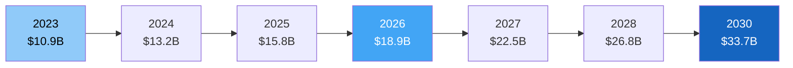
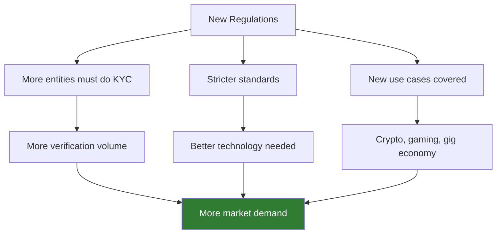
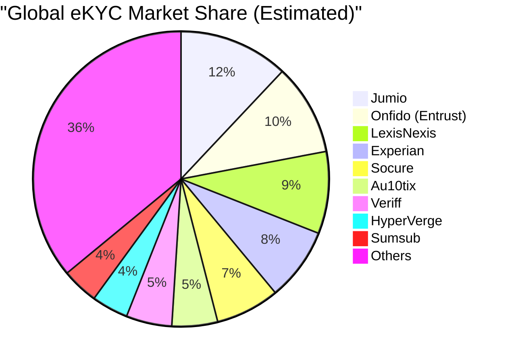

# eKYC Market Landscape

## Overview

The global eKYC and digital identity verification market is one of the fastest-growing segments in fintech infrastructure. Driven by regulatory pressure, digital transformation, and the explosion of online financial services, the market is experiencing rapid growth with significant investment activity.

---

## Market Size & Growth

### Global Identity Verification Market

| Metric | Value |
|--------|-------|
| **Market size (2023)** | ~$10.9 billion |
| **Projected size (2030)** | ~$33.7 billion |
| **CAGR (2023-2030)** | ~17.5% |
| **Largest region** | North America (~35% share) |
| **Fastest growing region** | Asia-Pacific (~22% CAGR) |

### Market Segments

| Segment | 2023 Share | Growth Driver |
|---------|-----------|---------------|
| **Document verification** | ~30% | Regulatory mandate for ID checks |
| **Biometric verification** | ~28% | Face recognition adoption surge |
| **Database/API verification** | ~22% | Government digital identity APIs |
| **AML/Compliance screening** | ~12% | Expanding AML regulations globally |
| **Orchestration platforms** | ~8% | Best-of-breed integration trend |

---

## Growth Drivers

### 1. Regulatory Expansion

Key regulatory drivers:

| Regulation | Impact on Market |
|-----------|-----------------|
| **EU 6AMLD / AMLR** | Unified EU KYC rules, new AMLA authority — expanding demand |
| **FATF Travel Rule** | Crypto exchanges now require full KYC — massive new market |
| **India DPDP Act** | Data protection compliance increases need for proper eKYC infrastructure |
| **US Corporate Transparency Act** | Beneficial ownership reporting — drives KYB demand |
| **EU eIDAS 2.0** | Digital identity wallets — new infrastructure needed |
| **RBI V-KYC guidelines** | Video KYC as accepted method — created new sub-market |

### 2. Digital Banking Explosion

| Metric | Impact |
|--------|--------|
| **Neobank users globally** | 400+ million (2024), projected 1 billion by 2028 |
| **Digital lending volume** | $500+ billion globally — each loan needs KYC |
| **Embedded finance** | Every non-financial app adding financial features needs KYC |
| **BNPL (Buy Now Pay Later)** | Fast KYC critical for point-of-sale verification |

### 3. Crypto & Web3

The crypto industry became one of the largest buyers of eKYC solutions:

| Metric | Value |
|--------|-------|
| **Crypto users globally** | 500+ million |
| **Exchanges requiring KYC** | All major exchanges post-2021 |
| **New market created** | ~$1.5 billion in crypto-specific KYC spend |
| **Key requirement** | Speed — users want to start trading immediately |

### 4. Post-COVID Digital Acceleration

COVID-19 accelerated digital onboarding adoption by an estimated **3-5 years**:

- Banks that planned eKYC for 2025 implemented it in 2020
- Regulators fast-tracked digital KYC acceptance
- Consumer expectation of digital-first became permanent

---

## Regional Market Analysis

### Asia-Pacific — Fastest Growing

| Country | Market Driver | Key Differentiator |
|---------|-------------|-------------------|
| **India** | Aadhaar eKYC, Jan Dhan, UPI explosion | Government-driven at massive scale |
| **China** | Facial recognition mandate, social credit | State-controlled biometric infrastructure |
| **Singapore** | Singpass/MyInfo integration | Government digital identity platform |
| **Indonesia** | 270M population, fintech boom | Rapid mobile-first adoption |
| **Philippines** | PhilSys national ID rollout | Emerging digital identity infrastructure |

### North America — Largest Market

| Driver | Details |
|--------|---------|
| **Regulatory** | BSA/AML, CDD Rule, Corporate Transparency Act |
| **Fintech boom** | Massive neobank and lending startup ecosystem |
| **Crypto** | US is largest crypto market — drives KYC demand |
| **Fraud** | Highest identity fraud rates drive demand for better verification |

### Europe — Most Regulated

| Driver | Details |
|--------|---------|
| **AML Directives** | Progressive tightening from 3AMLD to AMLR |
| **eIDAS 2.0** | EU Digital Identity Wallet — transformative infrastructure |
| **Strong data protection** | GDPR compliance shapes how eKYC solutions must operate |
| **Open banking** | PSD2/PSD3 drives embedded finance → more KYC needed |

### Middle East & Africa — Emerging

| Country | Development |
|---------|-------------|
| **UAE** | Emirates ID-based KYC, Dubai as fintech hub |
| **Saudi Arabia** | Vision 2030 driving digital banking |
| **Nigeria** | NIN (National Identification Number) rollout |
| **Kenya** | M-Pesa mobile money driving financial inclusion KYC |

---

## Competitive Landscape

### Market Share (Estimated, 2024)

### Vendor Tiers

| Tier | Companies | Annual Revenue | Key Characteristics |
|------|-----------|---------------|---------------------|
| **Tier 1: Enterprise Leaders** | Jumio, Onfido/Entrust, LexisNexis, Experian | $100M+ | Global coverage, enterprise clients, full compliance suite |
| **Tier 2: Growth Players** | Socure, Au10tix, Veriff, Sumsub, HyperVerge | $30-100M | Strong in specific regions or verticals, rapidly scaling |
| **Tier 3: Specialists** | iProov, Regula, Microblink, ComplyAdvantage | $10-50M | Best-in-class in specific capability (biometrics, documents, AML) |
| **Tier 4: Emerging** | IDenfy, Shufti Pro, Persona, Alloy | $5-30M | Innovative approaches, targeting underserved segments |

### Recent M&A Activity

| Year | Acquirer | Target | Deal Value | Strategic Rationale |
|------|----------|--------|-----------|-------------------|
| 2024 | **Entrust** | Onfido | ~$400M | Combined digital certificates + identity verification |
| 2023 | **Thales** | OneSpan (partial) | — | Digital identity + e-signatures |
| 2022 | **LexisNexis** | Emailage | — | Email intelligence for identity |
| 2021 | **Mastercard** | Ekata | $850M | Identity verification data |
| 2021 | **Jumio** | — | $150M funding | Scale enterprise sales |
| 2020 | **Socure** | — | $100M Series D | ML-driven identity platform |

!!! info "Consolidation Trend"
    The eKYC market is consolidating rapidly. Expect more Tier 1 players to acquire Tier 3 specialists to build full-stack platforms. This creates opportunity for independent consultants and niche solution providers who can offer specialized capabilities that large platforms lack.

---

## Funding & Investment Activity

### Total VC Funding in Identity Verification (2019-2024)

| Year | Total Funding | Notable Rounds |
|------|--------------|----------------|
| 2019 | ~$800M | Jumio ($150M), Socure ($30M) |
| 2020 | ~$1.1B | Onfido ($100M), ID.me ($100M) |
| 2021 | ~$2.5B | Socure ($450M), Veriff ($100M), Sumsub ($6M) |
| 2022 | ~$1.8B | Persona ($200M), Sardine ($51M) |
| 2023 | ~$1.2B | Market correction, but continued strong investment |
| 2024 | ~$1.5B | Recovery, focus on AI-native solutions |

---

## Technology Trends Shaping the Market

### 1. AI/ML Getting More Sophisticated
- **Domain generalization** for liveness models that work across unseen attacks
- **Self-supervised learning** reducing labeling costs
- **Multimodal models** combining document + face + behavioral signals

### 2. Edge/On-Device Processing
- More processing moving to the phone (reduce latency, improve privacy)
- ONNX Runtime Mobile, CoreML, TensorFlow Lite enabling on-device inference
- Hybrid approach: quick on-device check + server-side confirmation

### 3. Reusable/Portable Identity
- Verify once, carry credentials in a digital wallet
- EU Digital Identity Wallet (EUDI) expected from 2026
- Reduces repeated KYC — threat and opportunity for providers

### 4. Anti-Deepfake Arms Race
- Deepfakes becoming commodity (apps like FaceSwap, DeepFaceLab)
- Injection attacks growing rapidly
- Driving demand for more sophisticated PAD and device integrity solutions

### 5. Orchestration Over Monolith
- Trend toward best-of-breed via orchestration platforms
- Companies want to mix vendors: Jumio for docs + iProov for liveness + ComplyAdvantage for AML
- Platforms like Alloy, Persona, Sardine enabling this

---

## Market Opportunities

### Underserved Segments

| Segment | Why Underserved | Opportunity |
|---------|----------------|-------------|
| **SME Banking** | Enterprise eKYC solutions too expensive | Affordable, self-service eKYC for small banks |
| **Africa & Southeast Asia** | Limited local document coverage | Region-specific document support |
| **Insurance** | Different verification needs (health data, beneficiaries) | Insurance-specific KYC workflows |
| **Real estate** | Complex multi-party verification | Property-specific KYB + identity verification |
| **Aging population** | Accessibility challenges with biometrics | Inclusive eKYC solutions |

### Emerging Use Cases

| Use Case | Market Size Potential | Status |
|----------|---------------------|--------|
| **Age verification** (online content) | $2-5B by 2028 | Growing — EU and UK mandating |
| **Gig economy verification** | $1-3B | Early stage |
| **Healthcare identity** | $2-4B | Emerging — telemedicine driving demand |
| **Education verification** | $500M-1B | Online exam proctoring + credential verification |
| **Government services** | $3-5B | Digital government transformation |

---

## Key Takeaways

!!! success "Summary"
    - The global eKYC market is **$10.9B (2023)** growing to **$33.7B by 2030** at ~17.5% CAGR
    - **Asia-Pacific** is the fastest-growing region, driven by India's Aadhaar and Southeast Asian fintech booms
    - **Crypto KYC** created an entirely new ~$1.5B sub-market
    - **Consolidation** is accelerating — large players acquiring specialists
    - **Orchestration platforms** are disrupting monolithic vendors
    - The **deepfake arms race** is driving continuous investment in PAD technology
    - Significant **underserved opportunities** remain in SME banking, emerging markets, and new verticals

---

## Related Articles

- **Previous**: [← eKYC End-to-End Flow](ekyc-end-to-end-flow.md)
- **Next**: [Use Cases by Industry →](ekyc-use-cases-by-industry.md)
- [eKYC Vendor Landscape](ekyc-vendor-landscape.md)
- [eKYC Ecosystem Overview](ekyc-ecosystem-overview.md)
- [Build vs Buy](../11-business-strategy/ekyc-build-vs-buy.md)
- [eKYC Competitive Analysis](../11-business-strategy/ekyc-competitive-analysis.md)
