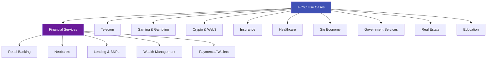
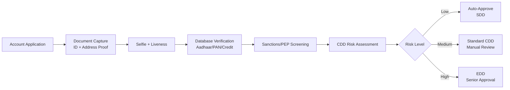
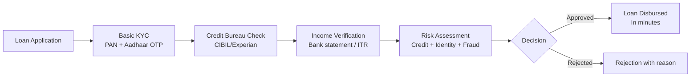
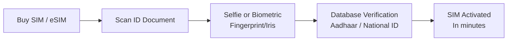
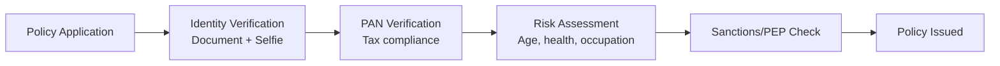

# eKYC Use Cases by Industry

## Overview

eKYC is not a one-size-fits-all solution. Different industries have different regulatory requirements, risk profiles, user expectations, and verification needs. This article explores how eKYC is applied across major industries, what specific challenges each faces, and what the typical verification flow looks like.

---

## Industry Map

---

## 1. Banking — Retail & Corporate

### Why eKYC is Needed
Banks are the most heavily regulated entities — KYC is a legal mandate in every jurisdiction. Traditional banks are now competing with neobanks on onboarding speed.

### Typical eKYC Flow

### Specific Requirements

| Requirement | Details |
|-------------|---------|
| **Regulation** | RBI KYC Master Direction (India), BSA/CIP (US), AML Directives (EU) |
| **Document types** | Government-issued photo ID + address proof |
| **Verification depth** | Full CDD: identity + address + source of funds (for high-value) |
| **Ongoing monitoring** | Transaction monitoring, periodic re-KYC (every 2-10 years) |
| **Special needs** | KYB for corporate accounts, UBO identification |
| **Typical volume** | 10K-1M+ verifications/month (varies by bank size) |

### Key Challenges
- **Legacy system integration** — Banks run on decades-old core banking systems
- **Multi-product KYC** — Same customer needs different KYC levels for savings vs loans vs investment
- **Re-KYC at scale** — Millions of existing customers need periodic re-verification
- **Regulatory variation** — Different rules per country/state for multinational banks

!!! example "Real-World Example"
    **HDFC Bank (India)** processes over 500,000 eKYC verifications per month using Aadhaar-based authentication. Their digital onboarding reduced account opening time from 3 days to under 10 minutes, with a 90% straight-through processing rate.

---

## 2. Neobanks & Digital-Only Banks

### Why eKYC is Critical
Neobanks have **no physical branches** — eKYC is literally the only way to onboard customers. Speed and conversion rate directly impact growth.

### Typical Flow

### Specific Requirements

| Requirement | Details |
|-------------|---------|
| **Speed** | < 2 minutes end-to-end (industry benchmark) |
| **Conversion rate** | Target: > 85% completion rate |
| **Mobile-first** | 95%+ users onboard via mobile app |
| **Global coverage** | Multi-country ID support for international expansion |
| **UX quality** | App Store ratings directly affected by onboarding experience |

### Key Metrics Neobanks Track

| Metric | Target | Industry Average |
|--------|--------|-----------------|
| **Time to complete KYC** | < 2 min | 3-5 min |
| **First attempt success rate** | > 80% | 65-75% |
| **Drop-off rate** | < 15% | 20-35% |
| **Auto-approval rate** | > 80% | 70-80% |
| **Cost per verification** | < $2 | $2-5 |

!!! example "Real-World Example"
    **Revolut** onboards users in under 3 minutes using Onfido's AI-powered document + face verification, supporting 30+ document types across 38 countries. Their fast onboarding helped them reach 35+ million customers.

---

## 3. Lending & BNPL (Buy Now Pay Later)

### Why eKYC is Critical
Speed is everything in lending — especially for micro-loans and BNPL. A customer applying for a loan at the point of sale won't wait 3 days.

### Typical Flow

### Specific Requirements

| Requirement | Details |
|-------------|---------|
| **Speed** | Approval + disbursement in < 5 minutes for micro-loans |
| **Fraud focus** | Synthetic identity fraud is a major risk in lending |
| **Income verification** | Beyond identity — need to verify ability to repay |
| **Repeat KYC** | Simplified re-verification for returning borrowers |
| **Regulatory** | Fair lending laws, interest rate disclosure, consent |

### BNPL-Specific Challenges
- **Point-of-sale KYC** — Must complete in 30-60 seconds while customer is checking out
- **Risk of stacking** — Same person taking BNPL from multiple providers
- **Young demographic** — First-time borrowers with thin credit files
- **Merchant integration** — KYC must be embedded in merchant's checkout flow

---

## 4. Cryptocurrency & Web3

### Why eKYC is Needed
FATF's Travel Rule and national regulations now require crypto exchanges to perform full KYC. This created a massive new market for eKYC providers.

### Typical Flow

### Specific Requirements

| Requirement | Details |
|-------------|---------|
| **Tiered verification** | Progressive KYC — basic access first, full access after complete verification |
| **Global coverage** | Users from 180+ countries with wildly different ID types |
| **Speed** | Users want to trade immediately — every minute of KYC delay = lost revenue |
| **Travel Rule compliance** | Must share originator/beneficiary data for cross-exchange transfers |
| **Blockchain analytics** | KYT (Know Your Transaction) — monitor on-chain activity |
| **Volume** | Major exchanges process millions of KYC verifications per month |

### Crypto-Specific Challenges
- **Pseudonymity culture** — Users resistant to KYC, may switch to non-KYC platforms
- **Global user base** — Must support obscure document types from nearly every country
- **Rapid scaling** — Bull markets cause 10x spikes in sign-up volume
- **Regulatory uncertainty** — Rules differ dramatically by country and change frequently

!!! example "Real-World Example"
    **Binance** uses Sumsub for global KYC, processing verification for 150+ million registered users across 180+ countries. They support 6,000+ document types and aim for < 5 minute verification.

---

## 5. Telecom

### Why eKYC is Needed
SIM card activation requires identity verification in most countries to prevent anonymous communication used for crime and terrorism.

### Typical Flow

### Specific Requirements

| Requirement | Details |
|-------------|---------|
| **Scale** | Telecom operators activate millions of SIMs monthly |
| **Cost sensitivity** | ARPU is low — KYC cost must be minimal (< $0.50) |
| **Field deployment** | Verification happens in retail stores, kiosks, doorstep delivery |
| **Offline capability** | Some areas have poor internet — need offline/partial-offline options |
| **Aadhaar integration** | In India, Aadhaar-based eKYC is the standard for SIM activation |

!!! example "Real-World Example"
    **Reliance Jio** activated 100 million SIM cards in just 170 days using Aadhaar eKYC — the fastest customer acquisition in telecom history. Each verification cost less than ₹5 (~$0.06).

---

## 6. Insurance

### Why eKYC is Needed
Insurance requires identity verification for policy issuance, claims processing, and beneficiary verification. Fraud is a major concern.

### Typical Flow (Policy Issuance)

### Specific Requirements

| Requirement | Details |
|-------------|---------|
| **Age verification** | Critical — determines premiums and eligibility |
| **Beneficiary verification** | Must verify identities of policy beneficiaries |
| **Claims verification** | Re-verify identity at claim time to prevent impersonation |
| **Health data integration** | Life/health insurance may need medical record verification |
| **Long lifecycle** | Policies last decades — re-KYC needed periodically |

---

## 7. Online Gaming & Gambling

### Why eKYC is Needed
Real-money gaming requires age verification (18+/21+) and identity verification to comply with gambling regulations and prevent money laundering.

### Typical Flow

### Specific Requirements

| Requirement | Details |
|-------------|---------|
| **Age gate** | Must be 100% certain user is 18+/21+ |
| **Geo-restriction** | Gambling legal only in certain jurisdictions — must verify location |
| **Self-exclusion** | Check against voluntary exclusion databases |
| **Deposit limits** | KYC level determines withdrawal/deposit limits |
| **Speed** | Users want to start playing immediately |
| **Re-verification** | At withdrawal time — prevent account takeover |

!!! example "Real-World Example"
    **Dream11** (India's largest fantasy sports platform) verifies 100+ million users using PAN-based eKYC. Full verification is required before users can withdraw winnings.

---

## 8. Gig Economy & Marketplaces

### Why eKYC is Needed
Platforms must verify drivers, delivery partners, hosts, and sellers to ensure safety and trust.

### Typical Flow (Driver Onboarding)

### Specific Requirements

| Requirement | Details |
|-------------|---------|
| **Multi-document** | ID + DL + vehicle registration + insurance |
| **Background checks** | Criminal record, driving history |
| **Ongoing verification** | Periodic selfie match to prevent account sharing |
| **Multi-country** | Different document types per country |
| **Trust & safety** | User safety depends on driver/partner verification quality |

---

## 9. Government Services

### Why eKYC is Needed
Government services are increasingly moving online — welfare distribution, tax filing, permit applications, and voting all require identity verification.

### Use Cases

| Service | eKYC Application |
|---------|-----------------|
| **Welfare distribution** | Verify beneficiary identity before disbursing subsidies (India's DBT) |
| **Tax filing** | PAN/Aadhaar verification for e-filing |
| **Passport application** | Pre-verification before appointment |
| **Digital signatures** | eKYC-verified digital certificate issuance |
| **Property registration** | Identity verification for land/property transactions |
| **Pension** | Periodic liveness verification for pensioners ("proof of life") |

!!! example "Real-World Example"
    **India's Direct Benefit Transfer (DBT)** uses Aadhaar eKYC to verify 300+ million beneficiaries, transferring over $350 billion in subsidies directly to verified bank accounts — eliminating massive middleman corruption.

---

## 10. Healthcare & Telemedicine

### Why eKYC is Needed
Patient identity verification prevents medical identity theft, ensures correct treatment, and complies with healthcare privacy regulations (HIPAA, etc.).

### Use Cases

| Use Case | eKYC Application |
|----------|-----------------|
| **Telemedicine** | Verify patient identity before virtual consultation |
| **Pharmacy** | Verify identity for controlled substance prescriptions |
| **Insurance claims** | Prevent fraudulent claims with identity verification |
| **Clinical trials** | Verify participant identity and eligibility |
| **Health records** | Authenticate access to electronic health records |

---

## Cross-Industry Comparison

| Industry | Speed Need | Volume | Fraud Risk | Regulatory Complexity | Primary eKYC Type |
|----------|-----------|--------|-----------|---------------------|-------------------|
| **Banking** | Medium | High | High | Very High | Document + Selfie + Database |
| **Neobanks** | Very High | High | High | High | Document + Selfie + Passive Liveness |
| **Lending** | Very High | Very High | Very High | High | Aadhaar/PAN + Credit Bureau |
| **Crypto** | High | Very High | High | Medium (changing) | Document + Selfie + Tiered |
| **Telecom** | High | Very High | Medium | Medium | Aadhaar/National ID |
| **Insurance** | Medium | Medium | Medium | Medium | Document + Database |
| **Gaming** | High | High | Medium | Medium | Document + Age Verification |
| **Gig Economy** | Medium | High | Medium | Low-Medium | Multi-document + Background |
| **Government** | Low-Medium | Very High | Medium | High | Aadhaar/National ID |
| **Healthcare** | Medium | Medium | Low-Medium | High (privacy) | Database + Photo Match |

---

## Key Takeaways

!!! success "Summary"
    - **Banking** is the largest eKYC market by revenue, driven by strict regulatory mandates
    - **Neobanks** push the boundaries on speed and UX — < 2 minute onboarding is the benchmark
    - **Crypto** created a massive new market with unique challenges (global coverage, tiered KYC, pseudonymity culture)
    - **Telecom** operates at extreme scale and cost sensitivity — Aadhaar eKYC at $0.06/verification
    - **Gaming** focuses on age verification and geo-restriction
    - **Gig economy** requires multi-document verification with ongoing re-verification
    - Each industry has **different priorities** — understanding these is key for solution design and consulting

---

## Related Articles

- **Previous**: [← Market Landscape](ekyc-market-landscape.md)
- **Next**: [Global Adoption →](ekyc-global-adoption.md)
- [eKYC End-to-End Flow](ekyc-end-to-end-flow.md)
- [eKYC Vendor Landscape](ekyc-vendor-landscape.md)
- [Case Study: India Banking eKYC](../10-case-studies/india-aadhaar-ekyc-scale.md)
- [Case Study: Crypto Exchange KYC](../10-case-studies/crypto-exchange-kyc.md)
