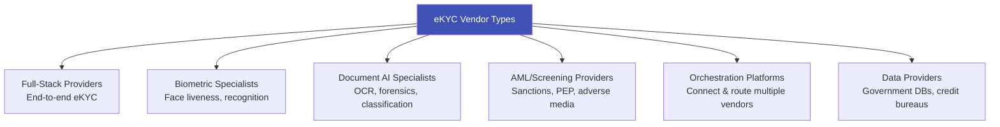
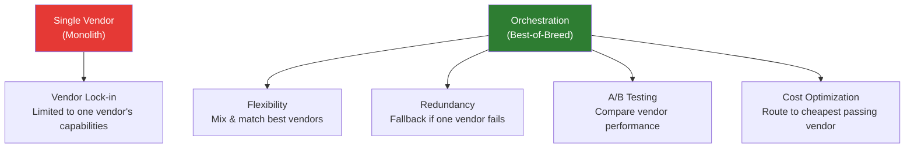

# eKYC Vendor Landscape

## Overview

The eKYC vendor landscape is crowded, fast-evolving, and increasingly specialized. Choosing the right vendor — or combination of vendors — is one of the most impactful decisions an organization makes in its identity verification journey. This article provides a comprehensive vendor analysis across capabilities, strengths, weaknesses, and positioning.

---

## Vendor Categories

---

## Full-Stack eKYC Providers

These companies offer the complete package: document verification + biometrics + liveness + screening.

### Detailed Comparison

| Provider | HQ | Founded | Document Types | Countries | Liveness | NIST FRVT | iBeta | Pricing Model |
|----------|-----|---------|---------------|-----------|----------|-----------|-------|---------------|
| **Jumio** | USA | 2010 | 5,000+ | 200+ | Active + Passive | Ranked | Level 1 & 2 | Per-verification |
| **Onfido (Entrust)** | UK | 2012 | 2,500+ | 195+ | Passive (Atlas AI) | Ranked | Level 1 & 2 | Per-verification + platform |
| **HyperVerge** | India/USA | 2014 | 1,000+ | 150+ | Active + Passive | — | Level 1 & 2 | Per-verification |
| **Veriff** | Estonia | 2015 | 12,000+ | 230+ | Video-based | — | Level 1 & 2 | Per-verification |
| **Sumsub** | UK | 2015 | 14,000+ | 220+ | Active + Passive | — | Level 1 | Per-verification + platform |
| **Au10tix** | Israel | 2002 | 6,000+ | 200+ | Passive | — | Level 1 | Per-verification |
| **IDenfy** | Lithuania | 2017 | 3,000+ | 200+ | Active + Passive | — | Level 1 | Per-verification |
| **Shufti Pro** | UK | 2017 | 3,000+ | 230+ | Active + Passive | — | Level 1 | Per-verification |
| **Regula** | USA | 1992 | 14,000+ | 247 | — | — | — | License + per-verification |
| **Socure** | USA | 2012 | — | USA focus | — | — | — | Per-verification |

### Provider Deep Dives

#### Jumio
**Strengths:** Pioneer in AI-based ID verification, strong enterprise relationships, proven at scale, comprehensive compliance suite.
**Weaknesses:** Premium pricing, can be slower to add new document types, US-centric support.
**Best for:** Large enterprises, banks, regulated industries needing proven compliance.
**Notable clients:** HSBC, United Airlines, Monzo, Nuvei.

#### Onfido (acquired by Entrust, 2024)
**Strengths:** Atlas AI engine (single model for document + face), strong European presence, developer-friendly API, Entrust's digital certificate infrastructure.
**Weaknesses:** Integration with Entrust still evolving, pricing increased post-acquisition.
**Best for:** Fintechs and neobanks, especially in Europe and UK.
**Notable clients:** Revolut, Bitstamp, Zipcar, Curve.

#### HyperVerge
**Strengths:** Deep India/Southeast Asia expertise, fast processing, competitive pricing, strong Aadhaar integration.
**Weaknesses:** Less coverage in Europe/Americas, smaller brand recognition globally.
**Best for:** India-focused banks, fintechs, and telecom operators.
**Notable clients:** Jio, SBI, CRED, Jupiter, Razorpay.

#### Veriff
**Strengths:** Video-first approach, excellent fraud detection, strong European coverage, high accuracy on diverse demographics.
**Weaknesses:** Higher latency (video processing), may be overkill for simple use cases.
**Best for:** Companies needing high-assurance verification, European market focus.
**Notable clients:** Bolt, Wise, Blockchain.com, Starship Technologies.

#### Sumsub
**Strengths:** All-in-one compliance platform (KYC + KYB + AML + transaction monitoring), competitive pricing, fast integration.
**Weaknesses:** Less specialized in any single capability, newer player.
**Best for:** Crypto exchanges, fintech startups wanting all-in-one solution.
**Notable clients:** Binance, OKX, Mercuryo, BitMEX.

#### Regula
**Strengths:** Deepest document forensics expertise (30+ years), on-premise deployment option, hardware document readers.
**Weaknesses:** Less focus on biometrics/liveness, more traditional business model.
**Best for:** Border control, high-security environments, organizations needing on-premise.
**Notable clients:** Government agencies, border control, embassies.

#### Socure
**Strengths:** ML-driven identity decisioning, strong in US market, excellent fraud prediction, proprietary data network.
**Weaknesses:** US-focused (limited international), less focus on document/biometric capture.
**Best for:** US banks and fintechs focused on identity fraud prevention.
**Notable clients:** Chime, SoFi, DraftKings, Capital One.

---

## Biometric Specialists

| Provider | HQ | Specialty | Key Technology | Notable Feature |
|----------|-----|-----------|---------------|-----------------|
| **iProov** | UK | Face liveness | Flashmark (patented illumination) | Certified to NIST, iBeta Level 2 |
| **FacePhi** | Spain | Face recognition | Strong in Latin America banking | On-device + server hybrid |
| **Innovatrics** | Slovakia | Face recognition | NIST FRVT top performer | Edge deployment capable |
| **Aware** | USA | Multi-modal biometrics | Face + fingerprint + iris | Government and enterprise |
| **Daon** | USA/Ireland | Biometric MFA | IdentityX platform | Multi-factor biometric |
| **ID R&D** | USA | Voice + face | Passive liveness (voice & face) | Anti-spoofing specialist |
| **BioID** | Germany | Liveness detection | Photo/video liveness | Privacy-focused |
| **Paravision** | USA | Face recognition | NIST FRVT top-5 | Ethical AI focus |

### When to Choose a Specialist Over Full-Stack

| Scenario | Choose Specialist | Choose Full-Stack |
|----------|------------------|-------------------|
| Need best-in-class liveness | ✅ iProov, ID R&D | |
| Need highest face matching accuracy | ✅ Innovatrics, Paravision | |
| Want single vendor simplicity | | ✅ Jumio, Onfido |
| Building custom pipeline | ✅ Mix-and-match best of breed | |
| Regulatory mandates specific certification | ✅ iBeta-certified specialist | |
| Budget constrained startup | | ✅ All-in-one (Sumsub, IDenfy) |

---

## Document AI Specialists

| Provider | Specialty | Key Feature | Deployment |
|----------|-----------|-------------|------------|
| **Microblink** | Mobile document scanning | BlinkID — on-device, fast | Mobile SDK |
| **Anyline** | Mobile OCR | Works offline | Mobile SDK |
| **ABBYY** | Enterprise OCR | FlexiCapture, FineReader | Server/Cloud |
| **Google Document AI** | Cloud OCR | Part of Google Cloud, ML-powered | Cloud API |
| **AWS Textract** | Cloud OCR | Integrated with AWS ecosystem | Cloud API |
| **Azure Document Intelligence** | Cloud OCR | Integrated with Azure | Cloud API |

---

## AML & Screening Providers

| Provider | Specialty | Data Sources | Key Differentiator |
|----------|-----------|-------------|-------------------|
| **ComplyAdvantage** | Real-time AML data | Proprietary ML-curated data | AI-powered, fewer false positives |
| **Dow Jones Risk & Compliance** | PEP + sanctions | Curated by Dow Jones journalists | Highest quality manual curation |
| **Refinitiv World-Check** | PEP + sanctions screening | 30,000+ sources | Largest coverage |
| **LexisNexis** | Identity + risk data | Extensive US data | Combined identity + screening |
| **Chainalysis** | Crypto compliance | Blockchain analytics | Crypto-specific KYT |
| **Elliptic** | Crypto compliance | Blockchain analytics | Cross-chain analytics |
| **NICE Actimize** | Enterprise AML | Transaction monitoring | Full AML platform for large banks |

---

## Orchestration Platforms

These platforms let you connect multiple eKYC/AML vendors into a single workflow:

| Platform | HQ | What It Does | Key Feature |
|----------|-----|-------------|-------------|
| **Alloy** | USA | Identity orchestration | Connect 200+ data sources, rules engine |
| **Persona** | USA | Identity infrastructure | Beautiful UX, developer-friendly, flexible workflows |
| **Sardine** | USA | Fraud + KYC orchestration | Device intelligence + identity in one |
| **Unit21** | USA | Risk & compliance ops | Case management + rules + ML |
| **Plaid** | USA | Financial data + identity | Bank account linking + identity verification |
| **Trulioo** | Canada | Global identity network | 500+ data sources, 195 countries |
| **Prove** | USA | Phone-centric identity | Phone number intelligence for identity |

### Why Orchestration is Growing

---

## Vendor Selection Framework

### Step 1: Define Your Requirements

| Requirement Category | Questions to Answer |
|---------------------|-------------------|
| **Geography** | Which countries will your users come from? |
| **Document types** | Which specific IDs do you need to support? |
| **Volume** | How many verifications per month? |
| **Speed** | What's your maximum acceptable verification time? |
| **Security level** | What liveness level do you need? (passive, active, iBeta certified?) |
| **Compliance** | Which regulations must you comply with? (GDPR, RBI, etc.) |
| **Integration** | Mobile SDK? Web SDK? API only? |
| **Deployment** | Cloud only, or need on-premise/hybrid? |
| **Budget** | What's your per-verification budget? |

### Step 2: Evaluate Against Criteria

| Evaluation Criteria | Weight | How to Test |
|--------------------|--------|-------------|
| **Accuracy (face match)** | 20% | Run test dataset through vendor API |
| **Liveness strength** | 20% | Attempt spoofing attacks in POC |
| **Document coverage** | 15% | Test with actual documents from your user base |
| **Speed / latency** | 10% | Measure end-to-end processing time |
| **UX quality** | 10% | Test with real users, measure completion rate |
| **API / SDK quality** | 10% | Developer experience evaluation |
| **Pricing** | 10% | Total cost at projected volume |
| **Compliance & certifications** | 5% | Check iBeta, NIST, SOC2, ISO 27001 |

### Step 3: POC (Proof of Concept)

!!! tip "Always Run a POC"
    Never select an eKYC vendor based on demos and sales decks alone. Run a **2-4 week POC** with:
    
    - **Real documents** from your target user base (not just US passports)
    - **Real spoofing attempts** (print attacks, screen replay at minimum)
    - **Real user testing** (actual target users, not internal team)
    - **Edge cases** — poor lighting, damaged documents, elderly users
    - **Volume testing** — ensure the system handles your peak load

---

## Pricing Landscape

### Typical Pricing Ranges (2024-2025)

| Vendor Tier | Per Verification | Monthly Minimum | Setup Fee |
|-------------|-----------------|-----------------|-----------|
| **Tier 1 Enterprise** (Jumio, Onfido) | $2.00-$5.00 | $5,000-$20,000 | $10,000-$50,000 |
| **Tier 2 Growth** (Veriff, Sumsub, HyperVerge) | $1.00-$3.00 | $1,000-$5,000 | $0-$10,000 |
| **Tier 3 Startup-Friendly** (IDenfy, Shufti Pro) | $0.50-$2.00 | $500-$2,000 | $0-$5,000 |
| **Biometric Specialist** (iProov) | $0.10-$0.50 (liveness only) | Varies | Varies |
| **Orchestration Platform** (Alloy, Persona) | $500-$5,000/mo + $0.50-$2.00/check | Platform fee | $5,000-$25,000 |

!!! info "Volume Discounts"
    All vendors offer significant volume discounts:
    
    - **10K/month**: Standard pricing
    - **100K/month**: 20-40% discount
    - **1M/month**: 50-70% discount
    - **10M+/month**: Custom enterprise pricing (often < $0.50/verification)

---

## Vendor Landscape by Region

### Best for India
1. **HyperVerge** — Deep India expertise, Aadhaar integration, competitive pricing
2. **IDfy** (India-based) — Specialized in Indian document verification
3. **Digio** (India-based) — eKYC + eSigning for Indian market
4. **Signzy** (India-based) — AI-powered KYC for Indian banks

### Best for Europe
1. **Onfido/Entrust** — Strong EU coverage, eIDAS awareness
2. **Veriff** — Estonian-based, excellent European support
3. **IDnow** (Germany) — VideoIdent specialist for German market
4. **Sumsub** — Good EU coverage, GDPR-compliant

### Best for USA
1. **Socure** — Best US identity fraud prevention
2. **Jumio** — Established enterprise relationships
3. **Persona** — Developer-friendly, modern API
4. **Alloy** — Orchestration for US financial institutions

### Best for Crypto/Global
1. **Sumsub** — All-in-one crypto compliance
2. **Jumio** — Enterprise-grade, global coverage
3. **Veriff** — High fraud detection, global reach
4. **Chainalysis** (for KYT/blockchain analytics)

---

## Key Takeaways

!!! success "Summary"
    - The eKYC vendor landscape has **6 categories**: full-stack, biometric specialists, document AI, AML screening, orchestration platforms, and data providers
    - **No single vendor is best at everything** — the trend is toward best-of-breed via orchestration
    - **Always run a POC** with real documents, real users, and real attack attempts
    - **Pricing varies 10x** between tiers — volume, commitment, and negotiation matter enormously
    - **Regional expertise matters** — choose vendors with deep experience in your target markets
    - **Consolidation is accelerating** — today's independent vendor may be tomorrow's acquisition
    - The **orchestration model** gives maximum flexibility but adds integration complexity

---

## Related Articles

- **Previous**: [← Future Trends](ekyc-future-trends.md)
- **Back to Foundations**: [Foundations Index](index.md)
- [eKYC Ecosystem Overview](ekyc-ecosystem-overview.md)
- [eKYC Market Landscape](ekyc-market-landscape.md)
- [Build vs Buy](../11-business-strategy/build-vs-buy.md)
- [eKYC Vendor Evaluation Matrix](../11-business-strategy/competitive-landscape.md)
- [eKYC Competitive Analysis](../11-business-strategy/competitive-landscape.md)
