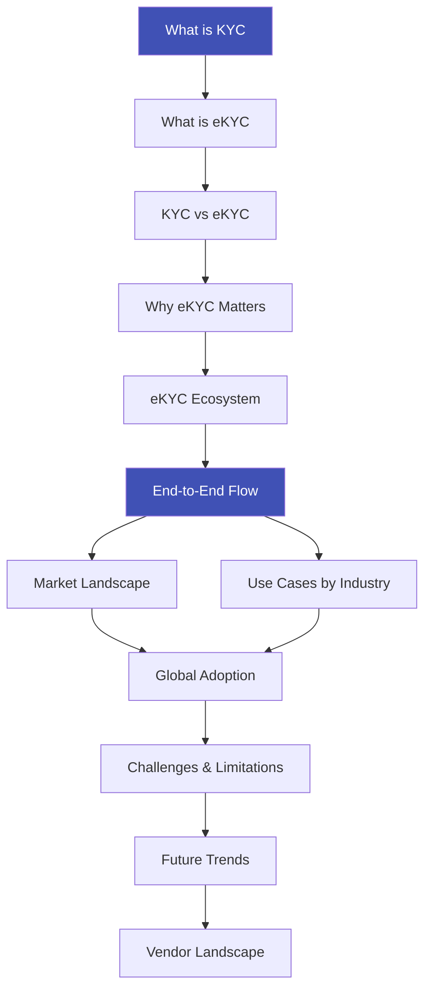

# 🏗️ Foundations

## Understanding eKYC from the Ground Up

This section covers everything you need to understand the **what, why, and how** of KYC and its digital transformation into eKYC. Whether you're new to the space or a seasoned professional, start here for a solid foundation.

---

## Articles in This Section

| # | Article | What You'll Learn |
|---|---------|-------------------|
| 1 | [What is KYC](what-is-kyc.md) | The origin, history, and regulatory foundation of Know Your Customer |
| 2 | [What is eKYC](what-is-ekyc.md) | How KYC went digital — the complete evolution |
| 3 | [KYC vs eKYC](kyc-vs-ekyc.md) | Side-by-side comparison of traditional vs electronic KYC |
| 4 | [Why eKYC Matters](why-ekyc-matters.md) | Business case, cost savings, conversion rates, and impact |
| 5 | [eKYC Ecosystem Overview](ekyc-ecosystem-overview.md) | All players: regulators, providers, banks, fintechs |
| 6 | [eKYC End-to-End Flow](ekyc-end-to-end-flow.md) | Complete user journey with detailed flowcharts |
| 7 | [Market Landscape](ekyc-market-landscape.md) | Market size, growth projections, and trends |
| 8 | [Use Cases by Industry](ekyc-use-cases-by-industry.md) | Banking, fintech, telecom, insurance, crypto, gaming |
| 9 | [Global Adoption](ekyc-global-adoption.md) | Country-by-country adoption and maturity |
| 10 | [Challenges & Limitations](ekyc-challenges-and-limitations.md) | Edge cases, failures, and inclusivity issues |
| 11 | [Future Trends](ekyc-future-trends.md) | Decentralized identity, AI advances, reusable KYC |
| 12 | [Vendor Landscape](ekyc-vendor-landscape.md) | Major vendors compared |

---

## Reading Order

!!! tip "Recommended Starting Point"
    If you're completely new to eKYC, start with **[What is KYC](what-is-kyc.md)** and follow the reading order above. If you already know the basics, jump directly to **[eKYC End-to-End Flow](ekyc-end-to-end-flow.md)** for the complete technical picture.
