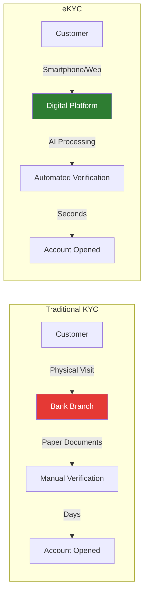
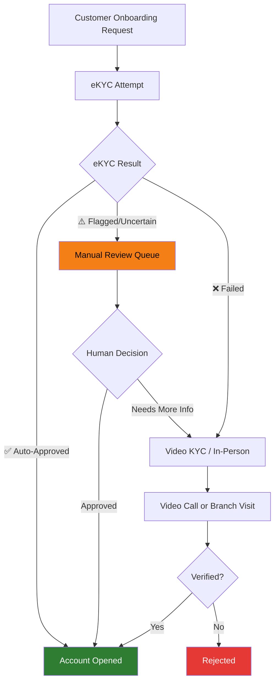
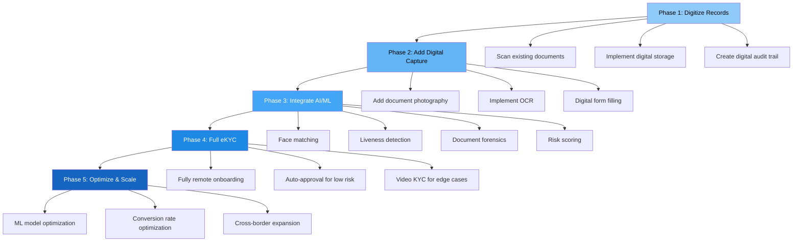

# KYC vs eKYC — A Comprehensive Comparison

## Overview

KYC (Know Your Customer) and eKYC (Electronic Know Your Customer) share the same goal — verifying customer identity — but differ fundamentally in **how** they achieve it. This article provides a detailed, side-by-side comparison across every dimension.

---

## The Fundamental Difference

---

## Detailed Comparison Table

### Process & Operations

| Dimension | Traditional KYC | eKYC |
|-----------|----------------|------|
| **Customer location** | Must visit a physical branch | Anywhere with internet connection |
| **Document handling** | Original documents physically inspected | Document images captured via camera |
| **Verification method** | Human visual inspection | AI/ML-powered automated analysis |
| **Data entry** | Manual by bank staff | Automatic via OCR |
| **Face verification** | Visual comparison by staff | Automated face matching (ArcFace, etc.) |
| **Liveness check** | Implicit (person is physically present) | Explicit (PAD: anti-spoofing AI models) |
| **Document authenticity** | Manual inspection (limited) | AI forensics (tamper detection, liveness) |
| **Database verification** | Manual lookup or batch processing | Real-time API calls |
| **Risk assessment** | Staff judgment + basic checklists | ML-based risk scoring engine |
| **Decision making** | Entirely human | Automated with human review for edge cases |
| **Audit trail** | Paper records, photocopies | Full digital log with timestamps, scores, images |
| **Storage** | Physical document archives | Cloud/digital storage with encryption |

### Performance Metrics

| Metric | Traditional KYC | eKYC |
|--------|----------------|------|
| **Time to verify** | 3-7 days (can be weeks) | 30 seconds - 5 minutes |
| **Cost per verification** | $15-$25 USD | $0.50-$5 USD |
| **Error rate (data entry)** | ~5% manual error rate | <1% with good OCR |
| **Fraud detection rate** | 60-70% (human dependent) | 90-99% (multi-layer AI) |
| **Throughput** | 20-50 verifications/agent/day | Thousands per minute (cloud-scaled) |
| **Availability** | Branch hours only (9-5) | 24/7/365 |
| **Conversion rate** | 50-70% (many abandon mid-process) | 80-95% (single-session completion) |
| **Re-verification speed** | Days (schedule appointment, visit) | Minutes (re-submit digitally) |

### Customer Experience

| Aspect | Traditional KYC | eKYC |
|--------|----------------|------|
| **First interaction** | Travel to branch, wait in queue | Open app, start immediately |
| **Documents needed** | Originals + photocopies + utility bills | Phone camera photo of ID |
| **Number of visits** | 1-3 visits typically | Zero physical visits |
| **Waiting time** | Hours at branch + days for processing | Real-time or minutes |
| **Language support** | Limited to staff language skills | Multi-language UI + multi-script OCR |
| **Accessibility** | Physical access required | Accessible to anyone with a smartphone |
| **Retry on failure** | Must revisit branch | Instant retry from phone |
| **Status tracking** | Call the branch | Real-time status in app |

### Security & Compliance

| Aspect | Traditional KYC | eKYC |
|--------|----------------|------|
| **Spoofing risk** | Low (physical presence) | Higher (requires liveness detection) |
| **Document forgery detection** | Limited (human judgment) | Advanced (AI forensics) |
| **Deepfake risk** | None (in-person) | Significant (requires injection attack detection) |
| **Data breach risk** | Physical theft of documents | Cyber attacks on digital storage |
| **Compliance audit** | Painful (search paper records) | Easy (searchable digital records) |
| **Regulatory acceptance** | Universal | Varies by country (growing acceptance) |
| **Biometric data concerns** | Minimal (no biometric storage) | Significant (face data storage/processing) |
| **Consent management** | Paper consent forms | Digital consent with timestamp proof |

---

## Where Traditional KYC Still Wins

Despite eKYC's advantages, there are scenarios where traditional KYC is still preferred or required:

!!! warning "When Traditional KYC is Better"
    1. **Ultra-high-risk customers** — Some EDD scenarios require in-person meetings with senior management approval
    2. **Complex corporate structures** — KYB for multi-layered holding companies may need physical document review
    3. **Regulatory mandates** — Some jurisdictions still require in-person verification for certain products (e.g., large insurance policies in some countries)
    4. **Edge cases** — Customers with severely damaged documents, rare document types, or biometric challenges
    5. **Elderly/non-digital populations** — Customers who cannot use smartphones or webcams
    6. **NFC-only documents** — Some secure verifications require physical chip reading in a controlled environment

---

## Where eKYC is Clearly Superior

!!! success "eKYC Advantages"
    1. **Scale** — Can handle millions of verifications simultaneously
    2. **Speed** — Seconds vs days
    3. **Cost** — 5-50x cheaper per verification
    4. **Consistency** — AI doesn't have bad days or varying skill levels
    5. **Financial inclusion** — Reaches remote and rural populations
    6. **Fraud detection** — Multi-layered AI detection far exceeds human capability
    7. **Audit readiness** — Every step logged, timestamped, and searchable
    8. **Customer satisfaction** — Dramatically better experience drives higher conversion
    9. **Global reach** — Single platform can verify IDs from 190+ countries
    10. **Continuous improvement** — ML models get better with more data; humans plateau

---

## The Hybrid Approach

In practice, most organizations use a **hybrid model** combining the best of both:

**Typical distribution in a mature eKYC system:**

| Outcome | Percentage | Method |
|---------|-----------|--------|
| Auto-approved by eKYC | 70-85% | Fully automated |
| Manual review (resolved) | 10-20% | Human + AI assisted |
| Escalated to Video KYC / in-person | 3-8% | Hybrid |
| Rejected | 2-5% | Automated or human |

---

## Cost Comparison (Realistic Breakdown)

### Traditional KYC Cost Per Verification

| Cost Component | Amount |
|---------------|--------|
| Staff salary (15 min @ $20/hr) | $5.00 |
| Branch overhead (space, utilities) | $3.00 |
| Paper, printing, photocopying | $1.00 |
| Physical document storage (per year) | $2.00 |
| Manual database checks | $2.00 |
| Compliance review | $3.00 |
| Courier/logistics (if needed) | $2.00 |
| **Total** | **$15-$25** |

### eKYC Cost Per Verification

| Cost Component | Amount |
|---------------|--------|
| OCR/Document processing (API call) | $0.10-$0.50 |
| Face matching (API call) | $0.05-$0.20 |
| Liveness detection (API call) | $0.10-$0.50 |
| Database verification APIs | $0.20-$1.00 |
| Sanctions/PEP screening | $0.10-$0.50 |
| Cloud infrastructure | $0.05-$0.20 |
| Manual review (for flagged cases only) | $0.50-$2.00 (amortized) |
| **Total** | **$0.50-$5.00** |

!!! info "Volume Matters"
    eKYC costs drop significantly at scale. A provider processing 1 million verifications/month can achieve costs as low as $0.30-$0.50 per verification, while traditional KYC costs remain relatively fixed regardless of volume.

---

## Migration Path: KYC → eKYC

For organizations transitioning from traditional to electronic KYC:

---

## Key Takeaways

!!! success "Summary"
    - eKYC is **not a replacement** for KYC — it's a **digital execution** of the same regulatory requirement
    - eKYC is **5-50x cheaper**, **100-1000x faster**, and **more accurate** than traditional KYC
    - **Hybrid models** are the reality — most organizations use eKYC as the primary path with human fallbacks
    - The main tradeoff: eKYC introduces **new attack vectors** (spoofing, deepfakes, injection) that require dedicated AI defenses
    - **Migration is gradual** — organizations typically move through phases over 1-3 years
    - **ROI is compelling** — even partial eKYC adoption shows significant cost savings and conversion improvements

---

## Related Articles

- **Previous**: [← What is eKYC](what-is-ekyc.md)
- **Next**: [Why eKYC Matters →](why-ekyc-matters.md)
- [What is KYC](what-is-kyc.md)
- [eKYC End-to-End Flow](ekyc-end-to-end-flow.md)
- [eKYC Challenges & Limitations](ekyc-challenges-and-limitations.md)
- [eKYC System Architecture](../09-infrastructure/ekyc-system-architecture.md)
