# What is eKYC (Electronic Know Your Customer)?

## Definition

**eKYC (Electronic Know Your Customer)** is the digital process of verifying a customer's identity remotely using electronic means — without requiring a physical visit to a branch or in-person document inspection. It leverages technologies like AI/ML, biometrics, optical character recognition (OCR), document forensics, and government database APIs to perform identity verification in real-time.

In simple terms: **eKYC does everything traditional KYC does, but digitally, faster, and at scale.**

---

## The Evolution: From Paper to Pixels


### What Changed?

The shift from KYC to eKYC was driven by three converging forces:

1. **Smartphone penetration** — Billions of people now carry high-quality cameras and internet connectivity in their pockets
2. **AI/ML breakthroughs** — Face recognition, OCR, and liveness detection became accurate enough for production use
3. **Regulatory acceptance** — Governments started accepting digital verification as legally equivalent to in-person verification

---

## How eKYC Works — The Complete Flow

```mermaid
graph TD
    A[📱 Customer Opens App/Web] --> B[📸 Capture ID Document]
    B --> C[🔍 Document Processing]
    C --> C1[OCR / Data Extraction]
    C --> C2[Document Classification]
    C --> C3[Document Authenticity Check]
    C --> C4[Document Liveness Check]

    C1 --> D[📋 Extracted Data]
    C2 --> D
    C3 --> D
    C4 --> D

    D --> E[🤳 Capture Selfie]
    E --> F[👤 Face Processing]
    F --> F1[Face Detection]
    F --> F2[Face Liveness / PAD]
    F --> F3[Face Matching: Selfie ↔ ID Photo]

    F1 --> G[✅ Biometric Result]
    F2 --> G
    F3 --> G

    G --> H[🔎 Backend Verification]
    H --> H1[Government Database Check]
    H --> H2[Sanctions / PEP Screening]
    H --> H3[AML Screening]
    H --> H4[Risk Scoring]

    H1 --> I{📊 Decision}
    H2 --> I
    H3 --> I
    H4 --> I

    I -->|Auto-Approved| J[✅ KYC Complete]
    I -->|Flagged| K[👨‍💼 Manual Review]
    I -->|Rejected| L[❌ Rejected]

    K -->|Approved| J
    K -->|Rejected| L

    style A fill:#4051B5,color:#fff
    style J fill:#2E7D32,color:#fff
    style L fill:#e53935,color:#fff
    style K fill:#F57F17,color:#000
```



### Step-by-Step Breakdown

#### Step 1: Document Capture
The customer photographs their government-issued ID (passport, driver's license, national ID, Aadhaar, PAN, etc.) using their phone camera or webcam.

**What happens behind the scenes:**

- **Auto-capture guidance** — On-screen rectangle guides the user to align the document
- **Blur detection** — Rejects blurry images
- **Glare detection** — Detects reflections that obscure text
- **Edge detection** — Identifies document boundaries for cropping
- **Image quality assessment** — Ensures the capture meets minimum quality thresholds

#### Step 2: Document Processing
The captured image goes through multiple AI pipelines simultaneously:

| Pipeline | Purpose | Technology |
|----------|---------|------------|
| **Document Classification** | Identify which type of document it is (passport, DL, national ID, etc.) | CNN classifier |
| **OCR / Data Extraction** | Extract text fields (name, DOB, ID number, address, expiry) | LayoutLMv3, PaddleOCR, Tesseract |
| **MRZ Reading** | Parse machine-readable zone on passports | Regex + OCR |
| **Document Authenticity** | Check for tampering, forgery, digital manipulation | Document forensics models |
| **Document Liveness** | Ensure it's a real physical document, not a screen/photocopy | Screen recapture detection |
| **Security Features** | Verify holograms, microprint, UV features (where possible) | Specialized CV models |

#### Step 3: Selfie Capture & Face Processing
The customer takes a selfie (or short video), which goes through:

| Pipeline | Purpose | Technology |
|----------|---------|------------|
| **Face Detection** | Locate the face in the image | SCRFD, RetinaFace |
| **Face Liveness (PAD)** | Verify the face is live — not a photo, screen, mask, or deepfake | CNN/ViT liveness models |
| **Face Quality** | Check pose, lighting, occlusion, resolution | Quality assessment models |
| **Face Matching** | Compare selfie face to face on the ID document (1:1 verification) | ArcFace, AdaFace embeddings |

#### Step 4: Backend Verification
Extracted data is cross-checked against authoritative sources:

- **Government databases** — Aadhaar (UIDAI), PAN (NSDL), DL (Vahan/Sarathi), Passport, Voter ID
- **Sanctions lists** — OFAC, UN, EU, UK HMT sanctions
- **PEP databases** — Politically Exposed Persons lists
- **Adverse media** — Negative news screening
- **Credit bureaus** — Identity cross-reference (CIBIL, Experian)
- **Bank account verification** — Penny drop for account ownership confirmation

#### Step 5: Risk Scoring & Decision
All signals are aggregated into a risk score:

```mermaid
graph LR
    A[Document Score] --> E[Risk Engine]
    B[Face Match Score] --> E
    C[Liveness Score] --> E
    D[Database Check Results] --> E
    F[Sanctions/PEP Results] --> E
    G[Device/IP Signals] --> E

    E --> H{Decision}
    H -->|Score > 85| I[✅ Auto-Approve]
    H -->|Score 50-85| J[🔍 Manual Review]
    H -->|Score < 50| K[❌ Auto-Reject]

    style E fill:#4051B5,color:#fff
    style I fill:#2E7D32,color:#fff
    style K fill:#e53935,color:#fff
    style J fill:#F57F17,color:#000
```



---

## Types of eKYC

Different approaches to electronic identity verification:

### 1. Document-Based eKYC (Most Common Globally)

```
Document Photo + Selfie + Liveness → AI Verification → Decision
```

- Customer photographs their ID and takes a selfie
- AI extracts data, checks document authenticity, matches faces
- Most widely adopted method worldwide
- Used by: Jumio, Onfido, IDenfy, HyperVerge, Veriff, etc.

### 2. Aadhaar-Based eKYC (India-Specific)

```
Aadhaar Number + Biometric/OTP → UIDAI Database → Verified Data Returned
```

- Customer provides Aadhaar number and authenticates via fingerprint, iris, or OTP
- UIDAI returns verified demographic data directly
- No document photography needed — data comes from the government database
- World's largest digital identity system (1.4 billion enrolled)

!!! info "Two Modes of Aadhaar eKYC"
    - **Biometric mode**: Fingerprint or iris scan → highest assurance
    - **OTP mode**: OTP sent to registered mobile → convenient but lower assurance
    - **Offline Aadhaar**: Downloaded XML with digital signature → no real-time UIDAI connection needed

### 3. Video KYC (V-KYC)

```
Live Video Call + Document Display + Agent Verification → Decision
```

- Live video call between customer and a trained KYC agent
- Customer shows documents on camera, agent verifies in real-time
- AI assists with face matching, liveness, document reading
- Mandated as an option by RBI (India) since January 2020
- Provides human-in-the-loop assurance for high-risk scenarios

### 4. Database-Driven eKYC

```
Customer Data Input → API Check Against Government/Credit Databases → Verified
```

- Customer provides basic details (name, DOB, ID number)
- System verifies against government or credit databases via API
- No biometric or document capture required
- Used for lower-risk scenarios (e.g., pre-paid SIM activation in some countries)

### 5. NFC-Based eKYC

```
Tap e-Passport/Smart ID on Phone → Read Chip Data → Cryptographic Verification
```

- Customer taps their chip-enabled document (e-passport, smart national ID) on their NFC-enabled phone
- Chip contains digitally signed data (photo, fingerprints, personal details)
- Cryptographic verification ensures data hasn't been tampered with
- Highest assurance level — data is signed by the issuing government
- Growing adoption in EU (eIDAS), supported by newer phones

### Comparison of eKYC Types

| Method | Assurance Level | Speed | Cost | User Effort | Where Used |
|--------|----------------|-------|------|-------------|------------|
| **Document + Selfie** | High | 30-60 sec | $$$ | Medium | Global |
| **Aadhaar Biometric** | Very High | 5-10 sec | $ | Low | India |
| **Aadhaar OTP** | Medium | 15-30 sec | $ | Low | India |
| **Video KYC** | Very High | 5-10 min | $$$$ | High | India, some EU |
| **Database Check** | Medium | 2-5 sec | $ | Low | Various |
| **NFC Chip Read** | Highest | 10-20 sec | $$ | Medium | EU, some Asia-Pacific |

---

## The Technology Stack Behind eKYC


---

## eKYC vs Traditional KYC — Quick Comparison

| Dimension | Traditional KYC | eKYC |
|-----------|----------------|------|
| **Location** | Bank branch (in-person) | Anywhere (phone/laptop) |
| **Time** | 3-7 days | 30 seconds - 5 minutes |
| **Cost per verification** | $15-$25 | $0.50-$5 |
| **Accuracy** | Depends on staff training | Consistent AI-driven accuracy |
| **Scalability** | Linear (more staff = more capacity) | Near-infinite (cloud-based) |
| **Customer experience** | Poor (multiple visits, waiting) | Smooth (single session) |
| **Fraud detection** | Manual, error-prone | AI-powered, multi-layered |
| **Audit trail** | Paper records, hard to search | Digital, fully searchable |
| **Accessibility** | Excludes remote/rural populations | Includes anyone with a smartphone |
| **24/7 availability** | Branch hours only | Always available |

---

## Real-World Impact Numbers

!!! success "eKYC in Action"
    - **India (Aadhaar eKYC)**: Over 100 million eKYC transactions per month. Reduced bank account opening time from days to minutes.
    - **Jio (Telecom)**: Onboarded 100 million subscribers in 170 days using Aadhaar eKYC — the fastest customer acquisition in telecom history.
    - **Paytm Payments Bank**: Opened 10 million accounts in the first 5 months using eKYC.
    - **Revolut (UK Neobank)**: eKYC-powered onboarding helped reach 35+ million customers across 38 countries.
    - **Grab (Southeast Asia)**: Uses eKYC to onboard drivers and merchants in 8 countries with varying ID document types.
    - **Binance (Crypto)**: Processes millions of KYC verifications monthly across 180+ countries using AI-powered eKYC.

---

## Challenges and Limitations of eKYC

Despite its advantages, eKYC is not without challenges:

### Technical Challenges
- **Spoofing attacks** — Print, screen replay, 3D masks, deepfakes, injection attacks
- **Document forgery** — Sophisticated fake IDs can fool some OCR/forensic systems
- **Cross-demographic accuracy** — Face recognition accuracy varies across skin tones, age groups
- **Edge cases** — Damaged documents, poor lighting, low-quality cameras, unusual ID formats
- **Aging gap** — Face on ID may be 5-10 years old, making matching harder

### Regulatory Challenges
- **Varying acceptance** — Not all countries accept eKYC as legally equivalent to in-person KYC
- **Data privacy** — Biometric data storage creates GDPR/DPDP compliance obligations
- **Cross-border complexity** — Different countries have different ID types, formats, and verification APIs
- **Evolving standards** — Regulations are constantly changing, requiring continuous adaptation

### Inclusivity Challenges
- **Digital divide** — Populations without smartphones or internet access are excluded
- **Biometric edge cases** — Elderly, manual laborers (worn fingerprints), visually impaired
- **Literacy** — UI must be accessible to people with limited literacy
- **Language diversity** — IDs come in hundreds of languages and scripts

---

## Key Takeaways

!!! success "Summary"
    - **eKYC is the digital transformation of identity verification** — faster, cheaper, more accurate, and more accessible than paper-based KYC
    - **Multiple approaches exist**: Document + Selfie, Aadhaar-based, Video KYC, Database-driven, NFC chip reading
    - **AI/ML is the backbone**: Face detection, face recognition, liveness detection, OCR, document forensics — all powered by deep learning
    - **Not a single product** — eKYC is a system of interconnected components that work together
    - **Growing rapidly** — market expected to exceed $20 billion by 2030
    - **Challenges remain** — spoofing attacks, cross-demographic fairness, regulatory fragmentation, and digital inclusion are ongoing concerns

---

## Related Articles

- **Previous**: [← What is KYC](what-is-kyc.md)
- **Next**: [KYC vs eKYC →](kyc-vs-ekyc.md)
- [eKYC End-to-End Flow](ekyc-end-to-end-flow.md) — Detailed technical flow
- [Face Liveness Detection](../02-biometrics-face/face-liveness-detection-overview.md)
- [Document Verification Overview](../03-document-verification/document-verification-overview.md)
- [eKYC System Architecture](../09-architecture/ekyc-system-architecture.md)
