# What is KYC (Know Your Customer)?

## Definition

**KYC (Know Your Customer)** is the mandatory process by which financial institutions and other regulated entities verify the identity of their customers before or during the time they start doing business with them. It is a critical component of anti-money laundering (AML) compliance and is required by law in virtually every country in the world.

At its core, KYC answers three fundamental questions:

1. **Who are you?** — Identity verification
2. **Are you who you claim to be?** — Authentication
3. **Are you a risk?** — Risk assessment and ongoing monitoring

---

## Why KYC Exists

### The Problem It Solves

Without KYC, the financial system becomes a playground for criminals. Here's what happens in a world without identity verification:

```mermaid
graph TD
    A[No Identity Verification] --> B[Anonymous Accounts]
    B --> C[Money Laundering]
    B --> D[Terrorist Financing]
    B --> E[Tax Evasion]
    B --> F[Fraud & Scams]
    B --> G[Sanctions Evasion]
    C --> H[💀 Destabilized Economy]
    D --> H
    E --> H
    F --> H
    G --> H

    style A fill:#e53935,color:#fff
    style H fill:#e53935,color:#fff
```

The United Nations Office on Drugs and Crime estimates that **2–5% of global GDP** (approximately $800 billion to $2 trillion) is laundered annually. KYC is the first line of defense against this.

### The Regulatory Push

KYC didn't emerge voluntarily — it was mandated through decades of legislation following major financial crimes and terrorist attacks:

| Year | Event | Impact |
|------|-------|--------|
| **1970** | US Bank Secrecy Act (BSA) | First law requiring banks to report suspicious transactions |
| **1989** | FATF established (G7 summit) | Created international AML standards |
| **1996** | FATF 40 Recommendations | Global framework for combating money laundering |
| **2001** | 9/11 attacks | Dramatic tightening of financial surveillance |
| **2001** | USA PATRIOT Act | Mandatory CIP (Customer Identification Program) for all US banks |
| **2005** | EU 3rd AML Directive | Risk-based approach to KYC across Europe |
| **2012** | HSBC $1.9B fine | Laundering Mexican drug cartel money — largest AML fine ever at the time |
| **2015** | EU 4th AML Directive (4AMLD) | Beneficial ownership registers, PEP screening |
| **2016** | Panama Papers leak | Exposed massive offshore tax evasion — accelerated UBO requirements |
| **2018** | EU 5th AML Directive (5AMLD) | Crypto exchanges brought under AML, enhanced EDD |
| **2020** | EU 6th AML Directive (6AMLD) | Criminal liability for legal entities, harmonized predicate offences |
| **2024** | EU AML Regulation (AMLR) | Single EU-wide AML rulebook, new EU AML Authority (AMLA) |

---

## The Three Pillars of KYC

KYC is not a single action — it's a multi-layered process built on three pillars:

### Pillar 1: Customer Identification Program (CIP)

The CIP is the initial gate — collecting and verifying basic identity information.

**What's collected:**

- Full legal name
- Date of birth
- Residential address
- Government-issued ID number (SSN, Aadhaar, PAN, passport number, etc.)
- Nationality / citizenship

**How it's verified (traditional KYC):**

- In-person visit to a bank branch
- Physical inspection of original documents (passport, driver's license, utility bills)
- Photocopies taken and stamped by bank staff
- Manual data entry into the bank's system
- Signature verification

!!! note "The Pain of Traditional CIP"
    In India before eKYC, opening a bank account required visiting a branch with original documents, filling a multi-page paper form, waiting 3-7 days for verification, and sometimes making multiple visits. For rural populations, the nearest branch could be 50+ km away.

### Pillar 2: Customer Due Diligence (CDD)

Once identity is established, CDD assesses the **risk** the customer poses:

| CDD Level | When Applied | What It Involves |
|-----------|-------------|------------------|
| **Simplified Due Diligence (SDD)** | Low-risk customers (small accounts, established entities) | Basic identity check, minimal documentation |
| **Standard CDD** | Most customers | Full identity verification, source of funds inquiry, risk categorization |
| **Enhanced Due Diligence (EDD)** | High-risk customers (PEPs, high-value accounts, sanctioned countries) | Deep investigation, senior management approval, ongoing enhanced monitoring |

**CDD includes:**

- Verifying the customer's identity against official databases
- Understanding the nature and purpose of the business relationship
- Identifying the beneficial owner (for companies)
- Assessing risk level (low / medium / high)
- Screening against PEP lists, sanctions lists, and adverse media

### Pillar 3: Ongoing Monitoring

KYC doesn't end at onboarding — it's a continuous process:

- **Transaction monitoring** — Flagging unusual patterns (sudden large transfers, transfers to high-risk countries, structuring)
- **Periodic re-KYC** — Updating customer information at regular intervals (typically every 2-10 years depending on risk)
- **Trigger events** — Re-verification when risk indicators change (address change, ownership change, adverse media hit)
- **Suspicious Activity Reports (SARs)** — Filing reports to financial intelligence units when suspicious activity is detected

---

## How Traditional (Paper-Based) KYC Works

Here's the step-by-step process of traditional KYC:

### Problems with Traditional KYC

| Problem | Impact |
|---------|--------|
| **Slow** | 3-7 days average, sometimes weeks |
| **Expensive** | $15-$25 per customer (manual labor, paper, storage) |
| **Error-prone** | Manual data entry leads to ~5% error rate |
| **Exclusionary** | Rural/remote populations can't easily access branches |
| **Inconsistent** | Quality depends on individual bank staff |
| **Difficult to scale** | Adding customers requires adding staff |
| **Poor customer experience** | Multiple branch visits, long waiting times |
| **Fraud-vulnerable** | Difficult to detect sophisticated document forgery manually |
| **Storage nightmare** | Physical documents need secure storage for years |
| **Audit challenges** | Retrieving records for compliance audits is time-consuming |

!!! warning "The Cost of KYC Failure"
    Global financial institutions have paid over **$36 billion in AML/KYC fines** between 2008 and 2023. The top penalties include:
    
    - **BNP Paribas**: $8.9 billion (2014) — sanctions violations
    - **HSBC**: $1.9 billion (2012) — Mexican drug cartel laundering
    - **Danske Bank**: $2 billion (2022) — €200 billion suspicious transactions through Estonian branch
    - **Westpac**: $1.3 billion (2020) — 23 million breaches of AML/CTF Act

---

## KYC Around the World

Different countries have implemented KYC requirements in different ways:

### India
- **Governed by**: RBI Master Direction on KYC (2016, updated regularly)
- **Key identifiers**: Aadhaar, PAN, Voter ID, Passport, Driving License
- **Unique feature**: Aadhaar-based eKYC (world's largest biometric identity system — 1.4 billion enrolled)
- **cKYC**: Central KYC Registry (CERSAI) — verify once, use across institutions
- **Video KYC**: Allowed since January 2020 for remote onboarding

### United States
- **Governed by**: Bank Secrecy Act (1970), USA PATRIOT Act (2001), FinCEN CDD Rule (2016)
- **Key identifiers**: SSN, Driver's License, Passport
- **Unique feature**: Customer Identification Program (CIP) mandatory for all financial institutions
- **FinCEN**: Financial Crimes Enforcement Network oversees compliance

### European Union
- **Governed by**: AML Directives (currently 6AMLD), upcoming AMLR
- **Key identifiers**: National ID, Passport, Residence Permit
- **Unique feature**: Risk-based approach, beneficial ownership registers
- **AMLA**: New EU-wide AML Authority (headquartered in Frankfurt, operational from 2025)

### United Kingdom
- **Governed by**: Money Laundering Regulations 2017 (amended 2022)
- **Key identifiers**: Passport, Driving License, BRP
- **Unique feature**: FCA supervision, digital identity trust framework

### Singapore
- **Governed by**: MAS Notice on Prevention of Money Laundering
- **Key identifiers**: NRIC, FIN, Passport
- **Unique feature**: MyInfo / Singpass — government-managed digital identity for seamless KYC

### UAE
- **Governed by**: CBUAE regulations, FATF compliance
- **Key identifiers**: Emirates ID (mandatory biometric card)
- **Unique feature**: Emirates ID serves as universal KYC document

---

## Who Needs to Do KYC?

KYC is not limited to banks. The following entities are typically required to perform KYC:

!!! info "Expanding Scope"
    The scope of KYC is continuously expanding. Recent additions include:
    
    - **Crypto/Virtual Asset Service Providers (VASPs)** — brought under KYC/AML since 5AMLD (EU) and FATF Travel Rule
    - **NFT platforms** — increasingly subject to KYC requirements
    - **Gig economy platforms** — KYC for seller/provider verification
    - **Online gaming** — age verification + identity checks for real-money gaming

---

## The KYC Process Flow (Summary)

---

## Key Takeaways

!!! success "Summary"
    - **KYC is mandatory** — regulated by law in virtually every country
    - **Three pillars**: Customer Identification (CIP), Customer Due Diligence (CDD), and Ongoing Monitoring
    - **Risk-based approach** — the depth of KYC scales with the customer's risk level
    - **Not just banks** — KYC applies to insurance, crypto, real estate, gaming, telecom, and more
    - **Costly when manual** — traditional KYC is slow, expensive, and error-prone
    - **Failure is expensive** — billions in fines for non-compliance
    - **Evolving continuously** — new regulations keep expanding the scope and depth of KYC requirements

---

## Related Articles

- **Next**: [What is eKYC →](what-is-ekyc.md) — How KYC went digital
- [KYC vs eKYC](kyc-vs-ekyc.md) — Detailed comparison
- [Customer Due Diligence (CDD)](../01-identity-verification/cdd-customer-due-diligence.md)
- [Enhanced Due Diligence (EDD)](../01-identity-verification/edd-enhanced-due-diligence.md)
- [Anti-Money Laundering (AML)](../01-identity-verification/aml-anti-money-laundering.md)
- [FATF](../01-identity-verification/fatf-financial-action-task-force.md)
