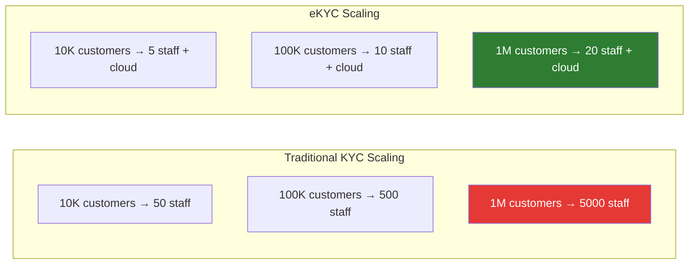
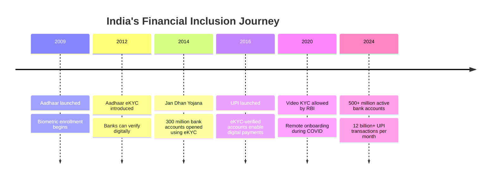
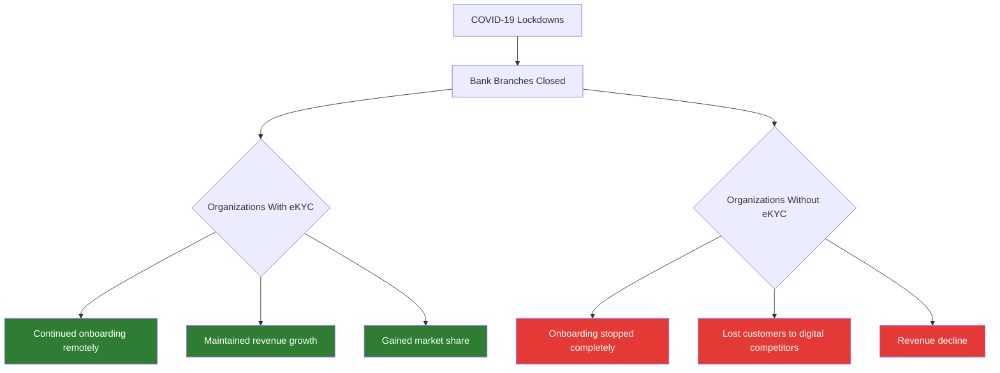

# Why eKYC Matters

## Overview

eKYC isn't just a technology upgrade — it's a fundamental shift that impacts **business economics, customer experience, regulatory compliance, financial inclusion, and national development**. This article explores why eKYC has become one of the most critical infrastructure components of the modern digital economy.

---

## The Business Case for eKYC

### 1. Dramatic Cost Reduction

**For a bank processing 1 million new customers per year:**

| Metric | Traditional KYC | eKYC | Savings |
|--------|----------------|------|---------|
| Cost per verification | $20 | $2 | $18 |
| Annual verification cost | $20,000,000 | $2,000,000 | **$18,000,000** |
| Staff required | 200+ KYC agents | 20 review agents | **90% reduction** |
| Processing infrastructure | Branch space, storage | Cloud servers | **80% reduction** |
| Re-KYC cost (annual) | $10,000,000 | $500,000 | **$9,500,000** |

!!! success "Real-World Savings"
    - **HDFC Bank (India)**: Reported 90% reduction in onboarding costs after Aadhaar eKYC adoption
    - **Standard Chartered**: Estimated $150 million annual savings from KYC digitization across Asia
    - **DBS Bank (Singapore)**: Reduced account opening cost from $30 to under $3 with MyInfo-based eKYC

### 2. Revenue Acceleration Through Speed

Time is money — literally. Every day a customer waits for KYC approval is a day they're not generating revenue for the business.

| Industry | Revenue Impact of Faster KYC |
|----------|------------------------------|
| **Banking** | Faster time-to-first-transaction: deposits, loans, investments start flowing sooner |
| **Lending** | Loan disbursement in hours vs weeks — critical for micro-loans and BNPL |
| **Insurance** | Policy issuance within minutes — captures impulse buyers |
| **Crypto** | Instant trading access — prevents users from going to competitors |
| **Telecom** | SIM activation in minutes — Jio's 100M users in 170 days |
| **Gaming** | Real-money gaming starts immediately — higher user activation |

### 3. Conversion Rate Improvement

Every friction point in the onboarding process causes drop-offs. Traditional KYC has massive friction:

| Metric | Traditional KYC | eKYC |
|--------|----------------|------|
| **Start-to-completion rate** | 40-50% | 80-95% |
| **Average time to complete** | 3-7 days | 2-5 minutes |
| **Abandonment rate** | 30-60% | 5-20% |
| **Customers lost to competitors** | High (they go to whoever is faster) | Low |

### 4. Scalability Without Linear Cost Growth

eKYC scales **horizontally** — adding cloud capacity is orders of magnitude cheaper than hiring and training staff.

---

## Financial Inclusion Impact

eKYC is arguably the most powerful financial inclusion tool ever created.

### The Problem: The Unbanked

According to the World Bank, approximately **1.4 billion adults** worldwide remain unbanked. The primary barriers are:

1. **Distance** — No bank branch within reasonable travel distance
2. **Documentation** — Lack of formal identity documents
3. **Cost** — Banks can't profitably serve low-value accounts with expensive KYC
4. **Literacy** — Complex paper forms are inaccessible

### How eKYC Solves This

| Barrier | eKYC Solution |
|---------|---------------|
| **Distance** | Verify from any location with a smartphone |
| **Documentation** | Digital ID systems (Aadhaar) provide universal identity |
| **Cost** | $0.50 eKYC makes low-value accounts viable |
| **Literacy** | Visual/guided UI with camera-based capture |

### India's Transformation — A Case Study

India's Aadhaar + eKYC combination created the largest financial inclusion story in history:

!!! info "Impact Numbers"
    - **Before eKYC (2011)**: Only 35% of Indian adults had a bank account
    - **After eKYC (2024)**: Over 80% of Indian adults have a bank account
    - **Jan Dhan Yojana**: 520+ million bank accounts opened, most using eKYC
    - **Cost of Aadhaar eKYC**: ₹3-5 per verification (~$0.04-$0.06) — making even zero-balance accounts economically viable

---

## Regulatory Compliance Benefits

### Consistent, Auditable Compliance

| Compliance Need | Traditional KYC | eKYC |
|----------------|----------------|------|
| **Audit trail** | Paper records, hard to retrieve | Complete digital trail with timestamps |
| **Consistency** | Varies by staff member | Standardized AI-driven process |
| **Reporting** | Manual compilation | Automated regulatory reporting |
| **Record retention** | Physical storage for 5-10 years | Digital archives, instantly searchable |
| **SAR filing** | Manual identification of suspicious patterns | AI-powered anomaly detection |
| **Re-KYC compliance** | Difficult to track and enforce | Automated reminders and re-verification |

### Reduced Regulatory Risk

Financial institutions face enormous fines for KYC/AML failures:

| Year | Institution | Fine | Reason |
|------|------------|------|--------|
| 2012 | HSBC | $1.9B | Failed to detect money laundering |
| 2014 | BNP Paribas | $8.9B | Sanctions violations |
| 2020 | Westpac | $1.3B | 23 million AML/CTF breaches |
| 2022 | Danske Bank | $2.0B | €200B in suspicious transactions |
| 2023 | Deutsche Bank | $186M | AML control failures |

eKYC reduces this risk by ensuring **every** verification follows the same rigorous process, **every** decision is documented, and **every** risk signal is captured.

---

## National Security & Anti-Crime Impact

eKYC strengthens the entire financial system's defense against crime:

### Money Laundering Prevention
- Real-time sanctions screening catches hits that manual processes might miss
- AI-powered transaction monitoring detects sophisticated laundering patterns
- Digital identity linkage prevents the same person from opening multiple anonymous accounts

### Terrorism Financing
- Instant PEP/sanctions screening against updated global databases
- Cross-referencing across financial institutions (where permitted)
- Pattern detection across multiple accounts and transactions

### Identity Fraud Prevention
- Multi-layered biometric verification is far harder to defeat than convincing a bank teller
- Document forensics catches sophisticated forgeries invisible to the human eye
- Deduplication prevents one person from creating multiple fake identities

---

## Pandemic Resilience

COVID-19 proved that eKYC is not just convenient — it's **essential**:

!!! example "COVID Impact"
    - **India's RBI** fast-tracked Video KYC guidelines in response to lockdowns
    - **UK's FCA** issued temporary guidance allowing digital onboarding
    - **Singapore's MAS** expanded acceptance of electronic verification
    - Banks with eKYC capabilities saw **2-3x customer acquisition** during lockdowns compared to peers

---

## Competitive Advantage

In a world where customers expect instant digital experiences:

### The Speed Advantage
A study by Signicat found that **68% of banking customers** who abandoned an application did so because the process was too long or complex. The fastest onboarding wins.

### The Experience Advantage
Modern customers compare their banking experience to Uber, Amazon, and Netflix — not to other banks. eKYC delivers that level of digital-native experience.

### The Global Advantage
eKYC enables a single platform to verify identities from 190+ countries, supporting global expansion without building physical infrastructure in each market.

---

## The Macro-Economic Impact

eKYC contributes to broader economic development:

| Impact Area | How eKYC Helps |
|-------------|---------------|
| **GDP growth** | Financial inclusion increases economic participation |
| **SME growth** | Faster, cheaper business account opening |
| **Government efficiency** | Digital identity enables efficient subsidy distribution |
| **Tax compliance** | Financial transparency reduces tax evasion |
| **Foreign investment** | Strong KYC infrastructure attracts international business |
| **Innovation** | eKYC enables new business models (neobanks, embedded finance) |

---

## Key Takeaways

!!! success "Summary"
    - **Cost**: 5-50x cheaper than traditional KYC, with massive savings at scale
    - **Revenue**: Faster onboarding = faster revenue generation + higher conversion rates
    - **Inclusion**: eKYC has brought hundreds of millions of unbanked people into the formal financial system
    - **Compliance**: More consistent, auditable, and defensible than manual processes
    - **Security**: Multi-layered AI defense far exceeds human capability for fraud detection
    - **Resilience**: Essential for business continuity during disruptions (pandemic, natural disasters)
    - **Competitive edge**: In a digital-first world, eKYC capability is a fundamental competitive requirement

---

## Related Articles

- **Previous**: [← KYC vs eKYC](kyc-vs-ekyc.md)
- **Next**: [eKYC Ecosystem Overview →](ekyc-ecosystem-overview.md)
- [What is KYC](what-is-kyc.md)
- [What is eKYC](what-is-ekyc.md)
- [eKYC Use Cases by Industry](ekyc-use-cases-by-industry.md)
- [eKYC ROI Calculation](../11-business-strategy/roi-ekyc-implementation.md)
- [Case Study: India Banking eKYC](../10-case-studies/india-aadhaar-ekyc-scale.md)
