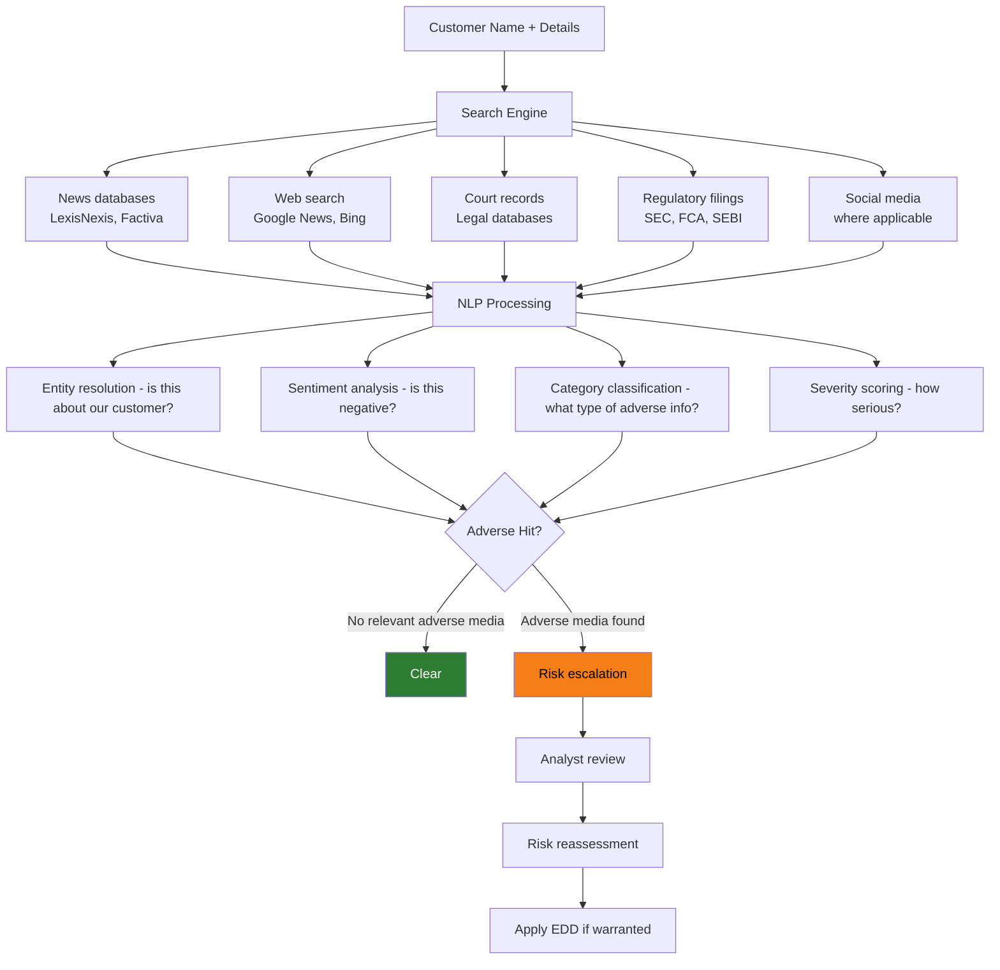

# Adverse Media Screening

## Definition

**Adverse media screening** (also called negative news screening) is the process of searching news sources, public records, and other media for negative information about customers that may indicate involvement in financial crime, fraud, corruption, or other activities that increase risk.

---

## What Adverse Media Includes

| Category | Examples |
|----------|---------|
| **Financial crime** | Money laundering charges, fraud convictions, embezzlement |
| **Corruption** | Bribery allegations, government corruption involvement |
| **Terrorism** | Links to terrorist organizations or financing |
| **Organized crime** | Association with criminal organizations |
| **Sanctions evasion** | Attempts to circumvent sanctions |
| **Tax evasion** | Tax fraud charges or investigations |
| **Regulatory action** | Fines, license revocations, enforcement actions |
| **Cybercrime** | Hacking, data theft, ransomware |
| **Environmental crime** | Illegal dumping, pollution violations |
| **Human rights** | Trafficking, forced labor associations |

---

## How Adverse Media Screening Works

---

## Adverse Media Providers

| Provider | Approach | Key Feature |
|----------|----------|-------------|
| **Dow Jones** | Curated by journalists | Highest quality, structured data |
| **Refinitiv World-Check** | Curated + automated | Broad coverage |
| **ComplyAdvantage** | AI-powered, real-time | Lowest false positive rate |
| **LexisNexis** | Extensive news archives | Deep historical coverage |
| **ACAMS / Kharon** | Specialized compliance data | Targeted for compliance teams |

---

## Key Takeaways

!!! success "Summary"
    - Adverse media screening detects **negative news** that PEP and sanctions lists may not capture
    - **NLP and AI** are essential — processing millions of news articles to find relevant hits
    - **Entity resolution** is the biggest challenge — confirming the news article is about YOUR customer
    - **FATF recommends** adverse media as part of CDD and risk assessment
    - Screening should happen at **onboarding and on an ongoing basis**
    - Adverse media findings may trigger **risk reassessment and upgrade to EDD**

---

## Related Articles

- **Previous**: [← Sanctions Screening](sanctions-screening.md)
- **Next**: [Ultimate Beneficial Owner (UBO) →](ubo-ultimate-beneficial-owner.md)
- [Politically Exposed Persons (PEP)](pep-politically-exposed-persons.md)
- [Enhanced Due Diligence (EDD)](edd-enhanced-due-diligence.md)
