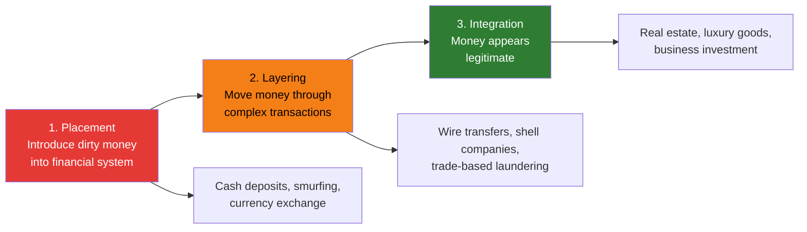
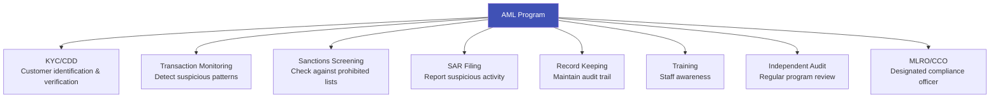

# Anti-Money Laundering (AML)

## Definition

**AML (Anti-Money Laundering)** refers to the set of laws, regulations, procedures, and technologies designed to prevent criminals from disguising illegally obtained money as legitimate income. KYC/eKYC is the **first line of defense** in the AML framework.

---

## The Three Stages of Money Laundering

---

## AML Framework Components

### How eKYC Supports AML

| AML Component | eKYC Role |
|--------------|-----------|
| **Customer identification** | Document verification, biometric matching |
| **Risk assessment** | Automated risk scoring based on customer attributes |
| **Sanctions screening** | Real-time API checks against global sanctions lists |
| **PEP identification** | Automated screening against PEP databases |
| **Adverse media** | NLP-powered negative news scanning |
| **Ongoing monitoring** | Transaction pattern analysis |
| **Deduplication** | Face-based 1:N search to prevent multiple accounts |
| **Record keeping** | Digital audit trail with images, scores, timestamps |

---

## Global AML Regulatory Landscape

| Jurisdiction | Primary Law | Supervisory Authority | Key Feature |
|-------------|-----------|---------------------|-------------|
| **Global** | FATF 40 Recommendations | FATF | International standard-setter |
| **USA** | Bank Secrecy Act, PATRIOT Act | FinCEN, OCC, Fed | CTR/SAR filing system |
| **EU** | AML Directives (6AMLD) + AMLR | National FIUs + AMLA (from 2025) | Risk-based, public UBO registers |
| **UK** | MLR 2017, POCA 2002 | FCA, NCA | Suspicious Activity Reports |
| **India** | PMLA 2002 | FIU-IND, ED | Aadhaar-enabled verification |
| **Singapore** | CDSA, TSOFA | MAS | Risk-based, MyInfo integration |

---

## AML Penalties (Recent Major Fines)

| Institution | Year | Fine | Violation |
|------------|------|------|-----------|
| **BNP Paribas** | 2014 | $8.9B | Sanctions violations |
| **Danske Bank** | 2022 | $2.0B | €200B suspicious flow through Estonian branch |
| **HSBC** | 2012 | $1.9B | Mexican cartel money laundering |
| **Westpac** | 2020 | $1.3B | 23M AML/CTF breaches |
| **Capital One** | 2021 | $390M | Willful BSA violations |
| **Deutsche Bank** | 2023 | $186M | AML control failures |

---

## Key Takeaways

!!! success "Summary"
    - AML is the **overarching framework** — KYC/eKYC is a critical component within it
    - Money laundering happens in **three stages**: placement, layering, integration
    - An AML program includes: KYC, transaction monitoring, sanctions screening, SAR filing, record keeping, training, and audit
    - **eKYC automates and strengthens** most AML components — identity verification, screening, risk scoring
    - AML fines run into **billions of dollars** — compliance is not optional
    - The trend is toward **real-time, AI-powered AML** replacing batch processing and manual review

---

## Related Articles

- **Previous**: [← Simplified Due Diligence (SDD)](sdd-simplified-due-diligence.md)
- **Next**: [Combating Financing of Terrorism (CFT) →](cft-combating-financing-of-terrorism.md)
- [FATF](fatf-financial-action-task-force.md)
- [Sanctions Screening](sanctions-screening.md)
- [KYT — Know Your Transaction](kyt-know-your-transaction.md)
