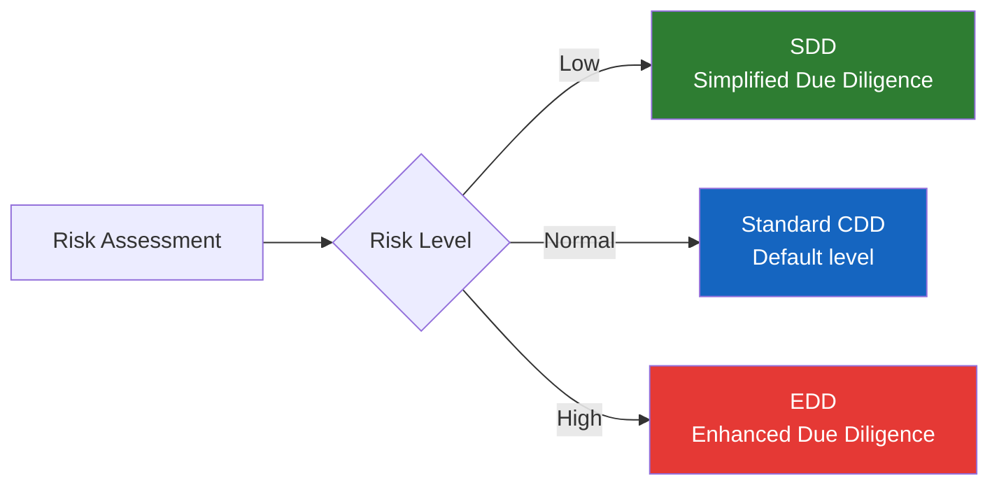
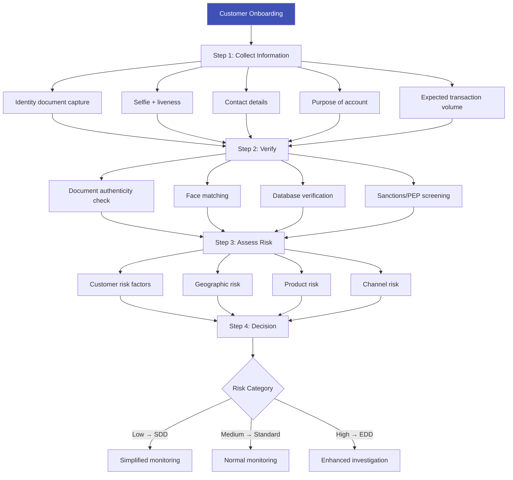

# Customer Due Diligence (CDD)

## Definition

**CDD (Customer Due Diligence)** is the core process within KYC where a financial institution verifies customer identity, assesses risk, and understands the purpose and intended nature of the business relationship. CDD is the **standard level** of due diligence — applied to most customers by default.

---

## The Three CDD Levels

---

## Standard CDD — What's Required

### The Five Pillars of CDD

| Pillar | What It Involves | eKYC Implementation |
|--------|-----------------|-------------------|
| **1. Identity verification** | Verify customer's name, DOB, address using reliable documents | Document capture + OCR + database check |
| **2. Beneficial ownership** | Identify who owns/controls the entity (for companies) | UBO declaration + ownership chain tracing |
| **3. Purpose of relationship** | Understand why the customer wants the account | Onboarding questionnaire |
| **4. Risk assessment** | Categorize customer as low/medium/high risk | Risk scoring engine |
| **5. Ongoing monitoring** | Monitor transactions and update information | KYT + periodic re-KYC |

### CDD Timing

| When CDD Must Be Performed | Details |
|---------------------------|---------|
| **Before establishing relationship** | Standard — verify before opening account |
| **During establishment** | Allowed if needed for business flow, but complete ASAP |
| **Existing customers** | At trigger events or periodic re-KYC dates |
| **Occasional transactions** | Above threshold (€15,000 in EU) even without ongoing relationship |
| **Suspicion of ML/TF** | Regardless of thresholds or exemptions |

---

## CDD in Practice — The eKYC Implementation

---

## When CDD is Not Required (Exemptions)

Limited exemptions exist in some jurisdictions:

| Exemption | Jurisdiction | Condition |
|-----------|-------------|-----------|
| **Low-value e-money** | EU | < €150, non-reloadable, limited use |
| **Government entities** | Various | Government accounts (low risk by nature) |
| **Listed companies** | EU | Subject to public disclosure requirements |
| **Pooled accounts** | Some | Managed by regulated entity with its own CDD |

!!! warning "Exemptions Are Limited"
    Even when exemptions apply, CDD must be performed if there is **any suspicion of money laundering or terrorist financing**, regardless of the exemption.

---

## Key Takeaways

!!! success "Summary"
    - CDD is the **default, standard level** of due diligence applied to most customers
    - **Five pillars**: identity verification, beneficial ownership, purpose, risk assessment, ongoing monitoring
    - CDD must be performed **before** establishing a business relationship (with limited exceptions)
    - **Risk assessment** during CDD determines whether SDD or EDD is appropriate
    - eKYC automates most CDD steps — document verification, face matching, database checks, screening

---

## Related Articles

- **Previous**: [← KYT — Know Your Transaction](kyt-know-your-transaction.md)
- **Next**: [Enhanced Due Diligence (EDD) →](edd-enhanced-due-diligence.md)
- [Simplified Due Diligence (SDD)](sdd-simplified-due-diligence.md)
- [KYC Deep Dive](kyc-know-your-customer.md)
- [Risk Scoring Engines](../06-fraud-risk/risk-scoring-engines.md)
