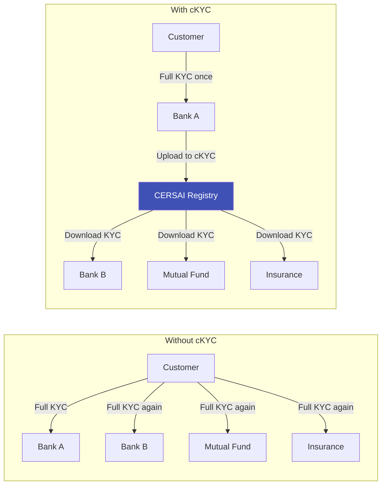
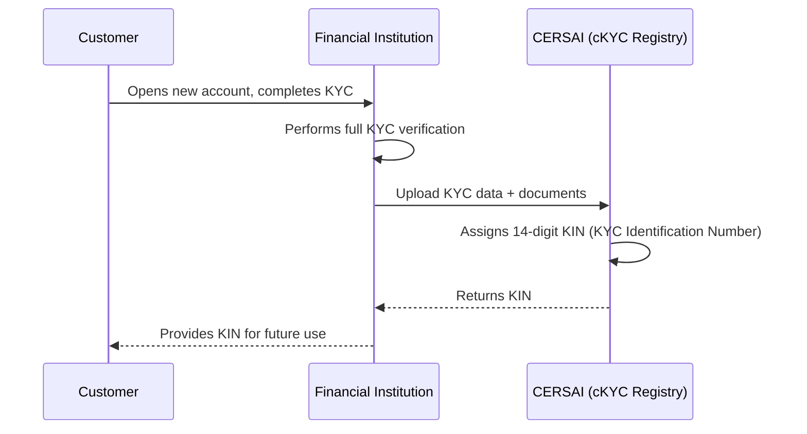
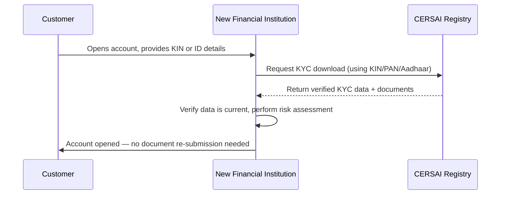

# Central KYC (cKYC)

## Definition

**cKYC (Central KYC)** is a centralized repository system where KYC records of customers are stored once and can be accessed by any financial institution, eliminating the need to repeat KYC verification every time a customer opens an account at a new institution. In India, this is managed by **CERSAI (Central Registry of Securitisation Asset Reconstruction and Security Interest)**.

---

## The Problem cKYC Solves

**Before cKYC:** A customer opening accounts at 5 institutions would undergo KYC 5 separate times.
**With cKYC:** Verify once, registered institutions download the existing verified KYC.

---

## How cKYC Works in India

### Registration Flow

### Download Flow (Subsequent Institutions)

### Key Data in cKYC Record

| Field | Details |
|-------|---------|
| **KIN** | 14-digit KYC Identification Number (unique per customer) |
| **Identity details** | Name, DOB, gender, PAN, Aadhaar (last 4 digits) |
| **Address** | Current + permanent address |
| **Contact** | Phone, email |
| **Photo** | Recent photograph |
| **Documents** | Scanned copies of OVDs submitted |
| **Account type** | Individual, HUF, company, trust, etc. |
| **Risk category** | Low / Medium / High (as assessed by uploading institution) |

---

## Regulatory Mandate

| Regulation | Details |
|-----------|---------|
| **RBI Master Direction** | All Regulated Entities (REs) must upload KYC data to cKYC registry |
| **Mandatory since** | February 2017 (phased rollout), fully mandatory by 2023 |
| **Applies to** | Banks, NBFCs, mutual funds (SEBI), insurance (IRDAI), pension funds |
| **Penalty for non-compliance** | Regulatory action from respective supervisor (RBI, SEBI, IRDAI) |

### SEBI cKYC Integration

For securities market participants (mutual funds, demat accounts, broking):
- **KRA (KYC Registration Agency)** systems (CAMS, Karvy, CVL, NDML, DotEx) integrated with CERSAI
- Single KYC sufficient for all capital market activities
- Interoperability between KRAs and cKYC registry

---

## Benefits

| Benefit | For Customers | For Institutions | For Regulators |
|---------|--------------|-----------------|----------------|
| **Convenience** | KYC once, use everywhere | Reduced onboarding friction | Standardized KYC data |
| **Speed** | Instant account opening | Skip verification for existing cKYC records | Faster compliance checks |
| **Cost** | No repeated document submission | Lower KYC processing cost | Centralized oversight |
| **Consistency** | Same data across all accounts | Reduced data quality issues | Single view of customer |
| **Portability** | KYC travels with customer | Access to pre-verified data | Cross-institutional risk view |

---

## Challenges

| Challenge | Details |
|-----------|---------|
| **Data freshness** | cKYC record may be outdated if customer changed address/name |
| **Upload compliance** | Not all institutions upload promptly or with high quality data |
| **Privacy concerns** | Centralized repository = centralized privacy risk |
| **Interoperability** | Different institutions use different systems and formats |
| **Deduplication** | Same customer with slightly different data across institutions |
| **Cost of integration** | Smaller institutions face technology integration challenges |

---

## cKYC Globally

India's cKYC model is being studied internationally:

| Country | Equivalent System |
|---------|------------------|
| **India** | CERSAI cKYC Registry |
| **Singapore** | MyInfo (government-managed, not institution-uploaded) |
| **Nordic countries** | Nordic KYC Utility (consortium model) |
| **EU** | Proposed under AMLR — interconnected beneficial ownership registers |
| **UAE** | Emirates ID serves as de facto central KYC |

---

## Key Takeaways

!!! success "Summary"
    - cKYC is a **centralized registry** that stores KYC data once and makes it available to all authorized institutions
    - In India, managed by **CERSAI** with a unique **14-digit KIN** per customer
    - **Mandatory for all Indian financial institutions** since 2023
    - **Eliminates repeated KYC** — verify once, open accounts anywhere
    - **Challenges include** data freshness, upload compliance, and privacy
    - The model is being studied globally as a way to reduce KYC duplication

---

## Related Articles

- **Previous**: [← Video KYC](vkyc-video-kyc.md)
- **Next**: [Re-KYC →](re-kyc-periodic-reverification.md)
- [KYC Deep Dive](kyc-know-your-customer.md)
- [eKYC Deep Dive](ekyc-electronic-kyc-deep-dive.md)
- [Reusable KYC](../04-digital-identity/reusable-kyc.md)
