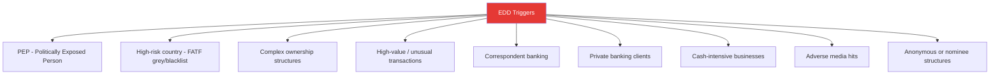
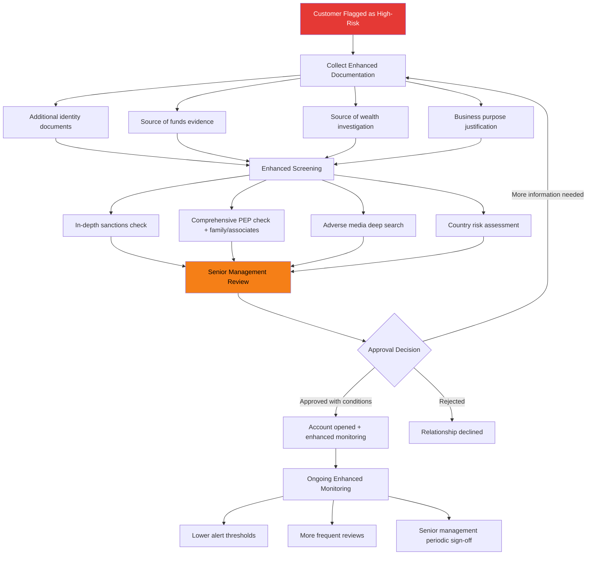

# Enhanced Due Diligence (EDD)

## Definition

**EDD (Enhanced Due Diligence)** is the highest level of customer due diligence, applied to customers assessed as **high-risk**. It involves deeper investigation, more extensive documentation, senior management approval, and enhanced ongoing monitoring beyond standard CDD.

---

## When EDD is Required

---

## EDD vs Standard CDD

| Aspect | Standard CDD | Enhanced Due Diligence (EDD) |
|--------|-------------|------|
| **Identity verification** | Standard document + selfie | Additional documents, multiple sources |
| **Source of funds** | Self-declaration | Documentary evidence required |
| **Source of wealth** | Not typically required | Full investigation of wealth origin |
| **Beneficial ownership** | Standard UBO identification | Deep ownership chain investigation |
| **Approval authority** | Branch manager / auto-approve | Senior management / MLRO / Compliance committee |
| **Ongoing monitoring** | Standard transaction monitoring | Enhanced monitoring with tighter thresholds |
| **Re-KYC frequency** | 8-10 years | 1-2 years |
| **Documentation** | Standard record | Extensive file with justification for acceptance |
| **Relationship review** | Periodic | Continuous |

---

## EDD Process

---

## EDD for PEPs

PEPs require EDD regardless of other risk factors:

| PEP Type | Definition | EDD Level |
|----------|-----------|-----------|
| **Foreign PEP** | Political figure in another country | Always EDD |
| **Domestic PEP** | Political figure in own country | EDD (risk-based in some jurisdictions) |
| **International org PEP** | Senior role in UN, World Bank, etc. | Always EDD |
| **Family member** | Close family of any PEP | EDD |
| **Close associate** | Known business/personal associate of PEP | EDD |

**PEP-specific EDD measures:**

- Senior management approval to establish/continue relationship
- Establish source of wealth and source of funds
- Enhanced ongoing monitoring throughout the relationship
- Annual relationship review with documented rationale

---

## Source of Funds vs Source of Wealth

| Concept | What It Means | Evidence Required |
|---------|--------------|-------------------|
| **Source of Funds (SOF)** | Where the money for this specific transaction comes from | Bank statements, salary slips, sale proceeds |
| **Source of Wealth (SOW)** | How the customer accumulated their total wealth over their lifetime | Inheritance records, business profits, investment history, property ownership |

---

## Key Takeaways

!!! success "Summary"
    - EDD is the **highest level of due diligence** — applied to high-risk customers, PEPs, and complex structures
    - Requires **senior management approval**, extensive documentation, and enhanced ongoing monitoring
    - **Source of funds AND source of wealth** must both be established and documented
    - **PEPs always require EDD** — including family members and close associates
    - EDD customers are re-verified **every 1-2 years** (vs 8-10 years for standard CDD)
    - Failure to apply EDD when required is a **major compliance violation** leading to significant fines

---

## Related Articles

- **Previous**: [← Customer Due Diligence (CDD)](cdd-customer-due-diligence.md)
- **Next**: [Simplified Due Diligence (SDD) →](sdd-simplified-due-diligence.md)
- [Politically Exposed Persons (PEP)](pep-politically-exposed-persons.md)
- [Source of Funds / Wealth](sof-sow-source-of-funds-wealth.md)
