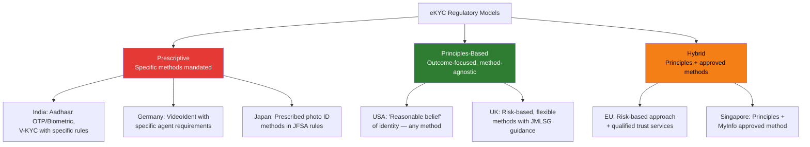
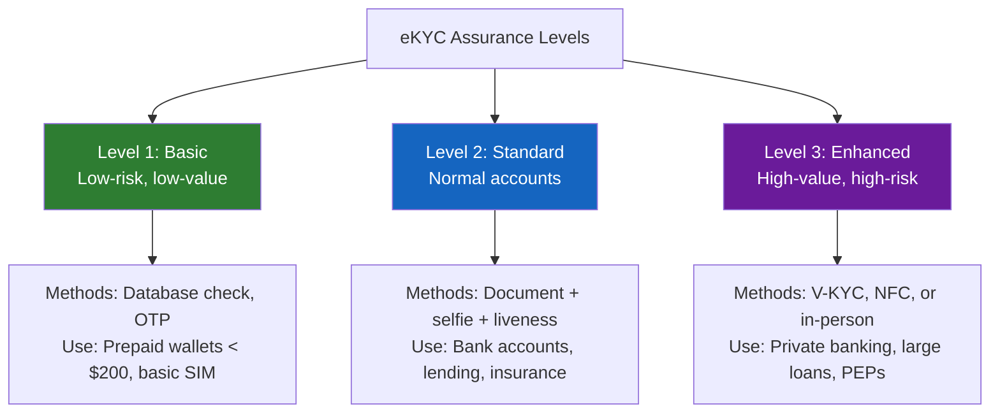

# eKYC — Electronic KYC (Regulatory Deep Dive)

## Definition

This article focuses on the **regulatory and compliance aspects** of eKYC — how different jurisdictions legally define it, what's permissible, what's restricted, and the specific compliance obligations that come with performing identity verification digitally. For the technical overview, see [What is eKYC (Foundations)](../00-foundations/what-is-ekyc.md).

---

## Legal Status of eKYC by Jurisdiction

### Where eKYC is Legally Equivalent to In-Person KYC

| Jurisdiction | Legal Basis | Conditions |
|-------------|------------|------------|
| **India** | RBI Master Direction on KYC (2016, amended) | Aadhaar-based, V-KYC, or digital KYC with OVD |
| **Singapore** | MAS Notice 626/824 | MyInfo-based or non-face-to-face with enhanced controls |
| **Estonia** | eIDAS + national law | eID/Smart-ID authentication accepted |
| **Germany** | BaFin Circular, GwG | VideoIdent or eID accepted |
| **UK** | MLR 2017 + JMLSG Guidance | Electronic verification accepted with risk-based approach |
| **UAE** | CBUAE regulations | Emirates ID + biometric accepted |
| **USA** | BSA/CIP (no explicit eKYC framework) | "Reasonable belief" of identity — method not prescribed |
| **EU (broad)** | 5AMLD/6AMLD + member state law | Remote identification accepted under conditions |

### Where eKYC is Restricted or Conditional

| Jurisdiction | Restriction |
|-------------|-------------|
| **Japan** | eKYC accepted but specific methods prescribed (photo ID + selfie, NFC, etc.) |
| **China** | Face recognition mandatory for financial accounts, subject to PIPL data protection |
| **Brazil** | BCB allows digital, but specific biometric requirements being developed |
| **Some African countries** | No formal eKYC framework yet — in-person remains default |

---

## eKYC Regulatory Models

---

## India's eKYC Regulatory Framework (Detailed)

India has the most detailed eKYC regulatory framework globally:

### Accepted eKYC Methods Under RBI

| Method | Legal Basis | Requirements | Assurance Level |
|--------|-----------|--------------|-----------------|
| **Aadhaar OTP** | Section 11A of PML Act | Customer consent, OTP on registered mobile | Medium |
| **Aadhaar Biometric** | Section 11A of PML Act | Fingerprint/iris scan at certified device | High |
| **Offline Aadhaar (XML)** | RBI circular 2019 | Downloaded XML with QR + digital signature | Medium |
| **Video KYC (V-KYC)** | RBI Master Direction Jan 2020 | Live video, trained agent, geo-tagging, recording | High |
| **Digital KYC (DigiLocker)** | RBI Master Direction | DigiLocker-fetched documents accepted as OVDs | Medium |
| **cKYC download** | RBI Master Direction | Download verified KYC from central registry | High |
| **OVD-based digital** | RBI Master Direction 2023 | Photo of OVD + live selfie + verification | Medium |

### V-KYC Specific Requirements (RBI)

| Requirement | Details |
|-------------|---------|
| **Agent** | Must be trained bank/RE official |
| **Video** | Live, real-time video call (not pre-recorded) |
| **Recording** | Entire session must be recorded and stored |
| **Geo-tagging** | GPS coordinates of customer captured |
| **Document display** | Customer must display original documents on camera |
| **OTP** | Aadhaar OTP verified during call |
| **Face match** | Live face matched with ID photo (AI-assisted) |
| **Randomized questions** | Agent asks random verification questions |
| **Bandwidth** | Minimum video quality must be maintained |
| **Audit trail** | Complete log with timestamps |

### Post-Supreme Court Aadhaar Ruling (2018)

The landmark Puttaswamy judgment impacted eKYC:

| Before Ruling | After Ruling |
|--------------|-------------|
| Aadhaar mandatory for bank accounts | Aadhaar voluntary for banks (but most popular method) |
| Private entities could use Aadhaar freely | Private use requires specific authorization |
| Biometric sharing with banks | Only yes/no response shared (not raw biometrics) |
| Banks stored Aadhaar data | Restrictions on Aadhaar data storage |

---

## Compliance Obligations for eKYC Providers

### Data Protection

| Obligation | GDPR (EU) | DPDP Act (India) | CCPA (US) |
|-----------|-----------|-------------------|-----------|
| **Consent** | Explicit consent for biometrics | Purpose-specific consent | Notice at collection |
| **Data minimization** | Collect only what's needed | Collect only for stated purpose | — |
| **Storage limitation** | Delete when purpose fulfilled | Retain only as long as needed | Consumer right to delete |
| **Data portability** | Right to receive data | — | Right to know data collected |
| **DPIA** | Required for biometric processing | — | — |
| **Breach notification** | 72 hours to DPA | Notify DPB without delay | "Expedient" notification |
| **Cross-border transfer** | Adequacy decision or SCCs | Restrictions being finalized | — |

### Biometric Data — Special Considerations

!!! warning "Biometrics = High Sensitivity"
    Under GDPR, biometric data is a **"special category"** requiring:
    
    - **Explicit consent** (not just legitimate interest)
    - **Data Protection Impact Assessment (DPIA)** before processing
    - **Purpose limitation** — cannot reuse for other purposes
    - **Enhanced security** — encryption, access controls, pseudonymization
    - **No mandatory processing** — user must have alternative options
    
    In the US, **BIPA (Illinois Biometric Information Privacy Act)** requires informed consent and has generated billions in class-action settlements (Meta: $1.4B, Google, TikTok).

### Audit & Record Requirements

| Jurisdiction | What Must Be Stored | Retention | Accessibility |
|-------------|-------------------|-----------|---------------|
| **India (RBI)** | KYC records, verification results, V-KYC recordings | 5 years post-relationship | Must be available for RBI inspection |
| **EU (AMLD)** | CDD documentation, copies/references of ID, transaction records | 5 years (extendable to 10) | Available for FIU/supervisory requests |
| **USA (BSA)** | CIP records, SARs, CTRs | 5 years | Available for FinCEN/examiner review |

---

## eKYC Acceptance Levels

Different activities may require different eKYC assurance levels:

---

## Key Takeaways

!!! success "Summary"
    - **eKYC's legal status varies significantly** — from fully equivalent (India, Singapore, UK) to conditionally accepted (Japan, Brazil)
    - **India has the most detailed eKYC regulations** — 7+ accepted methods, specific V-KYC requirements, cKYC mandate
    - **Biometric data triggers special compliance obligations** — GDPR special category, BIPA consent, DPIA requirements
    - **Record-keeping is non-negotiable** — 5+ years of storage with accessibility for regulators
    - **The trend is toward acceptance** — regulators globally are moving from restricting eKYC to actively enabling it
    - **Data protection and AML are often in tension** — eKYC providers must navigate both simultaneously

---

## Related Articles

- **Previous**: [← KYC Deep Dive](kyc-know-your-customer.md)
- **Next**: [Video KYC (V-KYC) →](vkyc-video-kyc.md)
- [What is eKYC (Foundations)](../00-foundations/what-is-ekyc.md)
- [GDPR and eKYC](../07-regulations-standards/gdpr-and-ekyc.md)
- [DPDP Act India](../07-regulations-standards/dpdp-act-india.md)
- [RBI KYC Master Direction](../07-regulations-standards/rbi-kyc-master-direction.md)
