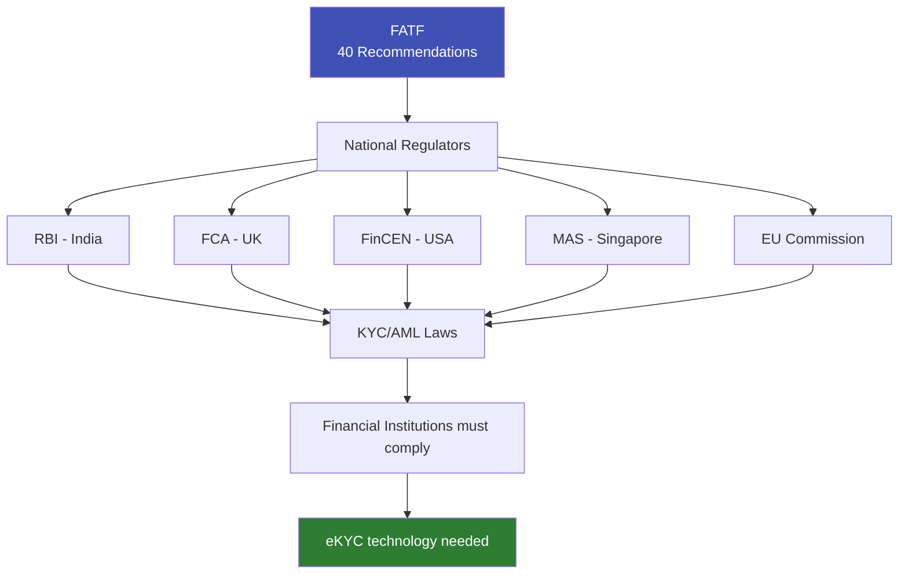

# FATF — Financial Action Task Force

## Definition

**FATF (Financial Action Task Force)** is the global inter-governmental body that sets international standards for combating money laundering, terrorist financing, and proliferation financing. Established in 1989 at the G7 summit, FATF's recommendations form the **foundation of every country's AML/KYC regulations**.

---

## Why FATF Matters for eKYC

FATF doesn't regulate individual countries directly — it creates the **standards** that national regulators then implement. When RBI mandates KYC, when the EU creates AML Directives, when FinCEN enforces BSA — they're all implementing FATF's recommendations.

---

## FATF's 40 Recommendations (Key Ones for eKYC)

| # | Recommendation | eKYC Relevance |
|---|---------------|----------------|
| **10** | Customer Due Diligence | **Core** — defines CDD requirements that eKYC implements |
| **11** | Record keeping | Defines what records eKYC must maintain |
| **12** | PEPs | Requires PEP screening — eKYC must include this |
| **13** | Correspondent banking | EDD for correspondent banking relationships |
| **15** | New technologies | Explicitly covers eKYC — risk-based approach to digital verification |
| **16** | Wire transfers | Travel Rule — originator/beneficiary info sharing |
| **20** | Suspicious transaction reporting | SAR/STR filing obligations |

### Recommendation 15 — New Technologies (Most Relevant)

FATF's Recommendation 15 specifically addresses digital identity and eKYC:

- Countries should assess ML/TF risks of **new technologies** before launching
- Financial institutions should assess risks of **non-face-to-face** relationships
- FATF's **Digital Identity Guidance (2020)** explicitly accepts eKYC when properly implemented
- Technology-neutral — doesn't mandate specific methods, but requires risk-based approach

---

## FATF Grey List and Black List

FATF maintains two lists that directly impact eKYC risk assessment:

### Grey List (Increased Monitoring)

Countries with strategic deficiencies in AML/CFT but committed to resolving them:

| Impact on eKYC | Details |
|---------------|---------|
| **Higher risk assessment** | Customers from grey-listed countries automatically flagged as higher risk |
| **EDD required** | Enhanced due diligence for transactions involving grey-listed countries |
| **Additional screening** | More intensive sanctions and PEP screening |
| **Business impact** | Many institutions avoid dealing with grey-listed countries entirely |

### Black List (High-Risk)

Countries with significant strategic deficiencies and no commitment to reform:

| Impact on eKYC | Details |
|---------------|---------|
| **Counter-measures applied** | Financial institutions must apply counter-measures |
| **Relationship prohibition** | Many institutions will not accept customers from blacklisted countries |
| **Maximum EDD** | If relationship is maintained, highest level of scrutiny required |

!!! info "Grey/Black List Impact"
    Being grey-listed can cost a country **up to 7.6% of GDP** in reduced capital flows, higher borrowing costs, and reduced foreign investment (IMF estimate). This makes FATF one of the most powerful financial governance bodies in the world.

---

## FATF Mutual Evaluations

FATF evaluates each member country's AML/CFT compliance through **Mutual Evaluations**:

| Rating | Meaning | Consequence |
|--------|---------|-------------|
| **Compliant** | Fully meets FATF standards | Good standing |
| **Largely Compliant** | Minor shortcomings | Monitoring |
| **Partially Compliant** | Significant shortcomings | Required to improve |
| **Non-Compliant** | Major deficiencies | Risk of grey/black listing |

---

## FATF and Digital Identity (2020 Guidance)

FATF's March 2020 guidance on digital identity was a landmark:

- **Explicitly accepted** that digital identity systems can provide **equal or higher assurance** than physical document checks
- Encouraged regulators to adopt **technology-neutral** approaches
- Recognized that eKYC can **improve financial inclusion** without compromising AML/CFT
- Emphasized **risk-based approach** — the assurance level should match the risk

---

## Key Takeaways

!!! success "Summary"
    - FATF sets the **global AML/KYC standards** that every country's regulations are based on
    - **40 Recommendations** cover CDD, PEPs, record keeping, suspicious reporting, and new technologies
    - **Grey/black lists** directly impact eKYC risk assessment — customers from listed countries need EDD
    - FATF's **2020 Digital Identity Guidance** was a major endorsement of eKYC — accepted as equal to in-person
    - Being FATF-compliant is essential for countries — grey-listing can cost up to **7.6% of GDP**
    - **Recommendation 15** specifically addresses eKYC and digital verification

---

## Related Articles

- **Previous**: [← Combating Financing of Terrorism (CFT)](cft-combating-financing-of-terrorism.md)
- **Next**: [Politically Exposed Persons (PEP) →](pep-politically-exposed-persons.md)
- [Anti-Money Laundering (AML)](aml-anti-money-laundering.md)
- [Sanctions Screening](sanctions-screening.md)
- [eKYC Global Adoption](../00-foundations/ekyc-global-adoption.md)
