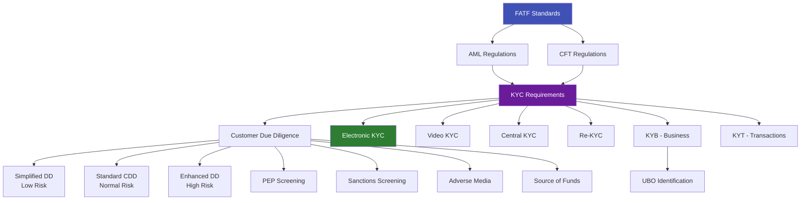

# 🔐 Identity Verification & Compliance

## The Regulatory Framework Behind eKYC

This section covers the **regulatory concepts, compliance frameworks, and verification processes** that drive the entire eKYC industry. From KYC and AML basics to FATF standards, due diligence levels, sanctions screening, and beneficial ownership — every concept that a compliance officer, product manager, or eKYC engineer needs to understand.

---

## Articles in This Section

### Core KYC Concepts
| # | Article | What You'll Learn |
|---|---------|-------------------|
| 1 | [KYC Deep Dive](kyc-know-your-customer.md) | Comprehensive KYC — beyond the basics |
| 2 | [eKYC Deep Dive](ekyc-electronic-kyc-deep-dive.md) | Technical and regulatory deep dive into electronic KYC |
| 3 | [Video KYC (V-KYC)](vkyc-video-kyc.md) | Live video-based verification — process, regulation, technology |
| 4 | [Central KYC (cKYC)](ckyc-central-kyc.md) | India's centralized KYC registry system |
| 5 | [Re-KYC](re-kyc-periodic-reverification.md) | Periodic customer re-verification requirements |

### Business & Entity Verification
| # | Article | What You'll Learn |
|---|---------|-------------------|
| 6 | [KYB — Know Your Business](kyb-know-your-business.md) | Verifying companies, entities, and their owners |
| 7 | [KYT — Know Your Transaction](kyt-know-your-transaction.md) | Transaction monitoring and suspicious pattern detection |

### Due Diligence Levels
| # | Article | What You'll Learn |
|---|---------|-------------------|
| 8 | [Customer Due Diligence (CDD)](cdd-customer-due-diligence.md) | The standard verification process |
| 9 | [Enhanced Due Diligence (EDD)](edd-enhanced-due-diligence.md) | Deep investigation for high-risk customers |
| 10 | [Simplified Due Diligence (SDD)](sdd-simplified-due-diligence.md) | Lighter verification for low-risk scenarios |

### AML & Counter-Terrorism
| # | Article | What You'll Learn |
|---|---------|-------------------|
| 11 | [Anti-Money Laundering (AML)](aml-anti-money-laundering.md) | Complete AML framework and its relationship with eKYC |
| 12 | [Combating Financing of Terrorism (CFT)](cft-combating-financing-of-terrorism.md) | How eKYC supports counter-terrorism financing |
| 13 | [FATF](fatf-financial-action-task-force.md) | The global body setting AML/KYC standards |

### Screening & Risk Assessment
| # | Article | What You'll Learn |
|---|---------|-------------------|
| 14 | [Politically Exposed Persons (PEP)](pep-politically-exposed-persons.md) | Identifying and managing high-risk political figures |
| 15 | [Sanctions Screening](sanctions-screening.md) | Checking against global sanctions lists |
| 16 | [Adverse Media Screening](adverse-media-screening.md) | Negative news monitoring and its role in risk assessment |

### Ownership & Source Verification
| # | Article | What You'll Learn |
|---|---------|-------------------|
| 17 | [Ultimate Beneficial Owner (UBO)](ubo-ultimate-beneficial-owner.md) | Identifying who really owns and controls entities |
| 18 | [Source of Funds / Wealth (SOF/SOW)](sof-sow-source-of-funds-wealth.md) | Verifying where money comes from |

---

## How These Concepts Connect

---

!!! tip "For eKYC Engineers"
    If you're building eKYC systems, the most practically relevant articles are: **CDD** (what you're actually implementing), **PEP/Sanctions Screening** (what your backend needs to check), and **KYT** (ongoing monitoring requirements).
