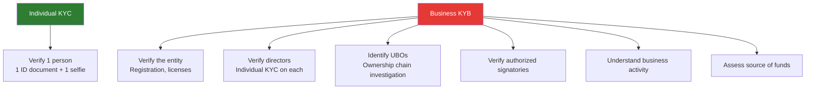
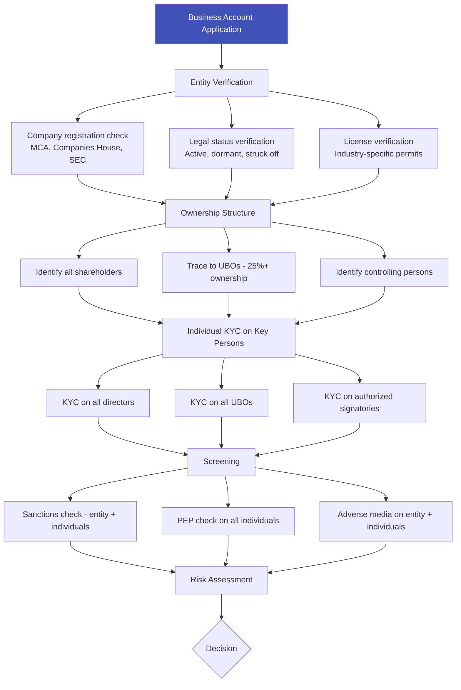
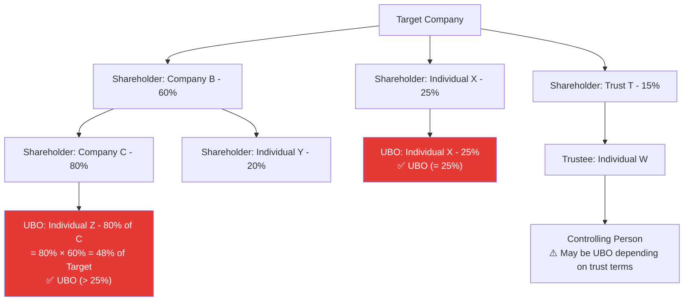

# KYB — Know Your Business

## Definition

**KYB (Know Your Business)** is the process of verifying the identity and legitimacy of a business entity before establishing a financial relationship. While KYC focuses on individuals, KYB addresses the more complex task of verifying companies, their ownership structures, directors, and beneficial owners.

---

## Why KYB is More Complex Than KYC

---

## KYB Verification Process

### Documents Required

| Document | Purpose |
|----------|---------|
| **Certificate of Incorporation** | Proves entity legally exists |
| **Memorandum & Articles of Association** | Business purpose, shareholder rights |
| **Board resolution** | Authorization to open account |
| **Shareholder register** | Identify all owners |
| **UBO declaration** | Declare beneficial owners (25%+ threshold) |
| **Financial statements** | Assess business activity and SOF |
| **Trade licenses** | Industry-specific authorization |
| **GST/VAT certificate** | Tax registration proof |
| **Directors' KYC** | Individual identity verification for each director |

---

## Complex Ownership Structures

The main challenge of KYB — tracing who really owns and controls the entity:

---

## KYB by Jurisdiction

| Jurisdiction | UBO Threshold | Key Registry | Special Requirements |
|-------------|--------------|-------------|---------------------|
| **India (RBI)** | 25% or controlling interest | MCA (Ministry of Corporate Affairs) | UBO declaration mandatory |
| **EU (AMLD)** | 25% + 1 share | National UBO registers (public) | Public UBO register access |
| **USA** | 25% equity + 1 control person | FinCEN BOI (from 2024) | Corporate Transparency Act |
| **UK** | 25% + significant control | Companies House PSC Register | Public PSC register |
| **Singapore** | 25% or significant interest | ACRA | Registrable Controllers register |

---

## Key Takeaways

!!! success "Summary"
    - KYB is **significantly more complex** than individual KYC — entities, ownership chains, multiple individuals
    - **UBO identification** (tracing to 25%+ natural person owners) is the hardest and most important part
    - **Individual KYC must be performed** on all directors, UBOs, and authorized signatories
    - **Complex structures** (holding companies, trusts, nominees) are used to obscure ownership — KYB must penetrate these
    - **Corporate Transparency Act** (US) and **public UBO registers** (EU) are making ownership data more accessible

---

## Related Articles

- **Previous**: [← Re-KYC](re-kyc-periodic-reverification.md)
- **Next**: [KYT — Know Your Transaction →](kyt-know-your-transaction.md)
- [Ultimate Beneficial Owner (UBO)](ubo-ultimate-beneficial-owner.md)
- [Customer Due Diligence (CDD)](cdd-customer-due-diligence.md)
- [Enhanced Due Diligence (EDD)](edd-enhanced-due-diligence.md)
