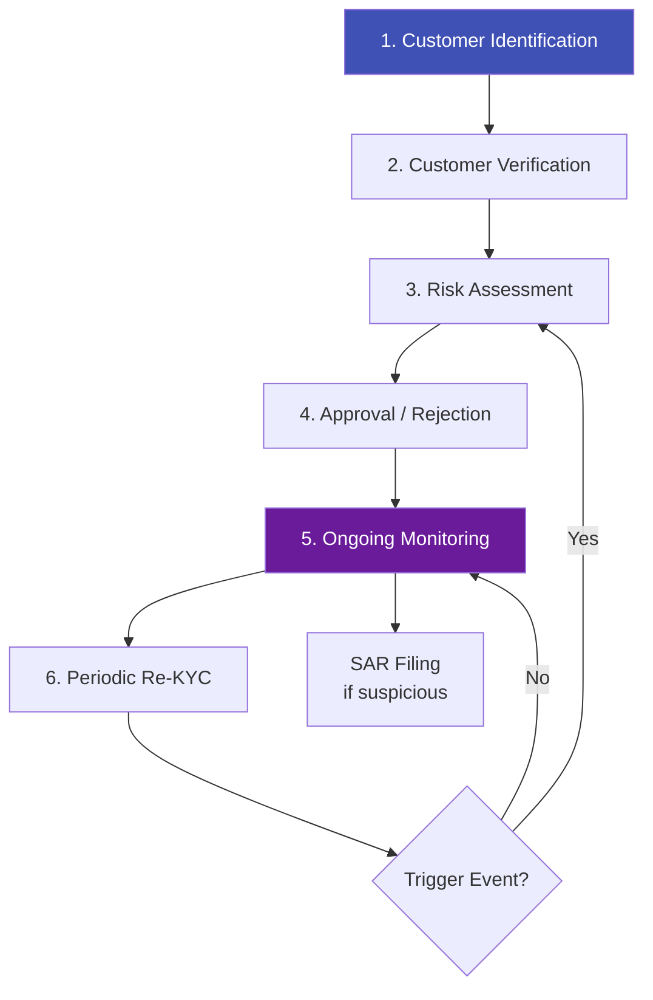
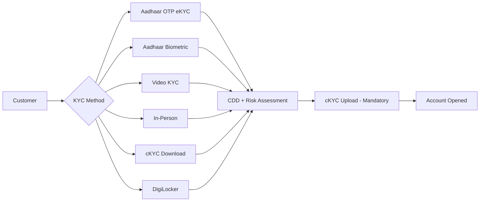
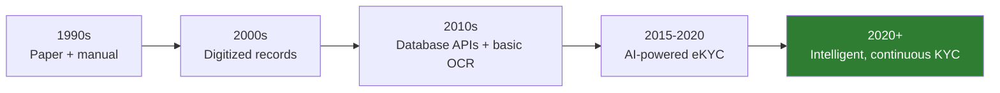

# KYC — Know Your Customer (Deep Dive)

## Definition

**KYC (Know Your Customer)** is the comprehensive process of identifying, verifying, and understanding customers to assess and manage the risk they pose to a financial institution. While the [Foundations article](../00-foundations/what-is-kyc.md) covered the basics, this deep dive explores the operational, regulatory, and technical details that compliance teams and eKYC builders need to master.

---

## The KYC Lifecycle

---

## KYC Data Requirements

### Individual Customers

| Data Category | Required Fields | Verification Method |
|--------------|----------------|-------------------|
| **Identity** | Full legal name, DOB, gender, nationality | Government-issued photo ID |
| **Address** | Current residential address | Utility bill, bank statement, official letter |
| **Tax ID** | PAN (India), SSN (US), TIN (EU) | Government database API |
| **Contact** | Phone number, email | OTP verification |
| **Employment** | Occupation, employer | Self-declaration |
| **Financial** | Expected account usage, source of funds | Declaration + docs for high-risk |
| **Biometric** | Photograph, fingerprint (where applicable) | Selfie match, biometric capture |

### Corporate Customers

| Data Category | Required Fields |
|--------------|----------------|
| **Entity identity** | Legal name, registration number, incorporation date |
| **Registration** | Certificate of incorporation, memorandum, articles |
| **Ownership** | Shareholders, UBOs (25%+ ownership) |
| **Directors** | Names, DOB, nationality, ID of all directors |
| **Address** | Registered office, principal business address |
| **Financial** | Nature of business, turnover, source of funds |
| **Tax** | GSTIN (India), VAT (EU), EIN (US) |

---

## Risk-Based Approach (RBA)

Modern KYC applies proportionate measures based on assessed risk:

### Risk Scoring Matrix

| Risk Factor | Low (1) | Medium (2) | High (3) |
|-------------|---------|------------|----------|
| **Customer type** | Salaried individual | Self-employed / SME | Trust, shell company, charity |
| **Country** | FATF member, low corruption | Medium corruption | FATF grey/blacklist, sanctioned |
| **PEP status** | Not a PEP | Family member of PEP | PEP or close associate |
| **Product** | Basic savings | Credit card, loans | Private banking, trade finance |
| **Channel** | Verified eKYC / in-person | Agent-introduced | Anonymous / third-party |
| **Transaction** | Predictable, low-value | Moderate, some international | High-value, cash-intensive |

**Weighted sum of scores determines CDD level:**

| Overall Risk | CDD Level | Approval Authority | Re-KYC Frequency |
|-------------|-----------|-------------------|-------------------|
| **Low** | Simplified (SDD) | Auto-approve | Every 10 years |
| **Medium** | Standard CDD | Branch/ops manager | Every 8 years |
| **High** | Enhanced (EDD) | Senior management / MLRO | Every 2 years |
| **Very High** | EDD + enhanced monitoring | Compliance committee | Annual |

---

## KYC Process by Country

### India — RBI KYC Master Direction

**India-specific rules:**

- **OVDs (Officially Valid Documents):** Aadhaar, Passport, Voter ID, DL, NREGA Job Card
- **Small accounts** (up to ₹50K balance): Simplified KYC allowed
- **cKYC mandatory**: All new accounts must upload to CERSAI central registry
- **V-KYC**: Allowed since Jan 2020 — live video, geo-tagging, recording stored
- **Re-KYC**: High risk every 2 years, medium every 8, low every 10

### USA — BSA/CIP/CDD

| Requirement | Details |
|-------------|---------|
| **CIP** | Name, DOB, address, SSN (or passport for non-US) |
| **CDD Rule (2016)** | Identify beneficial owners (25%+ equity + 1 controlling person) |
| **SAR filing** | Within 30 days of detecting suspicious activity |
| **CTR filing** | Cash transactions > $10,000 — automatic report to FinCEN |
| **Section 314(a)** | FinCEN can request info on specific individuals |
| **Section 314(b)** | Voluntary inter-institution information sharing |

### EU — AML Directives

| Directive | Key Requirement |
|-----------|----------------|
| **4AMLD (2015)** | Risk-based approach, beneficial ownership registers |
| **5AMLD (2018)** | Crypto under AML, enhanced EDD, public UBO registers |
| **6AMLD (2020)** | Criminal liability for legal entities, harmonized predicate offences |
| **AMLR (2024)** | Single EU rulebook, €10K cash payment cap, AMLA authority |

### UK — Money Laundering Regulations

- FCA-supervised, risk-based approach
- Electronic verification widely accepted
- Open Banking data can supplement KYC checks
- Joint Money Laundering Steering Group (JMLSG) provides industry guidance

---

## KYC Record-Keeping Requirements

| Jurisdiction | Retention Period | What Must Be Stored |
|-------------|-----------------|-------------------|
| **India (RBI)** | 5 years after business relationship ends | ID copies, transaction records, risk assessments |
| **USA (BSA)** | 5 years after account closure | CIP records, SARs, CTRs |
| **EU (AMLD)** | 5 years (extendable to 10) | CDD documentation, transaction records |
| **UK** | 5 years after relationship ends | Identity documents, risk assessments |
| **Singapore (MAS)** | 5 years | CDD records, transaction data |

---

## KYC Failures — What Goes Wrong

### Common Failure Modes

| Failure | Example | Consequence |
|---------|---------|-------------|
| **Inadequate CDD** | Not verifying source of funds for high-value account | Regulatory fine |
| **PEP miss** | Failing to identify a customer as politically exposed | SAR failure, potential complicity |
| **Stale data** | Customer changed address/name but records not updated | Compliance gap at audit |
| **Insufficient EDD** | Standard CDD applied to high-risk customer | Regulatory action |
| **Poor record-keeping** | Can't produce KYC records during audit | Fine + remediation order |
| **Training gaps** | Staff don't recognize red flags | Missed suspicious activity |

### Cost of KYC Failure

| Institution | Year | Fine | Failure |
|------------|------|------|---------|
| **BNP Paribas** | 2014 | $8.9B | Sanctions violations |
| **Danske Bank** | 2022 | $2.0B | €200B suspicious transactions through Estonia branch |
| **HSBC** | 2012 | $1.9B | Mexican drug cartel money laundering |
| **Westpac** | 2020 | $1.3B | 23 million AML/CTF breaches |
| **Deutsche Bank** | 2023 | $186M | AML control failures |
| **Capital One** | 2021 | $390M | Willful BSA/AML violations |

---

## KYC Technology Evolution

| Era | KYC Method | Speed | Cost |
|-----|-----------|-------|------|
| **Paper-based** | Branch visit, photocopies, manual checks | Days-weeks | $20-50 |
| **Database-assisted** | Staff use systems to check DBs | Hours-days | $10-20 |
| **eKYC** | AI document + biometric verification | Minutes | $1-5 |
| **Intelligent KYC** | Continuous, risk-adaptive, credential-based | Seconds | $0.10-2 |

---

## Key Takeaways

!!! success "Summary"
    - KYC is a **lifecycle**, not a one-time event — identification, verification, risk assessment, ongoing monitoring, and re-KYC
    - The **Risk-Based Approach** is the foundation — apply proportionate measures based on customer risk
    - **Every country implements KYC differently** — India (Aadhaar-centric), US (CIP/CDD Rule), EU (AML Directives), each with unique requirements
    - **Record-keeping** is universally required — typically 5 years after relationship ends
    - **KYC failures cost billions** — both in fines and reputational damage
    - The technology is evolving toward **continuous, intelligent, credential-based** verification

---

## Related Articles

- **Next**: [eKYC Deep Dive →](ekyc-electronic-kyc-deep-dive.md)
- [What is KYC (Foundations)](../00-foundations/what-is-kyc.md)
- [Customer Due Diligence (CDD)](cdd-customer-due-diligence.md)
- [Enhanced Due Diligence (EDD)](edd-enhanced-due-diligence.md)
- [Anti-Money Laundering (AML)](aml-anti-money-laundering.md)
- [FATF](fatf-financial-action-task-force.md)
