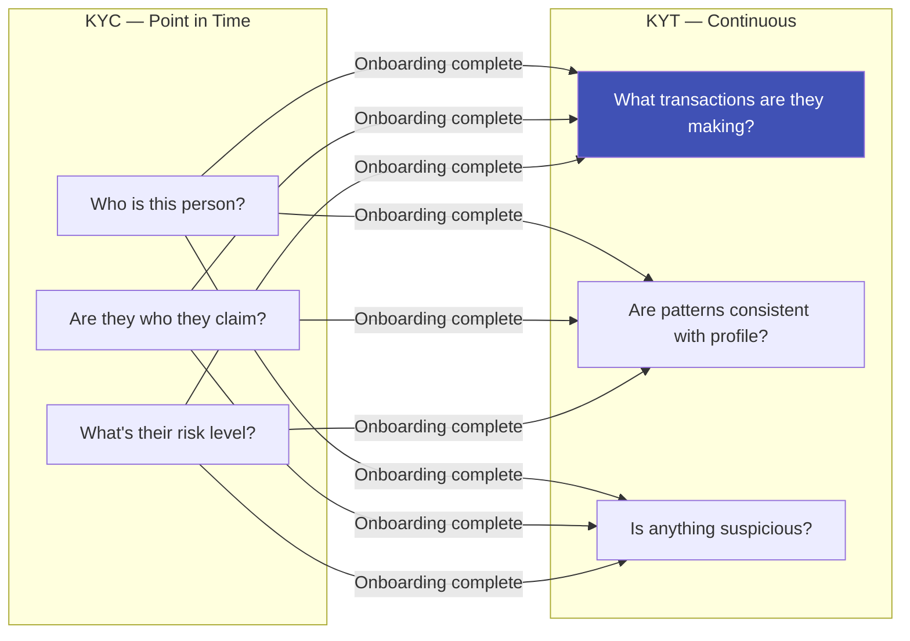
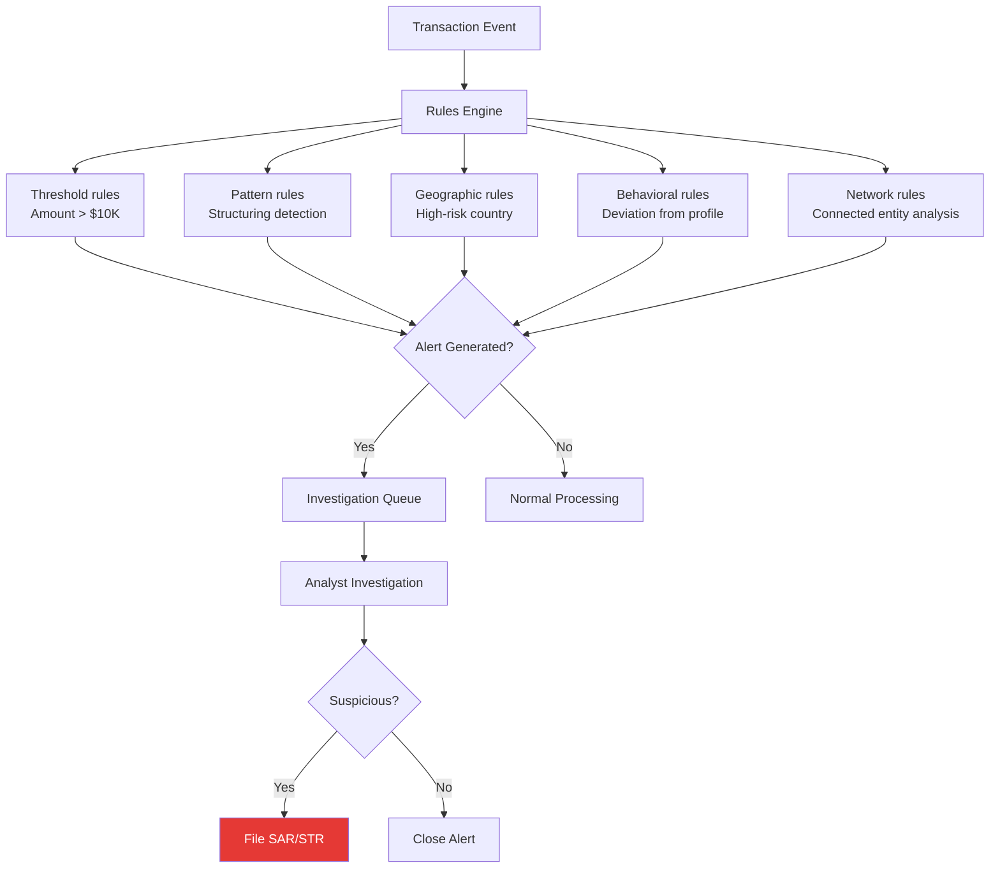

# KYT — Know Your Transaction

## Definition

**KYT (Know Your Transaction)** is the process of monitoring and analyzing customer transactions to detect suspicious patterns that may indicate money laundering, terrorist financing, fraud, or other financial crimes. While KYC verifies **who** the customer is, KYT monitors **what** they're doing with their account.

---

## KYC vs KYT

---

## What KYT Monitors

### Transaction Red Flags

| Red Flag Category | Examples |
|-------------------|---------|
| **Structuring (Smurfing)** | Multiple deposits just below $10,000 to avoid CTR reporting |
| **Unusual volume** | Account with $2K/month suddenly transacts $200K |
| **Geographic risk** | Transfers to/from FATF grey/blacklist countries |
| **Round-tripping** | Money sent out and returned through different channels |
| **Rapid movement** | Funds deposited and immediately transferred elsewhere |
| **Cash-intensive** | High cash deposits inconsistent with business type |
| **Third-party payments** | Payments from unrelated third parties |
| **Shell company patterns** | High throughput, no employees, minimal business activity |
| **Layering** | Complex series of transactions designed to obscure origin |

### Transaction Monitoring Rules

---

## KYT in Crypto (Blockchain Analytics)

KYT has special importance in cryptocurrency:

| Challenge | Traditional Finance | Crypto |
|-----------|-------------------|--------|
| **Identity** | Account holder known (KYC'd) | Wallet address is pseudonymous |
| **Transaction tracing** | Bank records | Public blockchain ledger |
| **Cross-border** | Correspondent banking, SWIFT | Instant, borderless, 24/7 |
| **Speed** | Hours/days for settlement | Seconds/minutes |

**Crypto KYT providers:**

| Provider | What They Do |
|----------|-------------|
| **Chainalysis** | Blockchain analytics, wallet risk scoring, transaction tracing |
| **Elliptic** | Cross-chain analytics, sanctions screening for crypto |
| **TRM Labs** | Blockchain intelligence for financial crime |
| **Crystal Blockchain** | Crypto transaction monitoring and compliance |

### FATF Travel Rule

The **Travel Rule** requires VASPs (Virtual Asset Service Providers) to share originator and beneficiary information for crypto transfers above $1,000:

| Data Shared | Details |
|-------------|---------|
| **Originator** | Name, account number, address/DOB/ID number |
| **Beneficiary** | Name, account number |
| **Transaction** | Amount, date, virtual asset type |

---

## KYT Technology Stack

| Component | Technology | Purpose |
|-----------|-----------|---------|
| **Rules engine** | Custom rules, Drools, FICO | Threshold and pattern-based detection |
| **ML models** | Anomaly detection, graph neural networks | Detect sophisticated patterns |
| **Graph analytics** | Neo4j, TigerGraph | Network analysis — connected entities |
| **Real-time streaming** | Kafka, Flink | Process transactions as they happen |
| **Case management** | NICE Actimize, Featurespace, custom | Manage investigation workflow |

---

## Key Takeaways

!!! success "Summary"
    - KYT is the **ongoing monitoring** complement to KYC's onboarding verification
    - Monitors transactions for **suspicious patterns**: structuring, unusual volume, geographic risk
    - **Suspicious Activity Reports (SARs)** must be filed when suspicious activity is confirmed
    - **Crypto KYT** uses blockchain analytics to trace pseudonymous transactions
    - The **FATF Travel Rule** mandates information sharing for crypto transfers
    - Modern KYT uses a **combination of rules and ML** for detection

---

## Related Articles

- **Previous**: [← KYB — Know Your Business](kyb-know-your-business.md)
- **Next**: [Customer Due Diligence (CDD) →](cdd-customer-due-diligence.md)
- [Anti-Money Laundering (AML)](aml-anti-money-laundering.md)
- [FATF](fatf-financial-action-task-force.md)
- [Fraud Detection ML Models](../06-fraud-risk/fraud-detection-ml-models.md)
