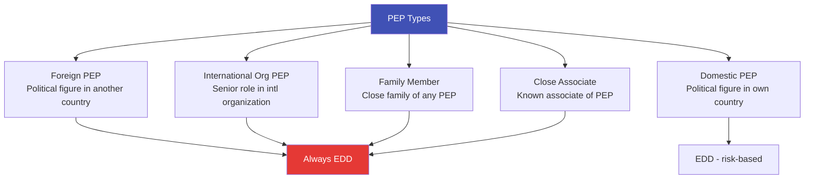
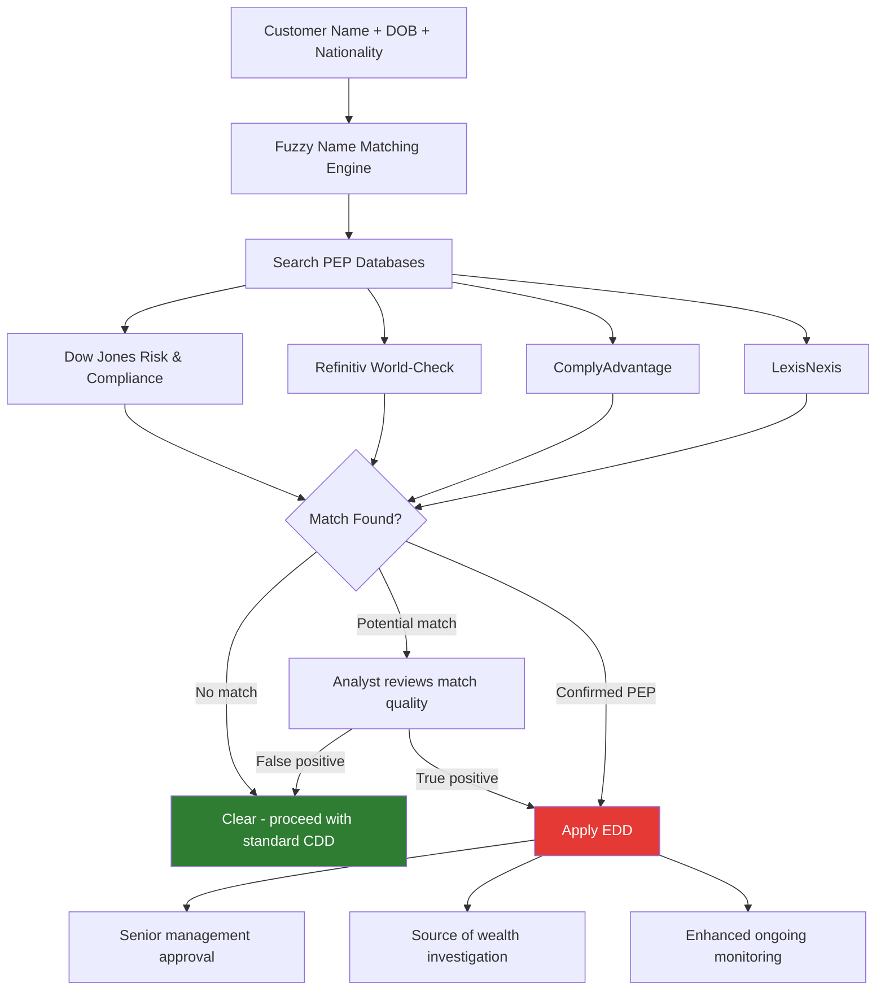

# Politically Exposed Persons (PEP)

## Definition

A **PEP (Politically Exposed Person)** is an individual who holds or has held a prominent public function, making them a higher risk for potential involvement in bribery, corruption, or money laundering. Financial institutions must apply **Enhanced Due Diligence (EDD)** when dealing with PEPs.

---

## PEP Categories

### Who Qualifies as a PEP

| Category | Examples |
|----------|---------|
| **Heads of State/Government** | Presidents, Prime Ministers, Monarchs |
| **Senior politicians** | Cabinet ministers, parliamentarians, senators |
| **Senior judicial** | Supreme/High Court judges, constitutional court members |
| **Senior military** | Generals, admirals, chiefs of staff |
| **State-owned enterprise leaders** | CEOs/directors of major SOEs |
| **Central bank officials** | Governors, board members |
| **Ambassadors** | Senior diplomatic representatives |
| **Senior party officials** | Leaders of major political parties |
| **International organizations** | UN Secretary-General, World Bank President, EU Commissioners |

### Family Members & Close Associates

| Relationship | Examples |
|-------------|---------|
| **Spouse/partner** | Husband, wife, civil partner |
| **Children** | Sons, daughters (and their spouses) |
| **Parents** | Mother, father |
| **Siblings** | Brothers, sisters (in some jurisdictions) |
| **Close associate** | Business partners, joint beneficial owners, close personal advisors |

---

## PEP Screening in eKYC

### How It Works

### PEP Screening Challenges

| Challenge | Details |
|-----------|---------|
| **Name transliteration** | Arabic/Chinese/Cyrillic names have multiple English spellings |
| **Common names** | "Mohammed Ali" or "John Smith" generates many false positives |
| **Data quality** | PEP lists may be outdated or incomplete |
| **Scope of family** | How far to extend family/associate screening? |
| **De-PEP timing** | When does someone stop being a PEP? (typically 1-2 years after leaving office) |
| **False positive rate** | Can be 90%+ — overwhelming review teams |

### PEP Data Providers

| Provider | Coverage | Key Feature |
|----------|----------|-------------|
| **Dow Jones Risk & Compliance** | 2.8M+ profiles | Manually curated by journalists |
| **Refinitiv World-Check** | 4.8M+ profiles | Broadest coverage |
| **ComplyAdvantage** | AI-curated, real-time | Lower false positive rate |
| **LexisNexis** | Extensive US/EU coverage | Combined identity + screening |

---

## Key Takeaways

!!! success "Summary"
    - PEPs are **higher risk** due to potential corruption and bribery — **EDD is always required**
    - PEP status extends to **family members and close associates**
    - **Fuzzy name matching** is essential — transliteration and common names make exact matching insufficient
    - **False positive rates are very high** (90%+) — requiring significant manual review
    - PEP status doesn't mean the person is criminal — it means **higher scrutiny is warranted**
    - **De-PEP**: Generally considered PEP for 1-2 years after leaving office (varies by jurisdiction)

---

## Related Articles

- **Previous**: [← FATF](fatf-financial-action-task-force.md)
- **Next**: [Sanctions Screening →](sanctions-screening.md)
- [Enhanced Due Diligence (EDD)](edd-enhanced-due-diligence.md)
- [Adverse Media Screening](adverse-media-screening.md)
