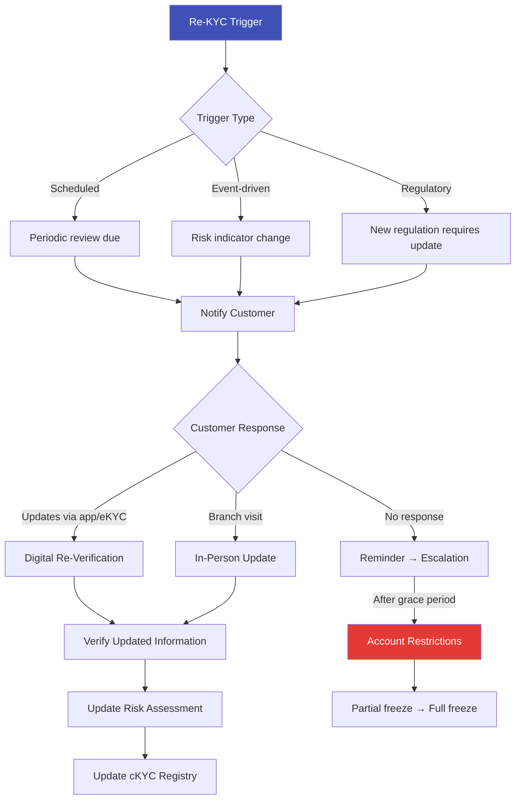

# Re-KYC — Periodic Re-Verification

## Definition

**Re-KYC** is the mandatory process of periodically updating and re-verifying a customer's KYC information to ensure it remains current, accurate, and aligned with the customer's risk profile. It is a critical component of the ongoing monitoring pillar of KYC compliance.

---

## Why Re-KYC is Necessary

Customer circumstances change over time:

| Change Type | KYC Impact | Risk Implication |
|-------------|-----------|------------------|
| **Address change** | Correspondence may not reach customer | Geo-risk may change |
| **Name change** | Marriage, legal change | Identity records mismatch |
| **Employment change** | New occupation, new income | Transaction pattern changes |
| **Business change** | New ownership, new activities | Risk profile changes |
| **PEP status change** | Customer becomes politically exposed | Requires upgrade to EDD |
| **Sanctions listing** | Customer added to sanctions list | Immediate action required |
| **Adverse media** | Negative news about customer | Risk reassessment needed |
| **Document expiry** | Passport, DL expires | Document on file no longer valid |

---

## Re-KYC Frequency by Jurisdiction

| Jurisdiction | High Risk | Medium Risk | Low Risk |
|-------------|-----------|------------|----------|
| **India (RBI)** | Every 2 years | Every 8 years | Every 10 years |
| **EU (AMLD)** | Risk-based (no fixed period) | Risk-based | Risk-based |
| **USA** | Risk-based | Risk-based | Risk-based |
| **Singapore (MAS)** | Annual | Every 3 years | Event-triggered |
| **UAE** | Every 2 years | Every 3 years | Every 5 years |

---

## Re-KYC Process

### Account Restriction on Re-KYC Failure

In India, RBI mandates progressive account restrictions if re-KYC is not completed:

| Stage | Timeline | Restriction |
|-------|----------|-------------|
| **Reminder** | 6 months before due | SMS/email/app notification |
| **Warning** | 3 months before due | Repeated notifications |
| **Partial freeze** | Re-KYC due date passed | Credits allowed, debits restricted |
| **Full freeze** | Grace period expired | All transactions blocked |
| **Account closure** | Extended non-compliance | Dormant → eventual closure |

---

## Digital Re-KYC Methods

| Method | Process | Speed |
|--------|---------|-------|
| **App-based self-update** | Customer updates info + fresh selfie in banking app | 2-5 minutes |
| **OTP-based verification** | Customer confirms existing data via OTP | 1 minute |
| **DigiLocker refresh** | Pull updated documents from DigiLocker | 2 minutes |
| **cKYC refresh** | Download updated record from central registry | Instant |
| **Video Re-KYC** | Abbreviated V-KYC call for significant changes | 3-5 minutes |
| **Aadhaar re-authentication** | Re-verify via Aadhaar OTP/biometric | 30 seconds |

---

## The Re-KYC Challenge at Scale

| Bank Size | Customers | Re-KYC per Year | Challenge |
|-----------|-----------|-----------------|-----------|
| **Small bank** | 1 million | ~100K-200K | Manageable with digital |
| **Large bank** | 50 million | 5-10 million | Massive operational load |
| **Mega bank (SBI)** | 500 million | 50-100 million | Requires fully automated digital re-KYC |

!!! info "The Opportunity"
    Re-KYC at scale is a massive pain point for banks — and a massive opportunity for eKYC technology providers. Banks need solutions that can process millions of re-KYC requests with minimal manual intervention.

---

## Key Takeaways

!!! success "Summary"
    - Re-KYC is **mandatory** — failure to re-verify leads to account restrictions and regulatory penalties
    - **Frequency depends on risk level** — high-risk every 2 years, low-risk every 10 years (India)
    - **Digital re-KYC** is essential for scale — app-based self-update, OTP verification, DigiLocker refresh
    - **Account restrictions** are progressively applied if re-KYC isn't completed
    - Re-KYC at scale (millions/year) is a **major operational challenge** and technology opportunity

---

## Related Articles

- **Previous**: [← Central KYC (cKYC)](ckyc-central-kyc.md)
- **Next**: [KYB — Know Your Business →](kyb-know-your-business.md)
- [KYC Deep Dive](kyc-know-your-customer.md)
- [Customer Due Diligence (CDD)](cdd-customer-due-diligence.md)
