# Sanctions Screening

## Definition

**Sanctions screening** is the process of checking customers, transactions, and counterparties against lists of individuals, entities, and countries that are subject to economic sanctions imposed by governments and international bodies. It is a **legal obligation** — transacting with sanctioned parties can result in criminal prosecution.

---

## Major Sanctions Lists

| List | Maintained By | Scope | Update Frequency |
|------|-------------|-------|-----------------|
| **OFAC SDN** | US Treasury | Blocked persons/entities — US sanctions | Multiple times per week |
| **UN Consolidated** | UN Security Council | Global — binding on all UN members | As resolutions are passed |
| **EU Sanctions** | European Commission | EU-wide sanctions | As regulations are adopted |
| **UK HMT** | HM Treasury | UK financial sanctions | Regularly updated |
| **OFAC Sectoral** | US Treasury | Sector-specific restrictions (Russia, Iran) | As policies change |
| **BIS Entity List** | US Commerce Dept | Export control restrictions | Periodically |

---

## How Sanctions Screening Works in eKYC

```mermaid
graph TD
    A[Customer Data<br/>Name, DOB, Nationality, Address] --> B[Screening Engine]

    B --> C[Exact Match Search]
    B --> D[Fuzzy Match Search<br/>Jaro-Winkler, Soundex, Levenshtein]
    B --> E[Alias Search]
    B --> F[Phonetic Search]

    C & D & E & F --> G{Results}
    G -->|No match| H[✅ Clear]
    G -->|Potential match| I[Match score + details]

    I --> J[Analyst Review]
    J -->|False positive| H
    J -->|True positive| K[🚨 BLOCK]

    K --> L[Reject/freeze account]
    K --> M[File SAR/report to authority]
    K --> N[Preserve all records]

    style K fill:#e53935,color:#fff
    style H fill:#2E7D32,color:#fff
```

### Screening Triggers

| When to Screen | Details |
|---------------|---------|
| **Onboarding** | Every new customer, every new account |
| **Transactions** | Real-time screening of payment beneficiaries |
| **List updates** | Re-screen entire customer base when lists are updated |
| **Periodic batch** | Regular re-screening (daily/weekly) of all customers |
| **Trigger events** | Name changes, new adverse media, geographic changes |

### Fuzzy Matching Algorithms

| Algorithm | How It Works | Best For |
|-----------|-------------|----------|
| **Jaro-Winkler** | Character-level similarity, weighted toward prefix | Typos, minor spelling variations |
| **Soundex** | Phonetic encoding of names | Names that sound alike but spelled differently |
| **Levenshtein** | Edit distance (insertions, deletions, substitutions) | General name similarity |
| **Double Metaphone** | Advanced phonetic algorithm | Cross-language phonetic matching |
| **Token-based** | Compare name tokens regardless of order | Different name orderings (family name first vs last) |

---

## Sanctions Compliance Requirements

| Requirement | Details |
|-------------|---------|
| **Real-time screening** | Payment screening must happen before transaction executes |
| **100% coverage** | Every customer, every transaction — no exceptions |
| **List currency** | Must use most current version of all applicable lists |
| **Record keeping** | All screening results and decisions must be retained |
| **Escalation** | True hits must be escalated immediately to compliance |
| **Blocking** | Confirmed sanctioned party's assets must be frozen immediately |
| **Reporting** | Report to relevant authority (OFAC, HMT, etc.) within required timeframe |

---

## Key Takeaways

!!! success "Summary"
    - Sanctions screening is a **legal obligation** — transacting with sanctioned parties is a criminal offense
    - Must screen against **multiple lists** (OFAC, UN, EU, UK HMT) simultaneously
    - **Fuzzy matching** is essential — names are transliterated, misspelled, and aliased
    - Screening happens at **onboarding, every transaction, and on list updates**
    - **True hits require immediate action** — freeze assets, file reports, block transactions
    - **False positive management** is a major operational challenge — good algorithms reduce this burden

---

## Related Articles

- **Previous**: [← Politically Exposed Persons (PEP)](pep-politically-exposed-persons.md)
- **Next**: [Adverse Media Screening →](adverse-media-screening.md)
- [Anti-Money Laundering (AML)](aml-anti-money-laundering.md)
- [FATF](fatf-financial-action-task-force.md)
