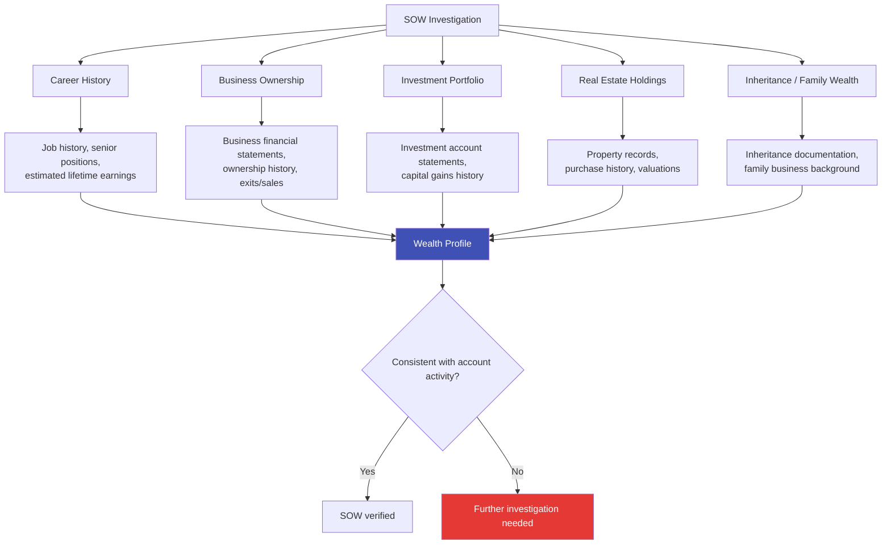

# Source of Funds / Source of Wealth (SOF/SOW)

## Definition

**Source of Funds (SOF)** and **Source of Wealth (SOW)** are two related but distinct concepts in KYC/AML compliance that help financial institutions understand where a customer's money comes from.

- **SOF**: Where the money for a specific transaction or account originates
- **SOW**: How the customer accumulated their total wealth over their lifetime

---

## SOF vs SOW

| Aspect | Source of Funds (SOF) | Source of Wealth (SOW) |
|--------|---------------------|----------------------|
| **Question answered** | Where did THIS money come from? | How did you become wealthy? |
| **Scope** | Specific transaction or deposit | Lifetime wealth accumulation |
| **When required** | All CDD (basic level) | Primarily during EDD |
| **Evidence** | Bank statement, salary slip, sale deed | Career history, business profits, inheritance |
| **Example** | "This ₹10L deposit came from property sale" | "I built wealth through 20 years in IT industry + property investments" |

---

## SOF/SOW Verification

### Common Sources of Funds

| Source | Acceptable Evidence |
|--------|-------------------|
| **Employment income** | Salary slips, employment contract, bank statements showing regular credits |
| **Business income** | Financial statements, tax returns, business bank statements |
| **Property sale** | Sale deed, settlement statement, property records |
| **Investment returns** | Brokerage statements, dividend records, capital gains statements |
| **Inheritance** | Will, probate documents, estate settlement records |
| **Gift** | Gift deed, donor's SOF (may require donor KYC) |
| **Loan proceeds** | Loan agreement, disbursement records |
| **Government benefits** | Benefit award letters, payment records |

### SOW Investigation (for EDD)

---

## When SOF/SOW is Required

| Scenario | SOF Required | SOW Required |
|----------|-------------|-------------|
| **Standard CDD** | Yes (basic) | No |
| **EDD — PEP** | Yes (detailed) | Yes |
| **EDD — High-risk country** | Yes (detailed) | Yes |
| **Large/unusual transaction** | Yes | Possibly |
| **Private banking** | Yes (detailed) | Yes |
| **Cash-intensive business** | Yes (detailed) | Yes |
| **Complex structures** | Yes (detailed) | Yes |

---

## Red Flags

| Red Flag | Concern |
|----------|---------|
| **Unable to explain SOF** | Customer cannot articulate where funds came from |
| **SOF inconsistent with profile** | Low-income person making large deposits |
| **Funds from high-risk jurisdiction** | Without clear business purpose |
| **Third-party funding** | Someone else deposits into customer's account |
| **Reluctance to provide documentation** | Customer avoids providing evidence |
| **SOW doesn't match lifestyle** | Declared wealth doesn't match observed spending patterns |
| **Sudden wealth** | Cannot explain rapid wealth accumulation |

---

## Key Takeaways

!!! success "Summary"
    - **SOF** (where THIS money came from) is required for all CDD; **SOW** (lifetime wealth) is required for EDD
    - Both must be **documented with evidence** — self-declaration alone is insufficient for high-risk
    - **Red flags** include inability to explain funds, inconsistency with profile, and third-party funding
    - SOF/SOW verification is one of the **most labor-intensive** parts of EDD — hard to automate
    - Getting SOF/SOW right is critical — it's one of the most common AML compliance failures

---

## Related Articles

- **Previous**: [← Ultimate Beneficial Owner (UBO)](ubo-ultimate-beneficial-owner.md)
- **Back to section**: [Identity Verification & Compliance](index.md)
- [Enhanced Due Diligence (EDD)](edd-enhanced-due-diligence.md)
- [Customer Due Diligence (CDD)](cdd-customer-due-diligence.md)
- [Anti-Money Laundering (AML)](aml-anti-money-laundering.md)
