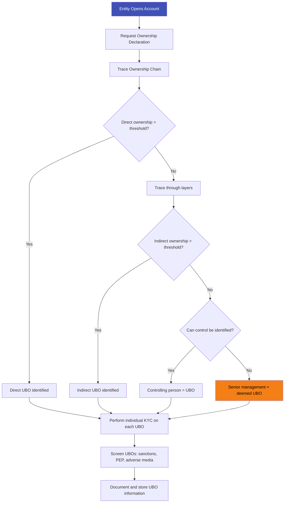
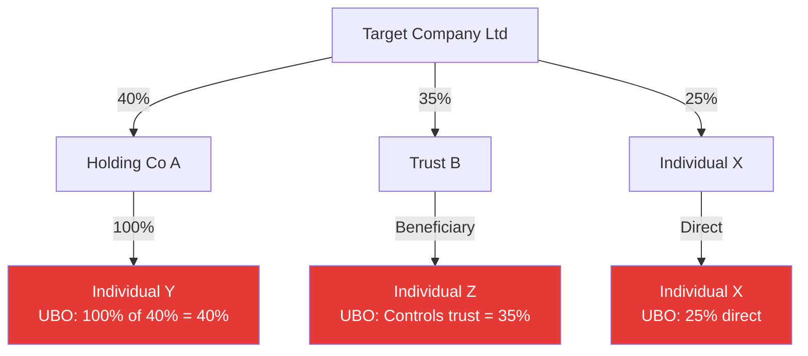

# Ultimate Beneficial Owner (UBO)

## Definition

A **UBO (Ultimate Beneficial Owner)** is the natural person who ultimately owns or controls a legal entity, even if ownership is exercised through a chain of other companies, trusts, or nominees. Identifying UBOs is a critical part of **KYB (Know Your Business)** and is required to prevent entities from being used as vehicles for money laundering, tax evasion, and terrorism financing.

---

## UBO Thresholds by Jurisdiction

| Jurisdiction | Ownership Threshold | Control Threshold |
|-------------|--------------------|--------------------|
| **EU (AMLD)** | 25% + 1 share | Any person exercising control |
| **USA (CTA)** | 25% equity | 1 individual with significant control |
| **UK (PSC)** | 25%+ shares or voting rights | Significant influence or control |
| **India (RBI/MCA)** | 25% (private), 10% (listed) | Controlling interest |
| **Singapore (ACRA)** | 25%+ shares or voting power | Significant control |
| **FATF recommendation** | 25% (or lower if risk warrants) | Effective control |

---

## UBO Identification Process

### Complex Ownership Example

Three UBOs identified: Individual Y (40% indirect), Individual Z (35% via trust), Individual X (25% direct).

---

## UBO Registers

| Country | Register | Public Access |
|---------|----------|---------------|
| **EU members** | National UBO registers | Restricted access (post-CJEU ruling 2022) |
| **UK** | Companies House PSC Register | Public and free |
| **USA** | FinCEN BOI (from 2024) | Law enforcement and FIs |
| **India** | MCA + RBI significant beneficial owner register | Not public |

---

## UBO Challenges

| Challenge | Details |
|-----------|---------|
| **Multi-layered structures** | Shell companies within shell companies across jurisdictions |
| **Nominees and trusts** | Obscure true ownership through intermediaries |
| **Bearer shares** | Some jurisdictions still allow unregistered ownership |
| **Cross-border chains** | Ownership chains spanning multiple countries with different UBO rules |
| **Verification** | Self-declared UBO data is hard to independently verify |
| **Ongoing changes** | Ownership changes may not be promptly reported |

---

## Key Takeaways

!!! success "Summary"
    - UBO identification is **mandatory** — must trace to the natural person behind every entity
    - **Typical threshold is 25%** ownership or significant control
    - If no UBO can be identified, **senior management is deemed the UBO** as a fallback
    - **Individual KYC** must be performed on each identified UBO
    - **Complex structures** (trusts, nominees, shell companies) are used to obscure UBOs — regulators are cracking down
    - **Public registers** (UK) and restricted registers (EU, US) are making UBO data more accessible

---

## Related Articles

- **Previous**: [← Adverse Media Screening](adverse-media-screening.md)
- **Next**: [Source of Funds / Wealth →](sof-sow-source-of-funds-wealth.md)
- [KYB — Know Your Business](kyb-know-your-business.md)
- [Enhanced Due Diligence (EDD)](edd-enhanced-due-diligence.md)
