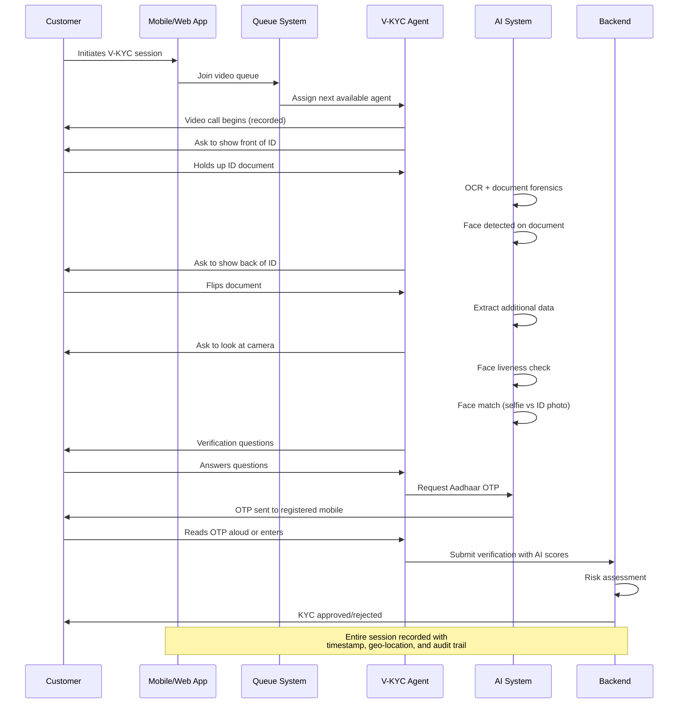
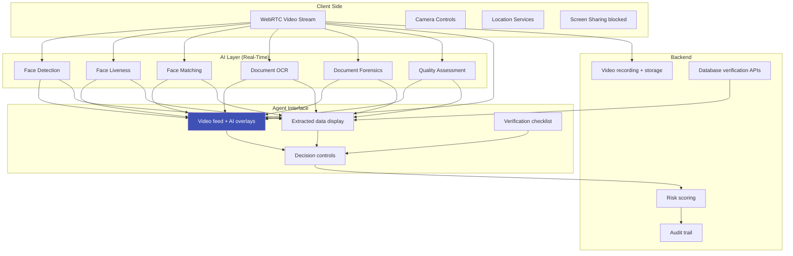
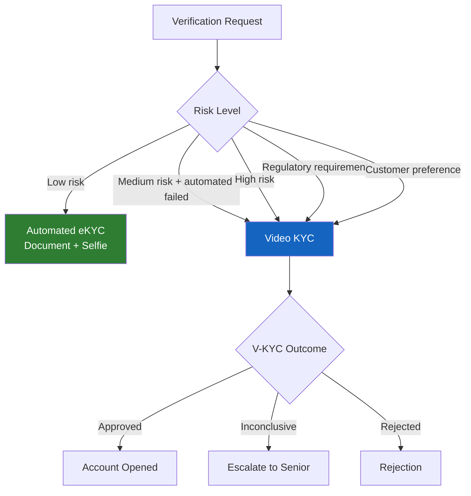

# Video KYC (V-KYC)

## Definition

**Video KYC (V-KYC)** is a method of customer identity verification conducted through a live, real-time video call between the customer and a trained verification agent. It combines the assurance of in-person verification with the convenience of remote onboarding, enhanced by AI-assisted checks for face matching, liveness, and document reading.

---

## How Video KYC Works

---

## V-KYC Regulatory Framework

### India (RBI) — Most Detailed V-KYC Guidelines

RBI's January 2020 amendment to the KYC Master Direction formalized V-KYC:

| Requirement | Details |
|-------------|---------|
| **Agent qualification** | Must be official of the Regulated Entity (bank/NBFC), trained in KYC/AML |
| **Video quality** | Clear, real-time, two-way audio-video |
| **Recording** | Entire session must be recorded and stored |
| **Geo-tagging** | Customer's live GPS location captured |
| **Document capture** | Customer must display original OVDs — high-res capture |
| **Aadhaar OTP** | Must be verified during the session |
| **PAN verification** | Cross-checked in real-time |
| **Face match** | Live face matched with photo on ID (AI-assisted) |
| **Randomized checks** | Agent asks questions to verify identity awareness |
| **Concurrent sessions** | Agent cannot handle multiple V-KYC calls simultaneously |
| **Audit trail** | Complete log with timestamps, agent ID, customer ID |
| **Failure handling** | If video drops, session must restart from beginning |
| **Redaction** | Aadhaar number must be masked/redacted in stored recordings |

### Germany (BaFin VideoIdent)

| Requirement | Details |
|-------------|---------|
| **Agent** | Trained identification agent (can be third-party) |
| **Encryption** | End-to-end encrypted video stream |
| **Document check** | Agent performs visual security feature inspection |
| **Hologram check** | Customer must tilt document to show holographic features |
| **Photo match** | Agent visually confirms face matches document |
| **Random questions** | From ID data to verify customer knows their own details |
| **Recording** | Session recorded, stored for 5 years |

### Other Jurisdictions

| Country | V-KYC Status |
|---------|-------------|
| **France** | PVID (Remote Identity Verification) framework — ANSSI certified |
| **Italy** | SPID video identification accepted |
| **Spain** | SEPBLAC guidance allows video-based identification |
| **Austria** | VideoIdent accepted under BWG |
| **India** | Most comprehensive V-KYC framework globally |

---

## V-KYC Technology Stack

### Key Technology Components

| Component | Technology | Purpose |
|-----------|-----------|---------|
| **Video streaming** | WebRTC | Low-latency, peer-to-peer video |
| **Recording** | Server-side recording | Compliance — entire session stored |
| **Face detection** | SCRFD / BlazeFace | Real-time face tracking during call |
| **Face liveness** | Passive liveness model | Ensure customer is live (not replay) |
| **Face matching** | ArcFace / AdaFace | Compare live face with ID document photo |
| **Document OCR** | LayoutLMv3 / PaddleOCR | Extract data from documents shown on camera |
| **Document forensics** | Forensic CNN | Check document authenticity in real-time |
| **Geo-location** | GPS + IP geolocation | Capture customer location |
| **Encryption** | TLS 1.3 + E2E encryption | Secure video transmission |
| **Queue management** | Custom or vendor (Twilio, Vonage) | Route customers to available agents |

---

## V-KYC vs Other eKYC Methods

| Aspect | Automated eKYC | Video KYC | In-Person KYC |
|--------|---------------|-----------|---------------|
| **Human involvement** | None (AI only) | Agent + AI hybrid | Fully human |
| **Assurance level** | High | Very High | Very High |
| **Speed** | 30-60 seconds | 5-15 minutes | 30-60 minutes |
| **Cost per verification** | $0.50-$5 | $5-$15 | $15-$25 |
| **Scalability** | Very high | Limited by agents | Limited by branches |
| **Availability** | 24/7 | Agent working hours | Branch hours |
| **Spoofing resistance** | Model-dependent | High (human + AI) | Very high |
| **User experience** | Best | Good (wait times) | Worst |
| **Regulatory acceptance** | Growing | High | Universal |

---

## When to Use Video KYC

**Typical V-KYC use cases:**

| Use Case | Why V-KYC |
|----------|-----------|
| **Automated eKYC fallback** | Face match or liveness failed — human verification as escalation |
| **High-value accounts** | Private banking, large deposit accounts require higher assurance |
| **PEP customers** | Additional human verification layer for politically exposed persons |
| **Document edge cases** | Damaged, unusual, or hard-to-read documents |
| **Regulatory mandate** | Some products require face-to-face equivalent verification |
| **Customer preference** | Some customers prefer human interaction |
| **Elderly users** | Users who struggle with automated selfie/liveness flow |

---

## V-KYC Agent Training Requirements

| Training Area | Topics |
|--------------|--------|
| **KYC/AML basics** | CDD, EDD, risk assessment, SAR identification |
| **Document recognition** | Identifying genuine documents, security features |
| **Fraud detection** | Common impersonation tactics, social engineering |
| **Technology** | Using the V-KYC platform, AI overlay interpretation |
| **Communication** | Professional video call conduct, customer guidance |
| **Privacy** | Data protection obligations, handling sensitive data |
| **Escalation** | When and how to escalate suspicious cases |
| **Regulatory** | Specific V-KYC regulatory requirements |

---

## V-KYC Challenges

| Challenge | Details | Mitigation |
|-----------|---------|------------|
| **Wait times** | Customers wait for available agent | Hybrid: try automated first, V-KYC fallback |
| **Bandwidth** | Poor network causes dropped calls | Adaptive bitrate, reconnection logic |
| **Cost** | $5-15 per verification (agent + infrastructure) | Reserve for high-risk / fallback only |
| **Scale** | Linear scaling — more calls need more agents | Outsource V-KYC to specialized providers |
| **Agent fatigue** | Repetitive work causes quality drop | Rotation, breaks, AI-assisted checklists |
| **Language** | Multi-lingual customer base | Multi-lingual agents or translation AI |
| **Spoofing** | Deepfake during video call | Real-time liveness + random challenges |

---

## Key Takeaways

!!! success "Summary"
    - **V-KYC combines human judgment with AI assistance** for the highest remote verification assurance
    - **India has the most comprehensive V-KYC framework** — mandatory recording, geo-tagging, agent qualification
    - **Best used as a fallback or escalation path** — not primary verification (too expensive to scale)
    - **Cost is $5-15 per verification** — 3-10x more than automated eKYC
    - **Deepfakes pose a growing threat** even for V-KYC — real-time face swap can fool human agents
    - V-KYC agents need **specialized training** in documents, fraud, regulation, and technology

---

## Related Articles

- **Previous**: [← eKYC Deep Dive](ekyc-electronic-kyc-deep-dive.md)
- **Next**: [Central KYC (cKYC) →](ckyc-central-kyc.md)
- [Face Liveness Detection](../02-biometrics-face/face-liveness-detection-overview.md)
- [Deepfake Detection](../02-biometrics-face/deepfake-detection.md)
- [RBI V-KYC Guidelines](../07-regulations-standards/rbi-vkyc-guidelines.md)
