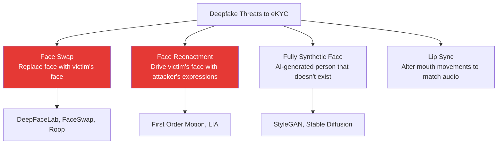

# Deepfake Detection

## Definition

**Deepfake detection** in eKYC identifies AI-generated or AI-manipulated face content — including face swaps, face reenactment, and fully synthetic faces — used to bypass identity verification.

---

## Deepfake Types Relevant to eKYC

---

## Detection Approaches

| Approach | How It Works | Strengths | Weaknesses |
|----------|-------------|-----------|------------|
| **Artifact detection** | Detect blending boundaries, inconsistent lighting, GAN fingerprints | Works on known generators | Fails on new generators |
| **Frequency analysis** | Analyze spectral features (GAN-generated faces lack high-frequency details) | Generator-agnostic to some extent | Can be bypassed by post-processing |
| **Temporal analysis** | Detect flickering, inconsistent inter-frame motion in video | Good for video deepfakes | Requires video (not single frame) |
| **Physiological signals** | Detect absence of blood flow (PPG), inconsistent eye reflections | Hard to fake biological signals | Requires good camera quality |
| **Device integrity** | Verify image came from real camera via hardware attestation | Strongest long-term defense | Requires device-level support |

---

## Detection Models

| Model/Method | Type | Key Feature |
|-------------|------|-------------|
| **EfficientNet-B4** | Binary classifier | Strong baseline, widely used |
| **Xception** | Binary classifier | Designed for manipulated image detection |
| **RECCE** | Reconstruction-based | Reconstruct face, compare with input — deepfakes reconstruct differently |
| **Multi-Attention** | Attention-guided | Multiple attention maps for local and global artifact detection |
| **SBI (Self-Blended Images)** | Self-supervised | Synthesize training data by self-blending — no real deepfakes needed |
| **CLIP-based** | Foundation model | Use CLIP features for zero-shot deepfake detection |

---

## The Arms Race

| Year | Attack Capability | Defense Capability |
|------|------------------|-------------------|
| 2018 | Obvious artifacts, 1-2min to generate | Simple artifact detection works |
| 2020 | Convincing swaps, video capable | Multi-cue detection needed |
| 2022 | Real-time face swap (DeepFaceLive) | Temporal + physiological required |
| 2024 | Indistinguishable from real to humans | Device attestation becoming necessary |
| 2026+ | Full synthetic identities | Cryptographic image provenance |

---

## Key Takeaways

!!! success "Summary"
    - Deepfakes are the **fastest-growing threat** to eKYC systems
    - **Real-time face swap** (DeepFaceLive + virtual camera) is the most dangerous current attack
    - Detection approaches: artifact analysis, frequency analysis, temporal analysis, physiological signals
    - **No single detection method is sufficient** — multi-cue approaches are necessary
    - Long-term solution: **cryptographic image provenance** (C2PA, device attestation)
    - Deepfakes are a bigger threat via **injection** than presentation — device integrity is critical

---

## Related Articles

- **Previous**: [← iBeta Certification](ibeta-certification.md)
- **Next**: [Injection Attacks →](injection-attack.md)
- [Face Liveness Detection Overview](face-liveness-detection-overview.md)
- [Injection Attacks](injection-attack.md)
