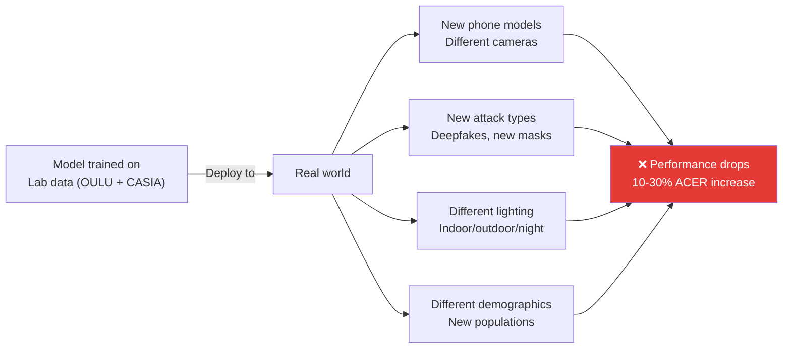
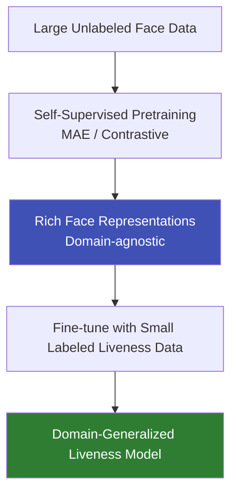

# Domain Generalization for Liveness

## Definition

**Domain Generalization (DG)** for face liveness aims to train models that perform well on **unseen domains** — new devices, new attack types, new environments, and new demographics — without requiring data from those domains during training. This is the **holy grail** of face anti-spoofing research.

---

## Why Domain Generalization Matters

---

## Key Approaches

### 1. SSDG (Single-Side Domain Generalization)

| Aspect | Details |
|--------|---------|
| **Paper** | Single-Side Domain Generalization for FAS (CVPR 2020) |
| **Approach** | Adversarial training to make features domain-invariant while preserving live/spoof discriminability |
| **Key idea** | Align feature distributions from different source domains |
| **Performance** | Significant improvement over baselines on cross-dataset protocols |

### 2. MADDG (Multi-Adversarial Domain Generalization)

| Aspect | Details |
|--------|---------|
| **Paper** | Multi-Adversarial Discriminative Deep DG for FAS (CVPR 2019) |
| **Approach** | Multiple domain discriminators at different feature levels |
| **Key idea** | Feature alignment at multiple scales |

### 3. Meta-Learning Approaches

| Aspect | Details |
|--------|---------|
| **Approach** | MAML-style meta-learning — simulate domain shift during training |
| **Key idea** | Split source domains into meta-train and meta-test, optimize for fast adaptation |
| **Benefit** | Model learns to generalize, not just memorize |

### 4. Self-Supervised / Foundation Model Approaches

| Approach | How It Works |
|----------|-------------|
| **Contrastive learning** | Learn representations by contrasting real vs spoof without explicit labels |
| **FLIP-MCL** | Foundation model + multimodal contrastive learning using CLIP features |
| **MAE pretraining** | Masked autoencoder pretrained on large face data, fine-tuned for liveness |

---

## Cross-Dataset Benchmark Results (HTER %)

| Method | O&C&I→M | O&M&I→C | O&C&M→I | I&C&M→O | Average |
|--------|---------|---------|---------|---------|---------|
| **Binary CNN baseline** | 29.2 | 28.5 | 27.6 | 25.4 | 27.7 |
| **MADDG (2019)** | 17.7 | 24.5 | 22.2 | 27.9 | 23.1 |
| **SSDG-R (2020)** | 7.4 | 10.4 | 11.7 | 15.6 | 11.3 |
| **D2AM (2020)** | 12.7 | 20.9 | 15.4 | 15.3 | 16.1 |
| **FLIP-MCL (2023)** | 5.8 | 7.5 | 8.6 | 10.2 | 8.0 |
| **Recent SOTA** | ~3-5 | ~5-8 | ~5-8 | ~8-12 | ~5-8 |

---

## Practical Strategies for Domain Generalization

| Strategy | Complexity | Effectiveness |
|----------|-----------|---------------|
| **Diverse training data** | Low (data collection) | High — most impactful single factor |
| **Strong augmentation** | Low (code) | Medium — helps with environmental variation |
| **Domain adversarial training** | Medium | Medium-High |
| **Self-supervised pretraining** | High (compute) | High — best current approach |
| **Synthetic attack generation** | Medium | High — covers attacks not in training data |
| **Test-time adaptation** | High | Medium — adapts at inference but adds latency |

---

## Key Takeaways

!!! success "Summary"
    - Domain generalization is the **#1 research challenge** in face liveness detection
    - Models trained on lab data **degrade 10-30%** when deployed to real-world conditions
    - **Self-supervised pretraining** + fine-tuning is the current best approach
    - **SSDG** and **FLIP-MCL** are landmark methods in this space
    - Practically, **diverse training data** remains the most impactful single improvement
    - Cross-dataset protocols (O&C&I→M) are the standard evaluation method

---

## Related Articles

- **Previous**: [← Liveness Datasets](liveness-datasets.md)
- **Next**: [iBeta Certification →](ibeta-certification.md)
- [Face Liveness Detection Overview](face-liveness-detection-overview.md)
- [Liveness Model Architectures](liveness-model-architectures.md)
- [Domain Generalization (AI/ML Techniques)](../08-ai-ml-techniques/domain-generalization.md)
