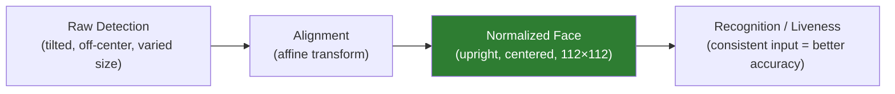
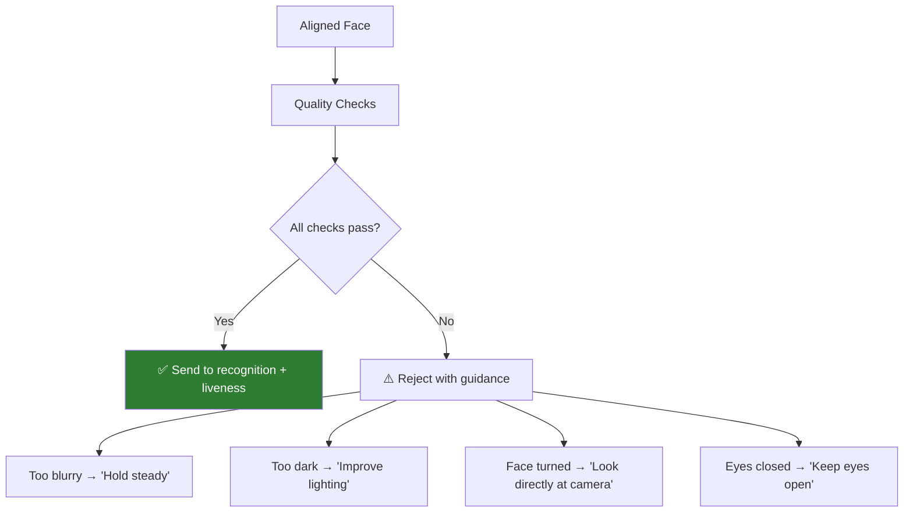

# Face Alignment & Preprocessing

## Definition

**Face alignment** is the process of transforming a detected face into a standardized, normalized representation — correcting for rotation, scale, and position — so that downstream models (recognition, liveness) receive consistent inputs regardless of how the face appeared in the original image.

---

## Why Alignment Matters



**Without alignment:** Recognition accuracy drops 5-15% because the model sees different geometric transformations of the same face.

**With alignment:** The model receives a standardized input every time, maximizing feature extraction quality.

---

## The Alignment Pipeline

### Step 1: Landmark-Based Affine Transform

Using the 5 facial landmarks from detection:

| Landmark | Standard Position (112×112) | Purpose |
|----------|---------------------------|---------|
| Left eye center | (38.29, 51.69) | Horizontal alignment reference |
| Right eye center | (73.53, 51.69) | Horizontal alignment reference |
| Nose tip | (56.02, 71.73) | Vertical centering |
| Left mouth corner | (41.54, 92.37) | Scale reference |
| Right mouth corner | (70.73, 92.37) | Scale reference |

**The affine transform:**

1. Compute similarity transform matrix from detected landmarks → standard landmarks
2. Apply transform to entire image
3. Crop to 112×112 (or model's expected input size)

```python
import cv2
import numpy as np
from skimage.transform import SimilarityTransform

# Standard reference landmarks for 112x112
ref_landmarks = np.array([
    [38.2946, 51.6963],  # left eye
    [73.5318, 51.5014],  # right eye
    [56.0252, 71.7366],  # nose
    [41.5493, 92.3655],  # left mouth
    [70.7299, 92.2041],  # right mouth
], dtype=np.float32)

def align_face(image, landmarks, output_size=112):
    tform = SimilarityTransform()
    tform.estimate(landmarks, ref_landmarks)
    M = tform.params[0:2, :]
    aligned = cv2.warpAffine(image, M, (output_size, output_size))
    return aligned
```

### Step 2: Color Normalization

| Method | Formula | Used By |
|--------|---------|---------|
| **[0, 1] scaling** | pixel / 255.0 | Many models |
| **[-1, 1] scaling** | (pixel - 127.5) / 128.0 | ArcFace, InsightFace |
| **ImageNet normalization** | (pixel/255 - mean) / std | ViT-based models |
| **Per-image standardization** | (pixel - μ) / σ per image | Some liveness models |

### Step 3: Input Sizing

| Model Type | Typical Input Size |
|-----------|-------------------|
| **Face recognition (ArcFace)** | 112 × 112 |
| **Face liveness (CNN)** | 224 × 224 or 256 × 256 |
| **Face liveness (ViT)** | 224 × 224 |
| **Face quality** | 112 × 112 or 224 × 224 |

---

## Face Quality Assessment (Pre-Filter)

Before passing to recognition/liveness, assess face quality:

| Quality Check | Metric | Threshold | Detection Method |
|--------------|--------|-----------|-----------------|
| **Blur** | Laplacian variance | > 50-100 | `cv2.Laplacian(gray, cv2.CV_64F).var()` |
| **Brightness** | Mean pixel value | 40-220 | Histogram analysis |
| **Face size** | Pixel area | > 80×80 | Bounding box dimensions |
| **Pose (yaw)** | Degrees from frontal | < 30° | Landmark-based or head pose estimator |
| **Pose (pitch)** | Degrees from frontal | < 20° | Landmark-based |
| **Occlusion** | Landmark visibility | All 5 visible | Landmark confidence scores |
| **Eye openness** | Eye aspect ratio | Eyes open | EAR (Eye Aspect Ratio) |



---

## Special Cases in eKYC

### Document Face Alignment

Faces extracted from ID documents have unique challenges:

| Challenge | Impact | Mitigation |
|-----------|--------|------------|
| **Low resolution** | 50-150px face on ID | Super-resolution or quality-aware matching |
| **Print artifacts** | Halftone dots, moiré patterns | Preprocessing filters |
| **Color distortion** | Faded, yellowed photos | Color correction, histogram equalization |
| **Partial occlusion** | Hologram/lamination overlap | Multiple capture attempts, angle guidance |

### Cross-Domain Alignment (ID Photo ↔ Selfie)

The aligned face from an ID document and a selfie will differ in:
- **Resolution**: ID face ~100px vs selfie ~300px
- **Quality**: Print artifacts vs camera noise
- **Age**: ID photo may be years older
- **Lighting**: Studio flash vs ambient

Models like **AdaFace** are specifically designed to handle this quality mismatch by adapting feature importance based on image quality.

---

## Key Takeaways

!!! success "Summary"
    - Face alignment via **5-point affine transform** is essential — improves recognition accuracy by 5-15%
    - Standard target: **112×112 pixels** for recognition, **224×224** for liveness
    - **Quality assessment** before downstream processing prevents garbage-in-garbage-out
    - Document face alignment has unique challenges: low resolution, print artifacts, color distortion
    - Color normalization must match the model's training preprocessing exactly
    - **AdaFace** handles quality mismatch between ID photos and selfies

---

## Related Articles

- **Previous**: [← Face Detection](face-detection.md)
- **Next**: [Face Quality Assessment →](face-quality-assessment.md)
- [Face Recognition Architectures](face-recognition-architectures.md)
- [Cross-Quality Face Matching](cross-quality-face-matching.md)
