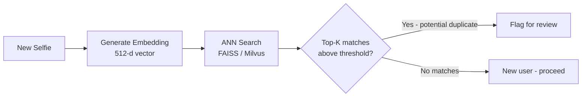

# Face De-Duplication (1:N Search)

## Definition

**Face de-duplication** uses 1:N face search to identify if a person already exists in the system — preventing the same individual from creating multiple accounts under different identities. This is a critical fraud prevention tool in eKYC.

---

## 1:1 vs 1:N

| Mode | Question | Process | Use Case |
|------|----------|---------|----------|
| **1:1** | "Is this the same person as on the ID?" | Compare 2 embeddings | Identity verification |
| **1:N** | "Does this face already exist in our database?" | Search 1 against N embeddings | De-duplication, fraud prevention |

---

## 1:N Search Architecture

### Vector Search Technologies

| Technology | Approach | Speed (1M vectors) | GPU Support |
|-----------|----------|-------------------|------------|
| **FAISS** | IVF + PQ (Facebook) | < 5ms | Yes |
| **Milvus** | Purpose-built vector DB | < 10ms | Yes |
| **Pinecone** | Managed vector DB | < 20ms | Managed |
| **ScaNN** | Anisotropic quantization (Google) | < 5ms | Yes |
| **Annoy** | Random projection trees (Spotify) | < 50ms | No |

---

## Challenges

| Challenge | Details |
|-----------|---------|
| **Scale** | Banks may have 100M+ customers — search must be fast |
| **Threshold** | Lower threshold catches more duplicates but more false positives |
| **Cross-age** | Same person at different ages may not match |
| **Twins** | Identical twins have very similar embeddings |
| **Photo quality** | Different quality images reduce match scores |
| **Privacy** | Storing face embeddings has privacy implications |

---

## Key Takeaways

!!! success "Summary"
    - 1:N de-duplication prevents **synthetic identity fraud** and multi-account fraud
    - **FAISS** with IVF+PQ indexing can search millions of faces in milliseconds
    - Threshold must be carefully tuned — too aggressive creates false duplicate alerts
    - **Critical for Aadhaar** (1.4B identities) and large financial institutions

---

## Related Articles

- [Face Recognition Overview](face-recognition-overview.md)
- [Face Matching & Thresholds](face-matching-thresholds.md)
