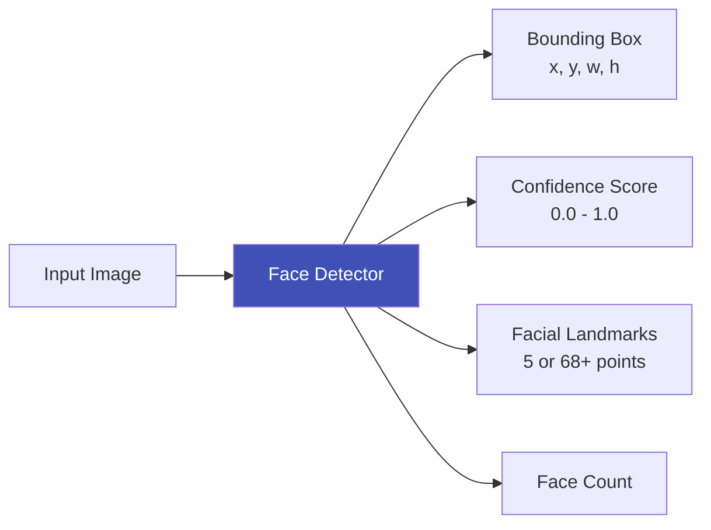
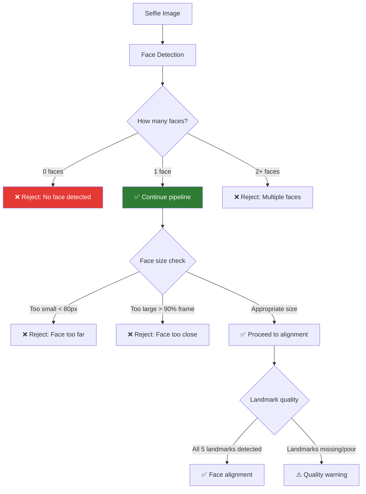

# Face Detection

## Definition

**Face detection** is the task of locating and extracting human faces from an image or video frame. In eKYC, it is the **first step** in both the face recognition and liveness detection pipelines — everything downstream depends on accurate, fast face detection.

---

## What Face Detection Outputs



| Output | Details | Use in eKYC |
|--------|---------|-------------|
| **Bounding box** | Rectangle coordinates around each face | Crop face for recognition/liveness |
| **Confidence score** | Probability that detection is a face (0-1) | Filter false detections |
| **Landmarks (5-point)** | Left eye, right eye, nose, left mouth, right mouth | Face alignment for recognition |
| **Landmarks (68/106-point)** | Detailed facial structure | Quality assessment, 3D pose estimation |
| **Face count** | Number of faces detected | Ensure exactly 1 face for selfie, detect face on document |

---

## Modern Face Detection Architectures

### SCRFD (Sample and Computation Redistribution for Face Detection)

| Aspect | Details |
|--------|---------|
| **Paper** | SCRFD: Sample and Computation Redistribution for Efficient Face Detection (2021) |
| **Architecture** | Single-stage anchor-based detector with efficient backbone |
| **Key innovation** | Redistributes computation across scales and samples for optimal efficiency |
| **Accuracy** | WIDER Face: 93.78% (Easy), 92.16% (Medium), 77.87% (Hard) |
| **Speed** | ~2ms on GPU (SCRFD-10GF), ~10ms on mobile |
| **Landmarks** | 5 keypoints |
| **Why it's popular for eKYC** | Best accuracy-speed tradeoff, multiple model sizes |

**SCRFD model variants:**

| Model | GFLOPs | WIDER Face Easy | Speed (GPU) | Use Case |
|-------|--------|----------------|-------------|----------|
| SCRFD-500M | 0.5 | 90.57% | ~1ms | Mobile/edge, real-time |
| SCRFD-2.5G | 2.5 | 93.78% | ~2ms | Server, balanced |
| SCRFD-10G | 10 | 95.16% | ~4ms | Server, highest accuracy |
| SCRFD-34G | 34 | 96.06% | ~12ms | Offline batch processing |

### RetinaFace

| Aspect | Details |
|--------|---------|
| **Paper** | RetinaFace: Single-shot Multi-level Face Localisation in the Wild (2020) |
| **Architecture** | Single-stage with FPN + multi-task (box, landmarks, 3D face) |
| **Key innovation** | Joint extra-supervised learning with mesh decoder for 3D face |
| **Accuracy** | WIDER Face: 96.3% (Easy) with ResNet-152 backbone |
| **Landmarks** | 5 keypoints (lightweight) or dense landmarks |
| **Why it's popular** | Proven, widely used, excellent landmark accuracy |

### BlazeFace

| Aspect | Details |
|--------|---------|
| **Origin** | Google MediaPipe (2019) |
| **Architecture** | Lightweight SSD-based, optimized for mobile |
| **Speed** | ~1ms on mobile GPU |
| **Accuracy** | Good for frontal faces, less robust for extreme angles |
| **Use case** | Real-time mobile face tracking, camera preview guidance |

### Comparison

| Detector | Accuracy | Speed (GPU) | Speed (Mobile) | Landmarks | Best For |
|----------|----------|-------------|----------------|-----------|----------|
| **SCRFD-2.5G** | 93.8% | 2ms | 10-30ms | 5-point | eKYC server pipeline |
| **SCRFD-500M** | 90.6% | 1ms | 5-15ms | 5-point | eKYC mobile SDK |
| **RetinaFace-R50** | 94.9% | 5ms | 50-100ms | 5-point | High-accuracy server |
| **BlazeFace** | ~90% | 0.5ms | 1-3ms | 6-point | Real-time camera preview |
| **MTCNN** | ~91% | 15ms | 100-300ms | 5-point | Legacy systems |
| **YOLO-Face** | ~92% | 3ms | 20-50ms | 5-point | General purpose |

---

## Face Detection in the eKYC Pipeline

### Selfie Face Detection



### Document Face Detection

| Challenge | Details | Solution |
|-----------|---------|----------|
| **Small face** | Face on ID card is often only 100-200px | Use high-res capture, specialized detector |
| **Print artifacts** | Printed photo has halftone dots, moiré | Preprocessing to reduce print noise |
| **Occlusion** | Hologram, lamination reflection overlaps face | Quality check + multiple capture angles |
| **Old/damaged photo** | Faded, scratched, low contrast | Image enhancement before detection |
| **Multiple faces** | Group photo on some documents | Select face matching the document's face region |

---

## Implementation Details

### Preprocessing for Detection

| Step | Purpose | Implementation |
|------|---------|---------------|
| **Resize** | Normalize input to expected resolution | Longest side to 640px (maintaining aspect ratio) |
| **Color normalization** | Handle different lighting | Convert to RGB, normalize to [0,1] or [-1,1] |
| **Padding** | Handle non-square images | Pad to square with border value |

### Post-Processing

| Step | Purpose | Details |
|------|---------|---------|
| **NMS (Non-Maximum Suppression)** | Remove duplicate detections | IoU threshold 0.4-0.5 |
| **Confidence filtering** | Remove low-confidence detections | Threshold 0.5-0.7 |
| **Size filtering** | Remove too-small/too-large detections | Min face size 20-80px |
| **Landmark validation** | Ensure landmarks are within bounding box | Sanity check on keypoint positions |

### Common Integration (Python)

```python
# Using InsightFace's SCRFD
from insightface.app import FaceAnalysis

app = FaceAnalysis(name='buffalo_l', providers=['CUDAExecutionProvider'])
app.prepare(ctx_id=0, det_size=(640, 640))

faces = app.get(image)

for face in faces:
    bbox = face.bbox           # [x1, y1, x2, y2]
    score = face.det_score     # confidence
    kps = face.kps             # 5 landmarks [[x,y], ...]
    embedding = face.embedding  # 512-d vector (if recognition model loaded)
```

---

## Benchmarks

### WIDER Face Dataset

The standard benchmark for face detection in the wild:

| Difficulty | Description | Top Performers |
|-----------|-------------|----------------|
| **Easy** | Large, clear faces | SCRFD-34G (96.06%), RetinaFace-R152 (96.3%) |
| **Medium** | Medium faces, some occlusion | SCRFD-10G (92.16%), RetinaFace-R50 (94.0%) |
| **Hard** | Tiny faces, heavy occlusion, extreme pose | SCRFD-34G (78.68%), TinaFace (92.4%) |

---

## Key Takeaways

!!! success "Summary"
    - Face detection is the **critical first step** — all downstream processing depends on it
    - **SCRFD** offers the best accuracy-speed tradeoff for eKYC (2ms server, 10-30ms mobile)
    - **RetinaFace** provides highest accuracy when speed is less critical
    - **BlazeFace** is ideal for real-time mobile camera preview/guidance
    - Must detect **exactly 1 face** for selfie verification, and extract face from document
    - **5-point landmarks** (eyes, nose, mouth corners) are essential for face alignment
    - Post-processing (NMS, confidence filtering, size filtering) is critical for clean results

---

## Related Articles

- **Next**: [Face Alignment & Preprocessing →](face-alignment-preprocessing.md)
- [Face Recognition Overview](face-recognition-overview.md)
- [Face Liveness Detection Overview](face-liveness-detection-overview.md)
- [On-Device Biometric Processing](on-device-biometric-processing.md)
