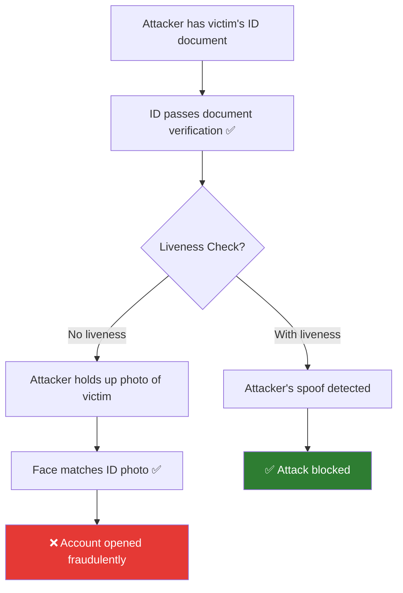
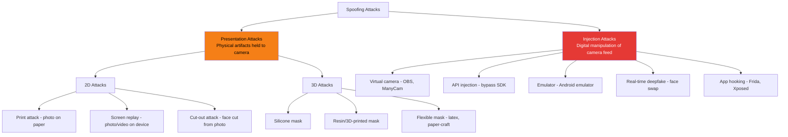
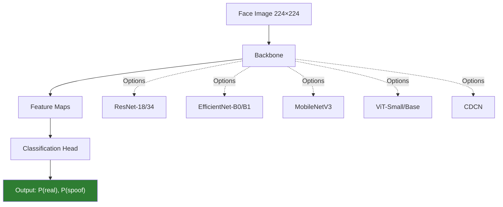
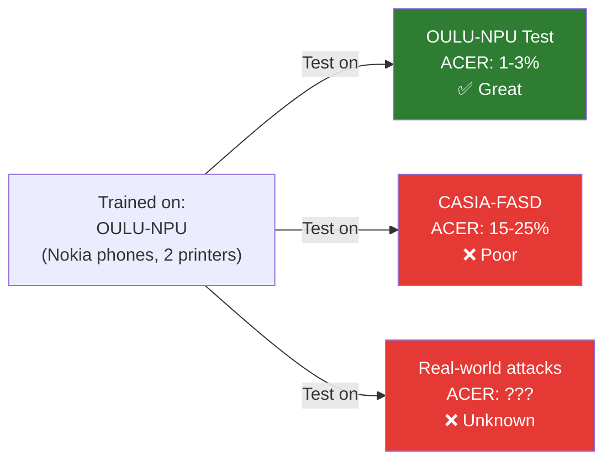

# Face Liveness Detection Overview

## Definition

**Face liveness detection** (also called **Presentation Attack Detection** or **PAD**) determines whether the face presented to the camera is a real, live human being — as opposed to a spoofed representation such as a printed photo, a screen replay, a 3D mask, or a deepfake.

It is arguably the **most critical AI component** in eKYC. If liveness fails, an attacker with a stolen ID can use the victim's photo to pass face matching — making the entire verification meaningless.

---

## Why Liveness is Critical



---

## Liveness vs Face Recognition

| Aspect | Face Recognition | Face Liveness |
|--------|-----------------|---------------|
| **Question** | Is this the same person as on the ID? | Is this a live, real person? |
| **Input** | Face image → embedding → comparison | Face image/video → real/spoof classification |
| **Output** | Similarity score (0-1) | Binary: live or spoof (with confidence) |
| **Threat model** | Wrong person | Right person's photo/video/mask/deepfake |
| **Complementary** | Useless without liveness | Useless without recognition |

---

## Attack Taxonomy



---

## Detection Approaches

### Passive Liveness

Analyzes a **single image or short video** without requiring the user to perform any action:

| Feature Type | What It Detects | Model Approach |
|-------------|----------------|----------------|
| **Texture analysis** | Moiré patterns, print dots, screen pixels | CNN feature extraction |
| **Color analysis** | Color distribution differences (real skin vs paper/screen) | Color space analysis (HSV, YCbCr) |
| **Frequency analysis** | High-frequency artifacts from printing/display | Fourier/wavelet features |
| **Depth cues** | Flatness of 2D attacks | Monocular depth estimation |
| **Reflection** | Specular reflections differ between skin and paper/screen | Reflection pattern analysis |
| **Edge artifacts** | Boundaries between face and spoof medium | Edge gradient analysis |

### Active Liveness

Requires the user to perform **specific actions** (challenges):

| Challenge | What It Proves | User Action |
|-----------|---------------|-------------|
| **Blink** | Face can blink naturally | Close and open eyes |
| **Head turn** | Face has 3D structure, responds to instructions | Turn head left/right |
| **Smile** | Face can change expression | Smile naturally |
| **Random gaze** | Eyes track a moving target | Follow on-screen dot |
| **Illumination response** | Skin reflects light differently than paper/screen | Screen flashes colors, observe face response |

### Comparison

| Aspect | Passive | Active |
|--------|---------|--------|
| **User experience** | Seamless — just look at camera | Requires following instructions |
| **Speed** | < 1 second | 3-10 seconds |
| **Spoof resistance** | Good (with strong models) | Higher (harder to replay) |
| **Deepfake resistance** | Moderate | Higher (dynamic actions) |
| **Accessibility** | Better (no action needed) | Challenging for some disabilities |
| **Failure rate** | Lower | Higher (users confused by challenges) |
| **Industry trend** | Growing preference | Declining (UX concerns) |

---

## Model Architecture Overview

### Typical Pipeline



### Key Architectures

| Architecture | Type | Key Feature | Params |
|-------------|------|-------------|--------|
| **CDCN** | CNN | Central Difference Convolution — captures fine-grained patterns | 2M |
| **ResNet-18 + binary head** | CNN | Simple, proven baseline | 11M |
| **EfficientNet-B0** | CNN | Good accuracy-efficiency tradeoff | 5M |
| **ViT-Small** | Transformer | Self-attention captures global patterns | 22M |
| **FLIP-MCL** | Hybrid | Foundation model with multimodal contrastive learning | — |

### Auxiliary Supervision

Instead of just binary classification, modern models add auxiliary tasks during training:

| Auxiliary Task | What It Adds | Benefit |
|---------------|-------------|---------|
| **Depth map estimation** | Predict face depth (real face = 3D, spoof = flat) | Provides geometric reasoning |
| **Reflection map** | Predict specular reflection patterns | Captures material properties |
| **Binary mask** | Predict which pixels are real face vs spoof medium | Fine-grained spatial understanding |
| **Domain label** | Predict which dataset the sample came from | Encourages domain-invariant features |

---

## The Generalization Problem

The biggest challenge in face liveness: **models trained on known attacks fail on unseen attacks**.



**Why this happens:**

- Models overfit to specific attack instruments (specific printers, screens)
- Models overfit to specific capture devices (specific phones, cameras)
- Lab conditions don't represent real-world diversity
- New attack types (deepfakes) not in training data

**Solutions:**

| Approach | How It Helps |
|----------|-------------|
| **Domain generalization** | Train to be invariant to source domain |
| **Self-supervised pretraining** | Learn robust representations without labels |
| **Diverse training data** | Cover many attack types, devices, environments |
| **Synthetic data augmentation** | Generate novel attacks for training |
| **Test-time adaptation** | Adapt to new domains at inference time |

See: [Domain Generalization for Liveness](domain-generalization-liveness.md)

---

## Liveness in the eKYC Pipeline

```mermaid
graph TD
    A[Selfie Captured] --> B[Face Detection]
    B --> C[Face Alignment]
    C --> D[Face Quality Check]
    D -->|Quality OK| E["Liveness Model<br/>P(real) vs P(spoof)"]

    E --> F{P(real) > threshold?}
    F -->|Yes - Live| G[Continue to face matching]
    F -->|No - Spoof| H[Reject + alert]

    F -->|Borderline| I[Escalate to V-KYC or retry]

    style G fill:#2E7D32,color:#fff
    style H fill:#e53935,color:#fff
```

### Threshold Setting

| Threshold Strategy | FAR | FRR | Use Case |
|-------------------|-----|-----|----------|
| **Low threshold (0.3)** | Higher (more spoofs pass) | Lower (fewer real users rejected) | Convenience-first |
| **Balanced (0.5)** | Moderate | Moderate | Standard eKYC |
| **High threshold (0.7)** | Lower (fewer spoofs pass) | Higher (more real users rejected) | High-security |
| **Very high (0.9)** | Very low | Very high | Critical systems (border control) |

---

## Key Takeaways

!!! success "Summary"
    - Face liveness is the **most critical AI component** in eKYC — without it, face matching is meaningless
    - Attacks range from **simple prints to sophisticated real-time deepfakes**
    - **Passive liveness** (single image) is trending over active (challenge-response) for better UX
    - **Domain generalization** is the biggest open challenge — models fail on unseen attacks
    - **Auxiliary supervision** (depth maps, reflection maps) improves robustness beyond binary classification
    - **Threshold tuning** balances security (low FAR) against usability (low FRR)
    - The field is rapidly evolving — new attacks and defenses emerge continuously

---

## Related Articles

- **Next**: [Presentation Attack Types →](presentation-attack-types.md)
- [Active vs Passive Liveness](active-vs-passive-liveness.md)
- [Liveness Model Architectures](liveness-model-architectures.md)
- [Domain Generalization for Liveness](domain-generalization-liveness.md)
- [Deepfake Detection](deepfake-detection.md)
- [Injection Attacks](injection-attack.md)
- [iBeta Certification](ibeta-certification.md)
