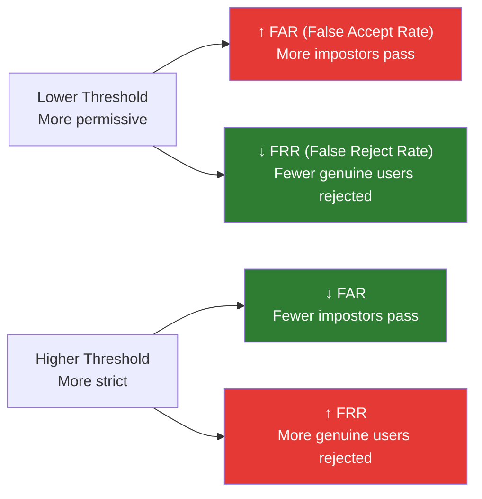

# Face Matching & Thresholds

## Definition

Face matching compares two face embeddings to determine if they belong to the same person. The **threshold** — the similarity score above which a match is accepted — is the single most important tunable parameter in face verification, directly controlling the tradeoff between **security (FAR)** and **usability (FRR)**.

---

## Cosine Similarity Scoring

Given embeddings **a** (selfie) and **b** (ID photo), both 512-dimensional:

```
similarity = (a · b) / (|a| × |b|)
```

| Score Range | Interpretation | Typical Action |
|-------------|---------------|----------------|
| **0.80 - 1.00** | Very high confidence — same person | Auto-approve |
| **0.65 - 0.80** | High confidence — likely same person | Auto-approve (standard config) |
| **0.50 - 0.65** | Moderate — possible match | Manual review |
| **0.30 - 0.50** | Low — likely different person | Reject |
| **0.00 - 0.30** | Very low — different person | Reject |

---

## The FAR/FRR Tradeoff



### Operating Points

| Use Case | Target FAR | Typical Threshold | FRR Impact |
|----------|-----------|-------------------|------------|
| **Convenience eKYC** | FAR ≤ 1% | 0.55-0.60 | FRR ~1-3% |
| **Standard eKYC** | FAR ≤ 0.1% | 0.60-0.65 | FRR ~3-5% |
| **High-security** | FAR ≤ 0.01% | 0.70-0.75 | FRR ~8-15% |
| **Border control** | FAR ≤ 0.001% | 0.80+ | FRR ~15-25% |

### Equal Error Rate (EER)

The point where FAR = FRR. Lower EER = better model:

| Model | EER (LFW) | EER (IJB-C) |
|-------|-----------|-------------|
| ArcFace-R100 | ~0.1% | ~1.5% |
| AdaFace-R100 | ~0.1% | ~1.2% |
| MobileFaceNet | ~0.3% | ~3.0% |

---

## 1:1 Verification vs 1:N Identification

| Mode | Use in eKYC | Process | Threshold Consideration |
|------|-------------|---------|----------------------|
| **1:1 Verification** | "Is this selfie the same person as ID?" | Compare 2 embeddings | Single threshold, tuned for FAR/FRR |
| **1:N Identification** | "Does this face exist in our database?" (deduplication) | Search against N faces | Lower threshold to catch more duplicates, accept higher false positive rate |

---

## Threshold Tuning in Practice

### Step 1: Collect Evaluation Data

- **Genuine pairs**: Same person, different images (selfie + ID)
- **Impostor pairs**: Different persons
- Minimum: 1,000 genuine + 10,000 impostor pairs

### Step 2: Plot DET/ROC Curve

- Plot FAR vs FRR at every threshold
- Choose operating point based on business requirements

### Step 3: Per-Demographic Validation

- Test threshold across age groups, genders, ethnicities
- Adjust if significant disparities exist (fairness requirement)

---

## Key Takeaways

!!! success "Summary"
    - The **threshold** is the most important parameter — controls security vs usability tradeoff
    - **Standard eKYC** typically operates at FAR ≤ 0.1% with threshold 0.60-0.65
    - **EER** is the key model quality metric — lower is better
    - **Per-demographic testing** is essential for fair verification
    - 1:1 verification (selfie vs ID) is the primary use; 1:N (deduplication) uses different thresholds
    - Threshold must be tuned on **representative data from your actual user population**

---

## Related Articles

- **Previous**: [← Face Recognition Architectures](face-recognition-architectures.md)
- **Next**: [Cross-Age Face Matching →](cross-age-face-matching.md)
- [Biometric Performance Metrics](biometric-performance-metrics.md)
- [Biometric Fairness & Bias](biometric-fairness-bias.md)
