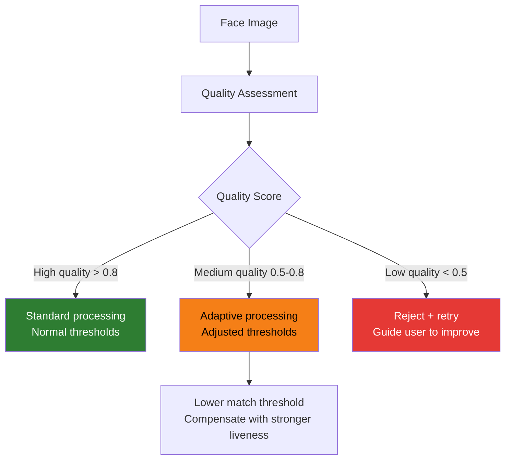

# Face Quality Assessment

## Definition

**Face Quality Assessment (FQA)** evaluates whether a captured face image meets the minimum quality requirements for reliable biometric processing. Poor quality inputs lead to false rejections, failed matches, and unreliable liveness decisions.

---

## Quality Factors

| Factor | Metric | Good | Marginal | Poor |
|--------|--------|------|----------|------|
| **Sharpness** | Laplacian variance | > 200 | 50-200 | < 50 |
| **Brightness** | Mean luminance | 80-200 | 40-80 or 200-240 | < 40 or > 240 |
| **Contrast** | Standard deviation | > 40 | 20-40 | < 20 |
| **Face size** | Inter-ocular distance | > 90px | 60-90px | < 60px |
| **Yaw angle** | Degrees | < 15° | 15-30° | > 30° |
| **Pitch angle** | Degrees | < 15° | 15-25° | > 25° |
| **Eye visibility** | EAR score | Both open | One partially closed | Closed/occluded |
| **Occlusion** | Coverage % | < 5% occluded | 5-15% | > 15% |
| **Expression** | Neutral score | Neutral | Mild expression | Extreme expression |

---

## ICAO Compliance (Passport/Travel Document Photos)

ICAO (International Civil Aviation Organization) defines strict quality standards:

| Requirement | ICAO Standard |
|-------------|--------------|
| **Head position** | Frontal, neutral expression |
| **Eyes** | Open, clearly visible, no red-eye |
| **Mouth** | Closed |
| **Glasses** | Preferably none; if worn, no reflections, eyes fully visible |
| **Head covering** | Only for religious reasons; face fully visible |
| **Background** | Plain, light, uniform |
| **Lighting** | Even, no shadows on face |
| **Resolution** | Minimum 300 DPI |
| **Color** | Full color (not B&W) |

---

## Quality-Aware Processing

### Quality-Aware Models

| Model | Approach |
|-------|----------|
| **AdaFace** | Adapts loss function based on image quality during training |
| **SER-FIQ** | Self-supervised quality estimation from face embeddings |
| **MagFace** | Uses embedding magnitude as quality indicator |
| **FaceQnet** | Dedicated quality estimation network |

---

## Key Takeaways

!!! success "Summary"
    - Quality assessment is a **critical gate** — prevents poor images from entering the pipeline
    - Key factors: sharpness, brightness, face size, pose angle, eye visibility, occlusion
    - **ICAO standards** define the gold standard for face image quality
    - **Quality-aware models** (AdaFace, MagFace) adapt their processing based on input quality
    - Real-time quality feedback in the SDK dramatically improves **first-attempt success rate**

---

## Related Articles

- **Previous**: [← Face Alignment & Preprocessing](face-alignment-preprocessing.md)
- **Next**: [Face Recognition Overview →](face-recognition-overview.md)
- [Cross-Quality Face Matching](cross-quality-face-matching.md)
- [ICAO Standards](../07-regulations-standards/icao-biometric-standards.md)
