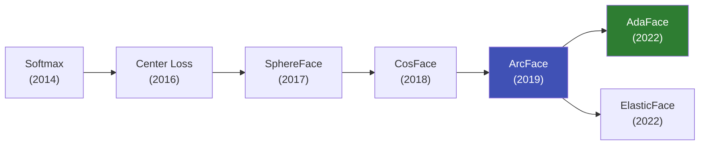
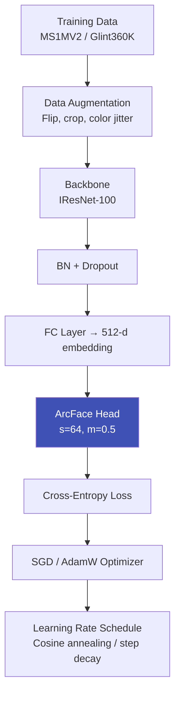

# Face Recognition Architectures

## Definition

This article covers the specific deep learning architectures and loss functions used in modern face recognition systems — the models that generate face embeddings for identity verification.

---

## Loss Function Evolution

### ArcFace (Additive Angular Margin)

| Aspect | Details |
|--------|---------|
| **Core idea** | Add angular margin penalty m to the angle between feature and class center |
| **Formula** | L = -log(exp(s·cos(θ + m)) / (exp(s·cos(θ + m)) + Σ exp(s·cos(θj)))) |
| **Default params** | s=64, m=0.5 |
| **Benefit** | Creates clear geometric boundary between classes on hypersphere |
| **Weakness** | Fixed margin — same difficulty for easy and hard samples |
| **Usage** | Most widely used in production eKYC systems |

### AdaFace (Quality-Adaptive)

| Aspect | Details |
|--------|---------|
| **Core idea** | Adapt margin based on image quality — harder margin for high-quality, softer for low-quality |
| **Quality proxy** | Feature norm as quality indicator |
| **Benefit** | Handles quality mismatch (ID photo vs selfie) that ArcFace struggles with |
| **eKYC relevance** | Directly addresses the core eKYC challenge of cross-quality matching |

### ElasticFace

| Aspect | Details |
|--------|---------|
| **Core idea** | Random margin sampled from distribution — elastic class boundaries |
| **Benefit** | More flexible decision boundaries, better generalization |
| **Training** | Margin drawn from Gaussian or uniform distribution each iteration |

---

## Backbone Architectures

### Standard Server Backbones

| Backbone | Params | GFLOPs | LFW | AgeDB-30 | CFP-FP | Best For |
|----------|--------|--------|-----|----------|--------|----------|
| **IResNet-100** | 65M | 24.2 | 99.83 | 98.35 | 99.07 | Production server |
| **IResNet-50** | 44M | 12.3 | 99.80 | 97.95 | 98.62 | Balanced server |
| **IResNet-34** | 33M | 7.4 | 99.78 | 97.60 | 98.20 | Efficient server |

### Mobile/Edge Backbones

| Backbone | Params | GFLOPs | LFW | Speed (Mobile) | Best For |
|----------|--------|--------|-----|----------------|----------|
| **MobileNetV3-Large** | 5.4M | 0.45 | 99.50 | 15-30ms | Standard mobile |
| **MobileFaceNet** | 0.99M | 0.22 | 99.55 | 5-15ms | Ultra-lightweight |
| **EfficientNet-B0** | 5.3M | 0.39 | 99.55 | 20-40ms | Balanced mobile |
| **GhostNet** | 5.2M | 0.15 | 99.45 | 5-10ms | Fastest mobile |
| **EdgeNeXt-S** | 5.6M | 1.0 | 99.60 | 15-25ms | Modern efficient |

### Vision Transformers

| Backbone | Params | GFLOPs | LFW | Notes |
|----------|--------|--------|-----|-------|
| **ViT-Small** | 22M | 4.6 | 99.80 | Competitive with CNNs |
| **ViT-Base** | 86M | 17.6 | 99.83 | Matches ResNet-100 |
| **DeiT-Small** | 22M | 4.6 | 99.78 | Distilled, efficient |

---

## Training Pipeline

### Training Hyperparameters (Typical)

| Parameter | Value |
|-----------|-------|
| **Batch size** | 512 (distributed across GPUs) |
| **Optimizer** | SGD (momentum=0.9, weight_decay=5e-4) |
| **Learning rate** | 0.1, decayed at epochs 20, 28, 32 |
| **Total epochs** | 34-40 |
| **Embedding dim** | 512 |
| **Input size** | 112 × 112 |
| **Augmentation** | Horizontal flip, random erasing |

---

## Benchmarks

### Verification Benchmarks

| Benchmark | What It Tests | Top Performance |
|-----------|--------------|-----------------|
| **LFW** | Labeled Faces in the Wild — general FR | 99.83% (near-saturated) |
| **AgeDB-30** | Cross-age (30-year gap) | 98.35% |
| **CFP-FP** | Cross-pose (frontal vs profile) | 99.07% |
| **CALFW** | Cross-age with LFW pairs | 96.20% |
| **CPLFW** | Cross-pose with LFW pairs | 93.37% |
| **IJB-C** | Unconstrained verification (NIST) | TAR=97% @ FAR=1e-4 |

---

## Key Takeaways

!!! success "Summary"
    - **ArcFace** remains the standard — angular margin loss on hypersphere creates discriminative embeddings
    - **AdaFace** is specifically relevant for eKYC — handles quality mismatch between ID photos and selfies
    - **IResNet-100** is the standard server backbone; **MobileFaceNet** for mobile
    - **Vision Transformers** are competitive but CNNs still dominate in production due to speed
    - Training requires **large-scale datasets** (5M+ images) with **clean labels**
    - LFW is saturated (99.8%+) — real evaluation requires cross-age, cross-pose, and cross-quality benchmarks

---

## Related Articles

- **Previous**: [← Face Recognition Overview](face-recognition-overview.md)
- **Next**: [Face Matching & Thresholds →](face-matching-thresholds.md)
- [AdaFace Details](cross-quality-face-matching.md)
- [On-Device Biometric Processing](on-device-biometric-processing.md)
- [NIST FRVT](nist-frvt.md)
