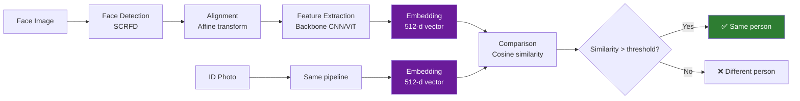

# Face Recognition Overview

## Definition

**Face recognition** in eKYC is the process of generating a mathematical representation (embedding) of a face and comparing it against another face to determine if they belong to the same person. It is used to **match a live selfie against the photo on an identity document**.

---

## The Face Recognition Pipeline



---

## Face Embeddings

A face embedding is a **dense vector** (typically 512 dimensions) that encodes the identity-relevant features of a face:

| Property | Details |
|----------|---------|
| **Dimensionality** | 512 (standard), 128 or 256 (lightweight) |
| **Content** | Encodes facial geometry, texture patterns, and identity features |
| **Same person** | Embeddings are close together (high cosine similarity) |
| **Different person** | Embeddings are far apart (low cosine similarity) |
| **Invariant to** | Lighting, expression, minor pose changes (within training distribution) |
| **Not invariant to** | Extreme pose (profile), heavy occlusion, dramatic age change |

### Cosine Similarity

The standard metric for comparing embeddings:

$$\text{similarity} = \frac{\mathbf{a} \cdot \mathbf{b}}{|\mathbf{a}| \cdot |\mathbf{b}|}$$

| Score | Interpretation |
|-------|---------------|
| > 0.80 | Very high confidence — same person |
| 0.65 - 0.80 | High confidence — likely same person |
| 0.50 - 0.65 | Moderate — possible match, needs review |
| < 0.50 | Low confidence — likely different person |
| < 0.30 | Very low — almost certainly different |

---

## Training Face Recognition Models

### Loss Functions

The key innovation in modern face recognition is the **angular margin loss**:

| Loss Function | Paper/Year | Key Innovation |
|--------------|-----------|----------------|
| **Softmax** | Baseline | Standard classification — poor discriminability |
| **Center Loss** | 2016 | Minimize intra-class distance |
| **SphereFace** | 2017 | Angular margin in weight space |
| **CosFace** | 2018 | Additive cosine margin — stable training |
| **ArcFace** | 2019 | Additive angular margin — best discriminability |
| **AdaFace** | 2022 | Quality-adaptive margin — handles quality variation |
| **ElasticFace** | 2022 | Elastic margin for flexible class boundaries |

### ArcFace Loss (Most Widely Used)

```
L = -log(exp(s * cos(θ_yi + m)) / (exp(s * cos(θ_yi + m)) + Σ exp(s * cos(θ_j))))
```

| Parameter | Typical Value | Purpose |
|-----------|--------------|---------|
| **s** (scale) | 64 | Controls temperature of softmax |
| **m** (margin) | 0.5 | Angular margin penalty for same-class features |

### Training Data

| Dataset | Size | Identities | Use |
|---------|------|-----------|-----|
| **MS1MV2** (MS-Celeb-1M cleaned) | 5.8M images | 85K IDs | Standard training set |
| **Glint360K** | 17M images | 360K IDs | Largest public training set |
| **WebFace260M** | 260M images | 4M IDs | Massive web-crawled (noisy) |
| **VGGFace2** | 3.3M images | 9.1K IDs | Diverse pose/age |
| **CASIA-WebFace** | 500K images | 10.5K IDs | Smaller, clean |

---

## Backbone Architectures

| Architecture | Params | GFLOPs | LFW Accuracy | Use Case |
|-------------|--------|--------|-------------|----------|
| **ResNet-100 (R100)** | 65M | 24 | 99.80%+ | Server — standard |
| **ResNet-50 (R50)** | 44M | 12 | 99.78% | Server — efficient |
| **ResNet-18 (R18)** | 28M | 4 | 99.60% | Edge/mobile |
| **MobileNetV3** | 5M | 0.5 | 99.50% | Mobile — lightweight |
| **ViT-S** | 22M | 4.6 | 99.80% | Emerging — transformer-based |
| **EdgeNeXt** | 5M | 1.0 | 99.55% | Mobile — efficient |

---

## 1:1 Verification vs 1:N Identification

| Mode | eKYC Use | Process | Speed |
|------|----------|---------|-------|
| **1:1 Verification** | Match selfie to ID photo | Compare 2 embeddings | < 1ms |
| **1:N Identification** | Deduplication — find if face exists in database | Compare 1 embedding against N | Depends on N (ANN search) |

### 1:N Search Technologies

For large-scale deduplication (millions of faces):

| Technology | Approach | Speed (1M database) |
|-----------|----------|-------------------|
| **FAISS** (Facebook) | Approximate nearest neighbor with GPU | < 10ms |
| **Milvus** | Vector database with indexing | < 20ms |
| **Annoy** (Spotify) | Random projection trees | < 50ms |
| **ScaNN** (Google) | Anisotropic vector quantization | < 10ms |

---

## Face Recognition Challenges in eKYC

| Challenge | Impact | Mitigation |
|-----------|--------|------------|
| **Cross-age** | ID photo 5-15 years old | Age-invariant models, lower thresholds |
| **Cross-quality** | ID photo vs HD selfie | AdaFace, quality-aware matching |
| **Twins** | Identical twins have very similar embeddings | Liveness + document data must also match |
| **Cosmetic changes** | Surgery, weight change, facial hair | Robust models trained on diverse variations |
| **Cross-ethnicity** | Performance variation across demographics | Balanced training data, per-demographic thresholds |
| **Extreme expressions** | Distorts facial geometry | Expression-invariant training |

---

## Key Takeaways

!!! success "Summary"
    - Face recognition converts faces to **512-d embeddings** and compares via **cosine similarity**
    - **ArcFace** is the most widely used loss function — additive angular margin for discriminability
    - **ResNet-100** is the standard server backbone; **MobileNetV3** for mobile
    - **1:1 verification** (selfie vs ID) is the primary eKYC use case — sub-millisecond comparison
    - **1:N deduplication** uses ANN search (FAISS) for large-scale face database matching
    - Key challenges: **cross-age, cross-quality, twins, demographic bias**
    - **AdaFace** specifically addresses the quality mismatch between ID photos and selfies

---

## Related Articles

- **Previous**: [← Face Quality Assessment](face-quality-assessment.md)
- **Next**: [Face Recognition Architectures →](face-recognition-architectures.md)
- [Face Matching & Thresholds](face-matching-thresholds.md)
- [Cross-Age Face Matching](cross-age-face-matching.md)
- [Face De-Duplication (1:N)](face-deduplication.md)
- [Biometric Performance Metrics](biometric-performance-metrics.md)
