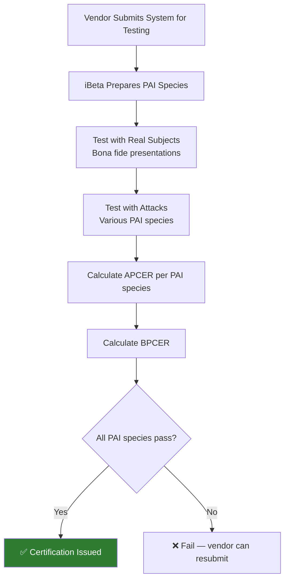

# iBeta Certification (ISO 30107-3)

## Definition

**iBeta** is an independent biometric testing laboratory that certifies Presentation Attack Detection (PAD) systems against the **ISO/IEC 30107-3** standard. iBeta certification has become a de facto industry requirement for eKYC providers selling to banks and enterprise clients.

---

## Certification Levels

| Level | What's Tested | Pass Criteria | Attacks Used |
|-------|-------------|---------------|-------------|
| **Level 1** | PAI species (attack types): print attacks, screen replay | APCER ≤ 0% for each PAI species tested, BPCER ≤ per plan | High-quality printed photos, smartphone/tablet replay |
| **Level 2** | Level 1 + advanced: 3D masks, silicone, more sophisticated PAIs | Same criteria, more PAI species | 3D masks (resin, silicone), latex overlays, high-quality print |

### Key Terms

| Term | Meaning |
|------|---------|
| **APCER** | Attack Presentation Classification Error Rate — % of attacks that fool the system |
| **BPCER** | Bona Fide Presentation Classification Error Rate — % of real users incorrectly rejected |
| **PAI** | Presentation Attack Instrument — the physical spoof artifact |
| **PAI Species** | Category of attack (e.g., "printed photo on A4 paper") |

---

## Testing Process

### Testing Parameters

| Parameter | Typical |
|-----------|---------|
| **Number of subjects** | 25-50 real subjects |
| **Number of attacks per PAI** | 100+ per PAI species |
| **PAI quality** | Professional-grade (high-res printing, latest devices) |
| **Environment** | Controlled and varied lighting |
| **Duration** | 2-6 weeks |
| **Cost** | $20,000-$50,000+ per test |
| **Report** | Detailed report with APCER/BPCER per PAI species |

---

## Who Has iBeta Certification

Most major eKYC/liveness providers claim iBeta certification:

| Provider | Level 1 | Level 2 |
|----------|---------|---------|
| **iProov** | ✅ | ✅ |
| **Jumio** | ✅ | ✅ |
| **Onfido** | ✅ | ✅ |
| **HyperVerge** | ✅ | ✅ |
| **FacePhi** | ✅ | — |
| **Veriff** | ✅ | ✅ |

---

## Why iBeta Certification Matters

| Reason | Details |
|--------|---------|
| **Enterprise sales** | Banks and large FIs increasingly require iBeta certification as a procurement condition |
| **Regulatory alignment** | Demonstrates compliance with ISO 30107 testing methodology |
| **Competitive advantage** | Differentiator in vendor evaluation |
| **Independent validation** | Third-party proof that PAD actually works |

---

## Limitations

!!! warning "What iBeta Doesn't Test"
    - **Deepfakes / injection attacks** — iBeta tests presentation attacks (physical artifacts), not digital manipulation
    - **Real-world diversity** — Lab conditions don't fully represent production environments
    - **Adversarial attacks** — Sophisticated, targeted attacks are not in scope
    - **Continuous updates** — Certification is a snapshot — attacks evolve

---

## Key Takeaways

!!! success "Summary"
    - iBeta certification against **ISO 30107-3** is the industry standard for PAD validation
    - **Level 1** tests prints and screens; **Level 2** adds 3D masks and advanced attacks
    - Certification costs **$20K-$50K+** and takes 2-6 weeks
    - **Increasingly required** for enterprise eKYC sales, especially to banks
    - **Does not cover deepfakes or injection attacks** — separate testing needed for these

---

## Related Articles

- **Previous**: [← Domain Generalization for Liveness](domain-generalization-liveness.md)
- **Next**: [Deepfake Detection →](deepfake-detection.md)
- [ISO 30107 — PAD Testing](iso-30107-pad-testing.md)
- [Biometric Performance Metrics](biometric-performance-metrics.md)
