# 🧬 Biometrics & Face

## The Core AI Technology Behind eKYC

This section is the **technical heart** of the eKYC knowledge base. It covers every aspect of face-based biometric verification — from detection and recognition to liveness, presentation attack detection, deepfakes, injection attacks, and the metrics that measure it all.

---

## Articles in This Section

### Face Detection & Preprocessing
| # | Article | What You'll Learn |
|---|---------|-------------------|
| 1 | [Face Detection](face-detection.md) | SCRFD, RetinaFace, BlazeFace — architectures, landmarks, speed |
| 2 | [Face Alignment & Preprocessing](face-alignment-preprocessing.md) | Affine transforms, normalization, quality assessment |
| 3 | [Face Quality Assessment](face-quality-assessment.md) | ICAO compliance, blur, exposure, pose estimation |

### Face Recognition
| # | Article | What You'll Learn |
|---|---------|-------------------|
| 4 | [Face Recognition Overview](face-recognition-overview.md) | End-to-end pipeline, embeddings, matching |
| 5 | [Face Recognition Architectures](face-recognition-architectures.md) | ArcFace, CosFace, AdaFace, ElasticFace |
| 6 | [Face Matching & Thresholds](face-matching-thresholds.md) | Cosine similarity, threshold tuning, 1:1 vs 1:N |
| 7 | [Cross-Age Face Matching](cross-age-face-matching.md) | Age-invariant recognition for old ID photos |
| 8 | [Cross-Quality Face Matching](cross-quality-face-matching.md) | Matching low-quality ID photos with HD selfies |

### Face Liveness & Presentation Attack Detection
| # | Article | What You'll Learn |
|---|---------|-------------------|
| 9 | [Face Liveness Detection Overview](face-liveness-detection-overview.md) | What, why, how — complete introduction |
| 10 | [Presentation Attack Types](presentation-attack-types.md) | Print, screen, mask, makeup — the attack taxonomy |
| 11 | [Active vs Passive Liveness](active-vs-passive-liveness.md) | Challenge-response vs single-frame detection |
| 12 | [Liveness Model Architectures](liveness-model-architectures.md) | CNN, ViT, multi-task, auxiliary supervision |
| 13 | [Liveness Datasets](liveness-datasets.md) | OULU-NPU, CASIA-FASD, SiW, CelebA-Spoof, and more |
| 14 | [Domain Generalization for Liveness](domain-generalization-liveness.md) | SSDG, MADDG, cross-dataset generalization |
| 15 | [iBeta Certification](ibeta-certification.md) | ISO 30107-3 testing, Level 1 vs Level 2 |

### Advanced Threats
| # | Article | What You'll Learn |
|---|---------|-------------------|
| 16 | [Deepfake Detection](deepfake-detection.md) | GAN artifacts, temporal analysis, detection methods |
| 17 | [Injection Attacks](injection-attack.md) | Virtual cameras, API injection, emulator attacks |
| 18 | [3D Mask Attacks](3d-mask-attacks.md) | Silicone, resin, 3D-printed masks |
| 19 | [Adversarial Attacks on Face Models](adversarial-attacks-face.md) | Perturbations, patches, physical adversarial attacks |

### Biometric Metrics & Standards
| # | Article | What You'll Learn |
|---|---------|-------------------|
| 20 | [Biometric Performance Metrics](biometric-performance-metrics.md) | FAR, FRR, EER, APCER, BPCER, ACER |
| 21 | [NIST FRVT](nist-frvt.md) | Face Recognition Vendor Test — how it works, rankings |
| 22 | [ISO 30107 — PAD Testing](iso-30107-pad-testing.md) | The standard for presentation attack detection testing |
| 23 | [Biometric Fairness & Bias](biometric-fairness-bias.md) | Demographic performance differentials, NIST FATE |

### Advanced Topics
| # | Article | What You'll Learn |
|---|---------|-------------------|
| 24 | [Face Anti-Spoofing Feature Extraction](face-anti-spoofing-features.md) | Texture, frequency, depth, temporal features |
| 25 | [Multi-Spectral Liveness](multi-spectral-liveness.md) | NIR, depth sensors, structured light |
| 26 | [Behavioral Biometrics](behavioral-biometrics.md) | Keystroke, gait, device interaction patterns |
| 27 | [Voice Biometrics](voice-biometrics.md) | Speaker verification, anti-spoofing |
| 28 | [Fingerprint in eKYC](fingerprint-ekyc.md) | Aadhaar biometric, on-device fingerprint |
| 29 | [Iris Recognition](iris-recognition.md) | IriCode, Aadhaar iris, mobile iris |
| 30 | [Face De-Duplication (1:N)](face-deduplication.md) | Preventing multiple accounts with same face |
| 31 | [Template Protection](template-protection.md) | Cancelable biometrics, homomorphic encryption |
| 32 | [On-Device Biometric Processing](on-device-biometric-processing.md) | Mobile inference, ONNX, CoreML, TFLite |

---

## How These Concepts Connect

```mermaid
graph TD
    A[Camera Capture] --> B[Face Detection<br/>SCRFD, RetinaFace]
    B --> C[Face Alignment<br/>Affine transform]
    C --> D[Face Quality Check<br/>Blur, pose, exposure]

    D -->|Quality OK| E[Parallel Processing]
    D -->|Poor quality| F[Reject + retry]

    E --> G[Face Liveness / PAD<br/>Is this a live face?]
    E --> H[Face Recognition<br/>Generate embedding]

    G -->|Spoof detected| I[Reject]
    G -->|Live face| J[Continue]

    H --> K[Face Matching<br/>Compare with ID photo]
    K -->|Match > threshold| L[✅ Verified]
    K -->|Match < threshold| M[❌ Mismatch]

    style B fill:#4051B5,color:#fff
    style G fill:#e53935,color:#fff
    style H fill:#6A1B9A,color:#fff
    style L fill:#2E7D32,color:#fff
```

---

!!! tip "For ML Engineers"
    Start with **Face Liveness Detection Overview** and **Liveness Model Architectures** if you're building PAD systems. If you're focused on recognition, start with **Face Recognition Architectures** and **Face Matching & Thresholds**.
