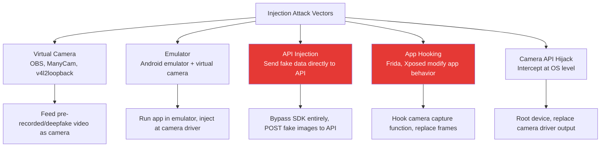
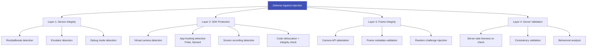

# Injection Attacks

## Definition

An **injection attack** bypasses the camera entirely by feeding fake images, video, or data directly into the verification pipeline. Unlike presentation attacks (holding a photo to the camera), injection attacks insert pre-recorded, synthetic, or deepfake content at a digital level — making them **invisible to camera-based liveness detection**.

---

## Injection Attack Vectors

---

## Why Injection Attacks Are Dangerous

| Reason | Details |
|--------|---------|
| **Invisible to PAD** | Liveness models analyze what the "camera" sees — if injection replaces camera, PAD sees "real" face |
| **Scalable** | Once pipeline is built, can attack thousands of times |
| **Deepfake-ready** | Real-time deepfake + virtual camera = perfect attack |
| **Growing tools** | Virtual cameras, Frida, Android emulators are freely available |
| **SDK bypass** | API injection skips all client-side security checks |

---

## Defense Layers

### Platform-Specific Defenses

| Platform | Available Defenses |
|----------|-------------------|
| **Android** | SafetyNet/Play Integrity API, camera2 API validation, root detection |
| **iOS** | App Attest, DeviceCheck, jailbreak detection (limited by Apple restrictions) |
| **Web** | Limited — WebRTC constraints, but fundamentally less secure than native |

---

## Key Takeaways

!!! success "Summary"
    - Injection attacks are the **industry's biggest current security gap** — most eKYC providers underprotect against them
    - Virtual camera + deepfake is the **most dangerous combination** — bypasses both PAD and face matching
    - Defense requires **multiple layers**: device integrity → SDK protection → frame integrity → server validation
    - **API injection** is the hardest to defend against — requires server-side validation of all submissions
    - **Platform attestation** (Play Integrity, App Attest) is becoming essential
    - This is an **active arms race** — defenses must continuously evolve

---

## Related Articles

- **Previous**: [← Deepfake Detection](deepfake-detection.md)
- **Next**: [3D Mask Attacks →](3d-mask-attacks.md)
- [Face Liveness Detection Overview](face-liveness-detection-overview.md)
- [eKYC Challenges & Limitations](../00-foundations/ekyc-challenges-and-limitations.md)
