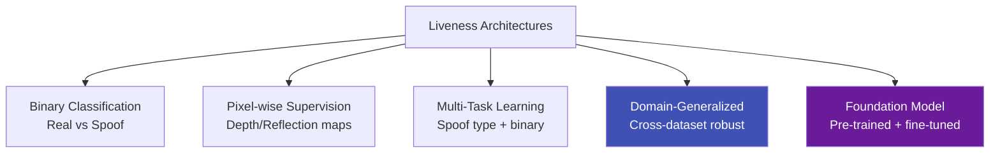
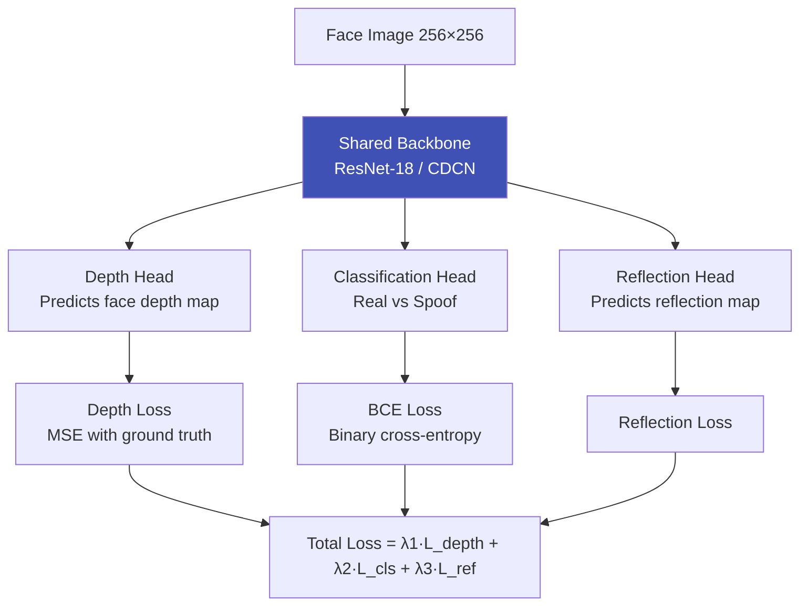

# Liveness Model Architectures

## Definition

This article covers the deep learning architectures specifically designed for face anti-spoofing / liveness detection, including CNN-based, transformer-based, and hybrid approaches with auxiliary supervision.

---

## Architecture Categories

---

## Key Architectures

### CDCN (Central Difference Convolution Network)

| Aspect | Details |
|--------|---------|
| **Paper** | Searching Central Difference Convolutional Networks for FAS (CVPR 2020) |
| **Key innovation** | Central Difference Convolution — captures fine-grained gradient patterns that regular convolution misses |
| **Supervision** | Pixel-wise depth map estimation |
| **Why it works** | Real faces have 3D depth structure; spoofs are flat — CDC is sensitive to these subtle gradient differences |
| **Performance** | Strong cross-dataset results, small model size (~2M params) |

### ViT for Liveness

| Aspect | Details |
|--------|---------|
| **Approach** | Vision Transformer with self-attention captures global patterns |
| **Benefit** | Attends to both local (texture) and global (layout, context) spoof cues |
| **Models** | ViT-Small (22M), ViT-Tiny (5.7M) |
| **Patch-based** | Each image patch is a token — model learns which patches contain spoof evidence |

### Auxiliary Supervision Tasks

| Auxiliary Task | What the Model Predicts | Why It Helps |
|---------------|------------------------|-------------|
| **Depth map** | Per-pixel depth of face | Real face = 3D structure, spoof = flat |
| **Reflection map** | Specular reflection patterns | Paper/screen reflect differently than skin |
| **Binary mask** | Which pixels are face vs spoof medium | Fine-grained spatial understanding |
| **Domain label** | Which dataset/domain the sample is from | Adversarial: forces domain-invariant features |

---

## Model Comparison

| Model | Params | OULU-NPU (ACER%) | Cross-Dataset | Mobile-Ready |
|-------|--------|-------------------|---------------|-------------|
| **CDCN** | 2M | 1.0% | Good | ✅ |
| **ResNet-18 + Binary** | 11M | 3-5% | Fair | ✅ |
| **ViT-Small** | 22M | 1-2% | Good | ⚠️ |
| **SSDG (ResNet-18)** | 11M | 2-4% | Very Good | ✅ |
| **FLIP-MCL** | Large | 0.5-1% | Excellent | ❌ |

---

## Key Takeaways

!!! success "Summary"
    - **CDCN** introduced Central Difference Convolution — captures fine gradient patterns missed by regular CNN
    - **Auxiliary supervision** (depth maps, reflection maps) significantly outperforms pure binary classification
    - **ViT** brings global attention to liveness — can attend to context cues across the full image
    - **Multi-task learning** with depth + binary is the most common production approach
    - Model size matters for mobile: **CDCN (2M)** and **ResNet-18 (11M)** are practical; ViT-Base (86M) is not

---

## Related Articles

- **Previous**: [← Active vs Passive Liveness](active-vs-passive-liveness.md)
- **Next**: [Liveness Datasets →](liveness-datasets.md)
- [Domain Generalization for Liveness](domain-generalization-liveness.md)
- [Face Anti-Spoofing Feature Extraction](face-anti-spoofing-features.md)
