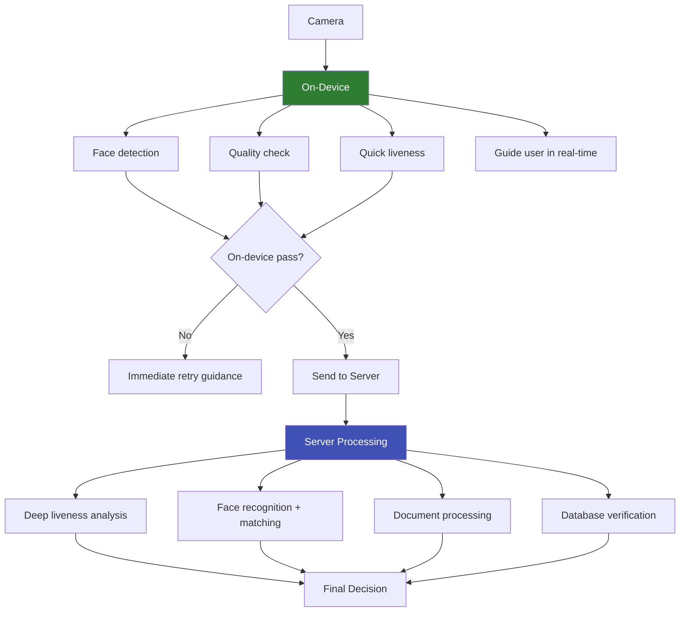

# On-Device Biometric Processing

## Definition

**On-device biometric processing** runs face detection, liveness detection, and/or recognition models directly on the user's phone, rather than sending images to a remote server. This provides faster feedback, better privacy, offline capability, and lower infrastructure costs.

---

## On-Device ML Frameworks

| Framework | Platform | Key Feature |
|-----------|----------|-------------|
| **CoreML** | iOS | Apple's native ML inference, Neural Engine support |
| **TensorFlow Lite** | Android/iOS | Cross-platform, GPU delegate, NNAPI |
| **ONNX Runtime Mobile** | Android/iOS | Cross-framework model compatibility |
| **MediaPipe** | Android/iOS/Web | Google's real-time ML pipeline |
| **MNN** | Android/iOS | Alibaba's mobile inference engine |
| **NCNN** | Android | Tencent's efficient mobile inference |
| **PyTorch Mobile** | Android/iOS | PyTorch's mobile deployment |

---

## Model Optimization for Mobile

| Technique | What It Does | Typical Speedup |
|-----------|-------------|----------------|
| **Quantization (INT8)** | Reduce weights from FP32 to INT8 | 2-4x faster, 4x smaller |
| **Pruning** | Remove unimportant weights | 1.5-3x faster |
| **Knowledge distillation** | Train small model to mimic large model | Smaller model with near-large accuracy |
| **Architecture search** | Design mobile-specific architectures | MobileFaceNet, GhostNet |
| **Operator fusion** | Combine multiple operations into one | 1.2-1.5x faster |

---

## Typical On-Device Performance

| Task | Model | Size | Latency (Mobile) |
|------|-------|------|------------------|
| **Face detection** | SCRFD-500M | 2.5MB | 5-15ms |
| **Face detection** | BlazeFace | 0.2MB | 1-3ms |
| **Face recognition** | MobileFaceNet | 4MB | 15-30ms |
| **Face liveness** | MobileNetV3-Small | 6MB | 10-25ms |
| **Full pipeline** | Detection + Liveness + Recognition | ~15MB | 30-80ms |

---

## Hybrid Architecture (Recommended)

---

## Key Takeaways

!!! success "Summary"
    - On-device processing provides **instant feedback**, better privacy, and offline capability
    - **ONNX Runtime** and **TFLite** are the most versatile cross-platform options
    - **INT8 quantization** gives 2-4x speedup with minimal accuracy loss
    - **MobileFaceNet** (4MB, 15-30ms) is the standard for on-device face recognition
    - **Hybrid architecture** is the practical approach — on-device for speed + server for depth
    - Full on-device pipeline runs in **30-80ms** on modern phones

---

## Related Articles

- [Face Detection](face-detection.md)
- [Face Recognition Architectures](face-recognition-architectures.md)
- [Face Liveness Detection Overview](face-liveness-detection-overview.md)
