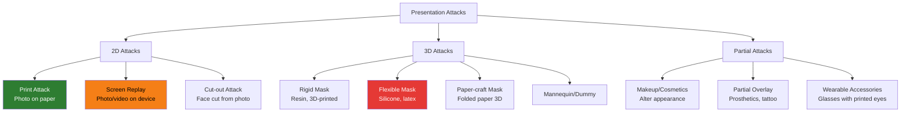

# Presentation Attack Types

## Definition

A **Presentation Attack (PA)** is an attempt to interfere with a biometric system by presenting a fake biometric trait (a **Presentation Attack Instrument**, or PAI) to the capture device. This article catalogues every known attack type relevant to face-based eKYC.

---

## Attack Taxonomy

---

## 2D Attacks (Most Common)

### Print Attack

| Aspect | Details |
|--------|---------|
| **Method** | Print victim's photo on paper, hold up to camera |
| **Cost** | $0.10-$1 (cheapest attack) |
| **Difficulty** | Very easy |
| **Effectiveness** | Defeats basic systems without liveness |
| **Detection cues** | Flat surface, paper texture, no 3D depth, moiré patterns, color/brightness uniformity |

### Screen Replay

| Aspect | Details |
|--------|---------|
| **Method** | Display victim's photo/video on a phone, tablet, or laptop screen |
| **Cost** | Already have a device ($0 marginal) |
| **Difficulty** | Easy |
| **Effectiveness** | Can defeat some liveness if video includes blinking/movement |
| **Detection cues** | Moiré patterns, screen bezel visible, screen refresh artifacts, pixel grid, color gamut differences |

### Cut-out Attack

| Aspect | Details |
|--------|---------|
| **Method** | Cut face region from printed photo, hold with eyes/mouth cut out (attacker's real eyes show through) |
| **Purpose** | Defeat blink-based active liveness |
| **Detection cues** | Edge discontinuity, inconsistent texture between real and paper regions |

---

## 3D Attacks (Higher Sophistication)

### Silicone Mask

| Aspect | Details |
|--------|---------|
| **Method** | Custom-made silicone mask of victim's face |
| **Cost** | $300-$3,000+ (professional quality) |
| **Difficulty** | High (requires mold or 3D scan of victim) |
| **Effectiveness** | Can defeat many liveness systems including active |
| **Detection cues** | Material reflectance, skin texture uniformity, eye movement limitations, thermal signature |

### 3D-Printed/Resin Mask

| Aspect | Details |
|--------|---------|
| **Method** | 3D-printed rigid mask from victim's photos (photogrammetry) |
| **Cost** | $50-$500 |
| **Detection cues** | Rigid (no expression), seams, material texture, no eye movement |

---

## Attack Difficulty vs Detection Difficulty

| Attack | Cost | Attacker Skill | Detection Difficulty |
|--------|------|----------------|---------------------|
| **Print (A4 paper)** | $0.10 | None | Easy |
| **Print (high-quality photo)** | $2 | Low | Easy-Medium |
| **Screen replay (photo)** | $0 | None | Medium |
| **Screen replay (video)** | $0 | Low | Medium |
| **Cut-out mask** | $1 | Low | Medium |
| **Paper-craft 3D** | $5 | Medium | Medium-Hard |
| **3D-printed mask** | $50-500 | Medium | Hard |
| **Silicone mask** | $300-3000 | High | Very Hard |
| **Real-time deepfake** | $0 (free tools) | Medium | Very Hard |

---

## Key Takeaways

!!! success "Summary"
    - **Print and screen replay** are the most common attacks (90%+ of attempts) — and the easiest to detect
    - **3D masks** are rare but dangerous — silicone masks can defeat many liveness systems
    - **Cost is decreasing** across all attack types, especially deepfakes (free tools)
    - iBeta Level 1 tests against **prints and screens**; Level 2 adds **3D masks**
    - A robust liveness system must handle the **full spectrum** from cheap prints to sophisticated masks

---

## Related Articles

- **Previous**: [← Cross-Quality Face Matching](cross-quality-face-matching.md)
- **Next**: [Active vs Passive Liveness →](active-vs-passive-liveness.md)
- [Face Liveness Detection Overview](face-liveness-detection-overview.md)
- [3D Mask Attacks](3d-mask-attacks.md)
- [Deepfake Detection](deepfake-detection.md)
- [iBeta Certification](ibeta-certification.md)
