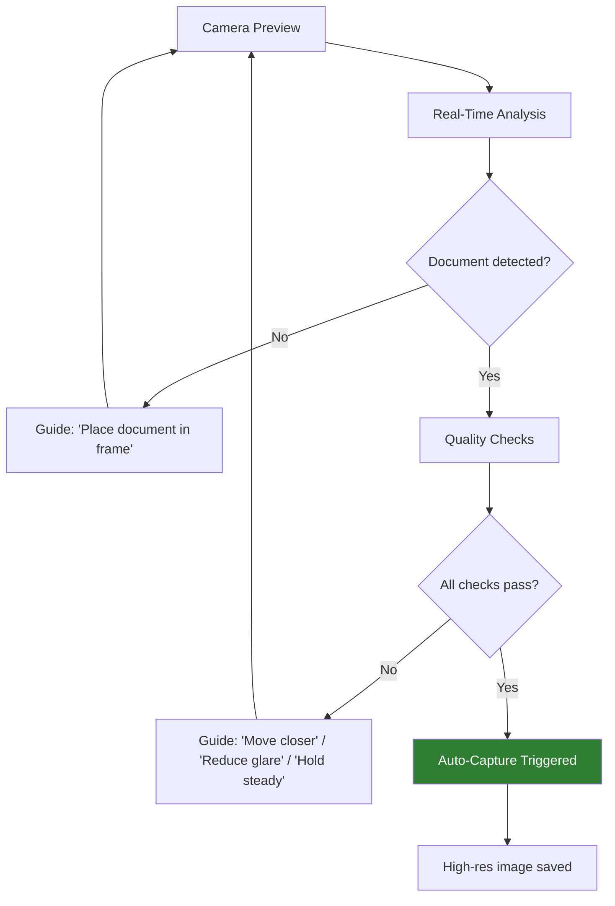

# Document Capture & Quality

## Definition

**Document capture** is the process of acquiring a high-quality image of an identity document through a phone camera or scanner. Quality at capture directly determines the accuracy of all downstream processing — OCR, forensics, and face extraction.

---

## Auto-Capture System



---

## Quality Checks

| Check | Metric | Threshold | Detection Method |
|-------|--------|-----------|-----------------|
| **Document presence** | Detection confidence | > 0.9 | Object detection model |
| **Full document visible** | All 4 corners detected | All inside frame | Corner detection |
| **Blur** | Laplacian variance | > 100 | Laplacian filter |
| **Glare/reflection** | Specular highlight area | < 5% of doc area | Highlight detection |
| **Shadow** | Luminance uniformity | Variance < threshold | Regional brightness analysis |
| **Resolution** | DPI equivalent | > 300 DPI | Pixel density calculation |
| **Tilt/skew** | Angle from horizontal | < 10° | Corner-based angle computation |
| **Distance** | Document size in frame | 60-90% of frame | Bounding box ratio |
| **Lighting** | Mean brightness | 80-220 | Histogram analysis |
| **Occlusion** | Finger/thumb overlap | < 3% overlap | Hand detection model |

---

## Perspective Correction

After capture, apply perspective transform to get a flat, rectangular document image:

```python
import cv2
import numpy as np

def perspective_correct(image, corners):
    """
    corners: 4 detected document corners [TL, TR, BR, BL]
    Returns: perspective-corrected rectangular image
    """
    # Target dimensions (standard ID card aspect ratio)
    width, height = 856, 540  # ~CR80 card at 100 DPI

    dst = np.array([[0, 0], [width, 0], [width, height], [0, height]], dtype=np.float32)
    M = cv2.getPerspectiveTransform(corners.astype(np.float32), dst)
    corrected = cv2.warpPerspective(image, M, (width, height))
    return corrected
```

---

## Front vs Back Capture

| Side | What's Extracted | Special Challenges |
|------|-----------------|-------------------|
| **Front** | Photo, name, DOB, document number, expiry | Hologram glare over photo area |
| **Back** | MRZ, barcode, additional data, signature | Low contrast text, barcode readability |

---

## Key Takeaways

!!! success "Summary"
    - **Quality at capture determines everything** — poor capture = poor OCR + poor forensics
    - **Auto-capture with real-time guidance** dramatically improves first-attempt success rate
    - Critical checks: blur, glare, all corners visible, resolution > 300 DPI
    - **Perspective correction** after capture normalizes the document for downstream processing
    - Both **front and back** capture are typically needed for full data extraction

---

## Related Articles

- **Next**: [Document Classification →](document-classification.md)
- [OCR Pipeline for ID Documents](ocr-pipeline-id-documents.md)
- [Face Quality Assessment](../02-biometrics-face/face-quality-assessment.md)
