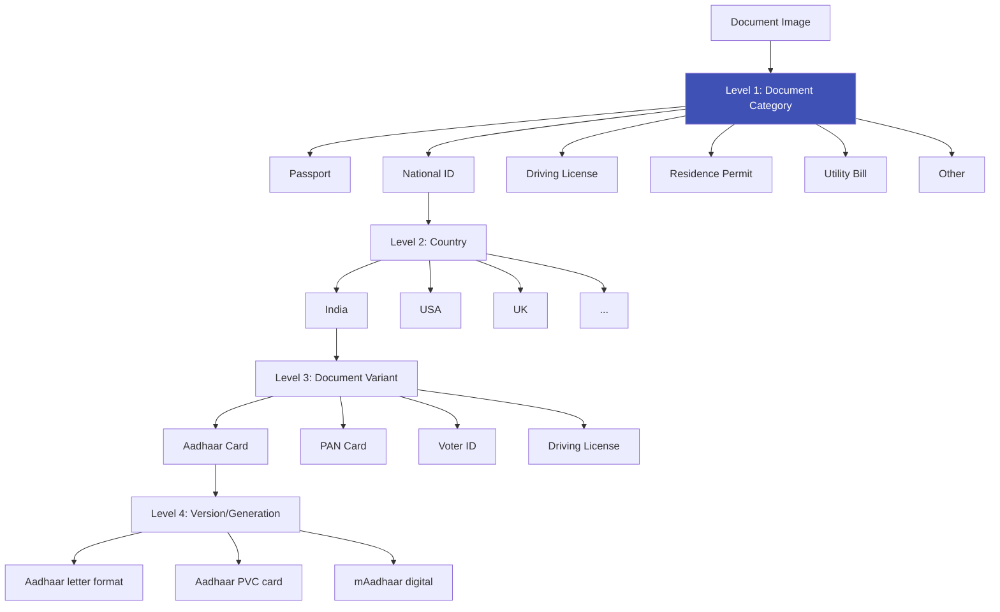

# Document Classification

## Definition

**Document classification** automatically identifies the type and country of an identity document from a captured image. With **6,000+ document types globally** (and hundreds of format variants), classification must determine: What country? What document type? What version/generation?

---

## Classification Hierarchy

---

## Model Architectures

| Approach | Architecture | Accuracy | Speed | Notes |
|----------|-------------|----------|-------|-------|
| **CNN classifier** | EfficientNet-B0/B2 | 98-99% | 10-30ms | Standard approach |
| **ViT classifier** | ViT-Small/Base | 99%+ | 20-50ms | Better on diverse layouts |
| **Hierarchical** | Level1 CNN → Level2 CNN | 99%+ | 20-60ms | Separate models per level |
| **Multi-task** | Shared backbone + multiple heads | 98%+ | 15-30ms | Country + type + version jointly |

---

## Challenges

| Challenge | Details | Mitigation |
|-----------|---------|------------|
| **6000+ classes** | Massive classification space | Hierarchical: country first, then type |
| **Visual similarity** | Many IDs look alike (same template, different country) | Fine-grained features, MRZ/text cues |
| **New document versions** | Countries update ID formats regularly | Continuous model updates, few-shot learning |
| **Poor image quality** | Blur, glare, partial capture | Quality-gate before classification |
| **Double-sided** | Front and back look very different | Separate front/back classifiers |
| **Rare documents** | Long-tail distribution — some types seen rarely | Data augmentation, few-shot approaches |

---

## Document Coverage by Vendor

| Vendor | Document Types | Countries |
|--------|---------------|-----------|
| **Regula** | 14,000+ | 247 |
| **Sumsub** | 14,000+ | 220 |
| **Veriff** | 12,000+ | 230 |
| **Jumio** | 5,000+ | 200 |
| **Onfido** | 2,500+ | 195 |
| **HyperVerge** | 1,000+ | 150 |
| **Microblink** | 2,500+ | 140 |

---

## Key Takeaways

!!! success "Summary"
    - Classification must handle **6,000+ document types** across 200+ countries
    - **Hierarchical classification** (category → country → type → version) is the standard approach
    - **EfficientNet/ViT** classifiers achieve 99%+ accuracy on known types
    - **New document versions** require continuous model updates — this is ongoing maintenance
    - Document coverage (number of supported types) is a **key vendor differentiator**

---

## Related Articles

- **Previous**: [← Document Capture & Quality](document-capture-quality.md)
- **Next**: [ID Document Types Worldwide →](id-document-types-worldwide.md)
- [OCR Pipeline](ocr-pipeline-id-documents.md)
