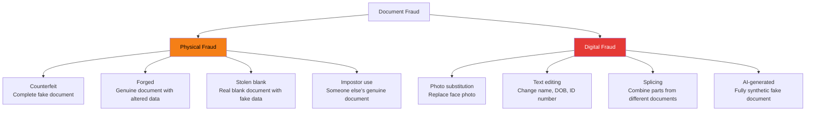
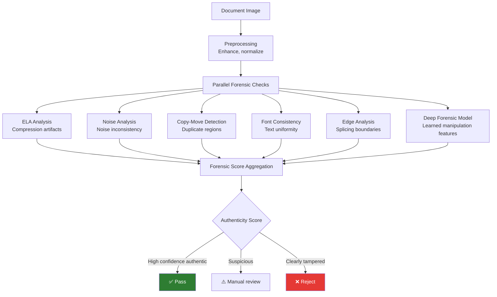

# Document Forensics Overview

## Definition

**Document forensics** in eKYC detects whether an identity document has been tampered with, forged, or digitally manipulated. It answers the critical question: "Is this document authentic, or has it been altered?"

---

## Types of Document Fraud

---

## Forensic Detection Methods

### Error Level Analysis (ELA)

| Aspect | Details |
|--------|---------|
| **How it works** | Re-save JPEG at known quality, compare error levels — manipulated regions show different error patterns |
| **Detects** | Photo splicing, text editing, region replacement |
| **Limitation** | Ineffective on uncompressed images or high-quality re-saves |

### Noise Analysis

| Aspect | Details |
|--------|---------|
| **How it works** | Analyze sensor noise pattern — manipulated regions have inconsistent noise |
| **Detects** | Copy-move, splicing from different sources |
| **Techniques** | Noise level estimation, noise inconsistency maps |

### Copy-Move Detection

| Aspect | Details |
|--------|---------|
| **How it works** | Find duplicate regions within the document (e.g., cloned background to hide text) |
| **Techniques** | SIFT/SURF keypoint matching, PatchMatch, deep feature matching |
| **Detects** | Background cloning to cover original text, replicated security patterns |

### Font Consistency Analysis

| Aspect | Details |
|--------|---------|
| **How it works** | Verify all text uses expected font — edited text often has different font characteristics |
| **Detects** | Text field replacement where attacker uses different font |
| **Techniques** | Font classification model, character-level feature comparison |

### Deep Learning Forensics

| Model | Approach | Detects |
|-------|----------|---------|
| **ManTraNet** | Manipulation tracing network — pixel-level prediction | General manipulation |
| **MVSS-Net** | Multi-View Multi-Scale supervision | Splicing, copy-move |
| **CAT-Net** | Compression Artifact Tracing | JPEG double compression from editing |
| **Custom CNN** | Binary classifier on document regions | Document-specific tampering |

---

## Forensic Pipeline for eKYC

---

## Accuracy Expectations

| Fraud Type | Detection Rate | False Positive Rate |
|-----------|---------------|-------------------|
| **Obvious text editing** (font mismatch, alignment) | 95%+ | < 1% |
| **Photo substitution** | 90%+ | < 2% |
| **Professional text editing** (matching font) | 60-80% | 3-5% |
| **High-quality counterfeit** | 40-70% | 5-10% |
| **AI-generated fake** | 30-60% (evolving) | Variable |

---

## Key Takeaways

!!! success "Summary"
    - Document forensics uses **multiple complementary methods** — no single technique catches everything
    - **ELA and noise analysis** are effective baselines; **deep learning** adds learned manipulation patterns
    - **Text editing** is the most common digital fraud — font consistency analysis is critical
    - Detection accuracy varies widely: **obvious edits** (95%+) to **AI-generated fakes** (30-60%)
    - A **multi-signal forensic pipeline** with score aggregation is the production approach
    - This is an **arms race** — attackers improve tools, so forensic models need continuous updates

---

## Related Articles

- **Next**: [Digital Tampering Detection →](digital-tampering-detection.md)
- [Document Liveness](document-liveness.md)
- [Synthetic Document Detection](synthetic-document-detection.md)
- [Security Feature Validation](security-feature-validation.md)
