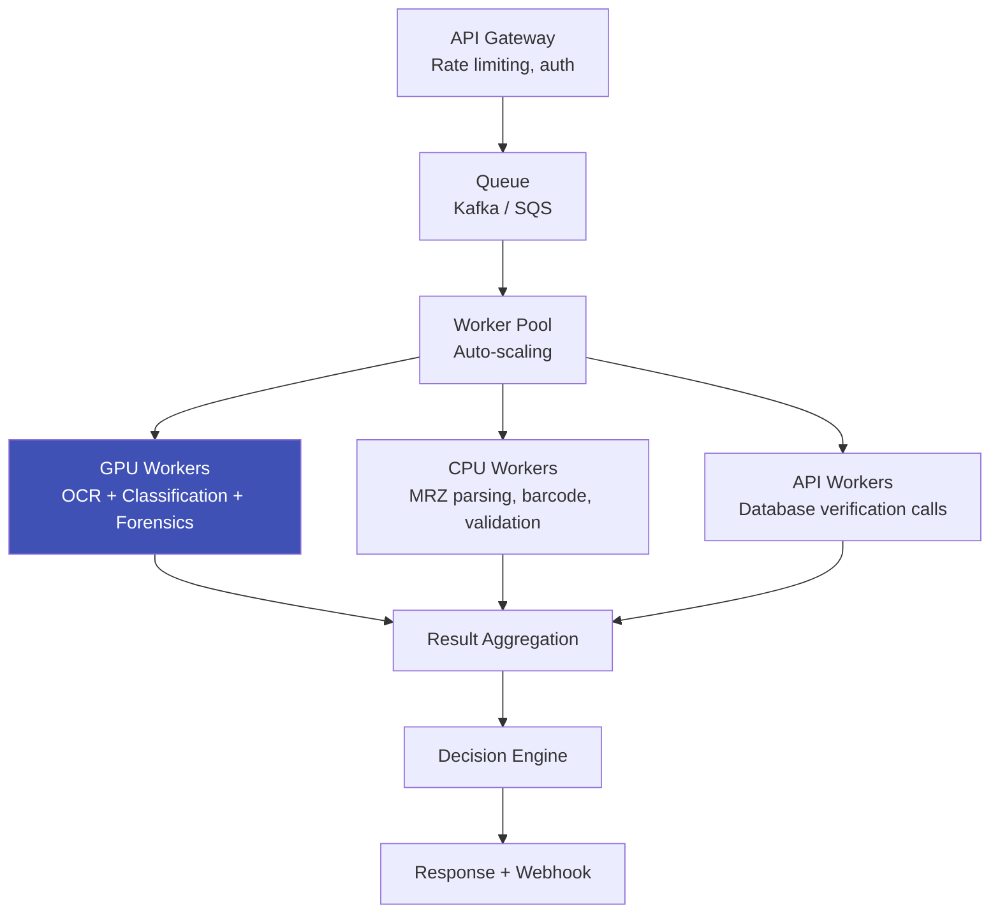

# Document Processing at Scale

## Definition

Processing millions of document verifications per day requires optimized infrastructure — GPU batching, async pipelines, caching, and load balancing.

---

## Architecture for Scale

## Optimization Techniques

| Technique | Impact |
|-----------|--------|
| **GPU batching** | Process 8-32 documents simultaneously — 5-10x throughput |
| **Model optimization** | TensorRT, ONNX Runtime — 2-4x faster inference |
| **Pipeline parallelism** | Run OCR, forensics, classification concurrently |
| **Caching** | Cache document templates, model artifacts |
| **Auto-scaling** | Scale GPU workers based on queue depth |
| **Regional deployment** | Process close to user for lower latency |

## Performance Targets

| Scale | Infrastructure | Processing Time |
|-------|---------------|----------------|
| **1K/day** | Single GPU server | < 3 seconds |
| **100K/day** | 4-8 GPU servers | < 3 seconds |
| **1M/day** | 20-50 GPU servers, auto-scaling | < 5 seconds |
| **10M/day** | Distributed GPU cluster | < 5 seconds |

---

## Key Takeaways

!!! success "Summary"
    - **GPU batching** is the single biggest optimization for document processing throughput
    - **Pipeline parallelism** (concurrent OCR + forensics + classification) reduces end-to-end time
    - **TensorRT / ONNX Runtime** provide 2-4x inference speedup over raw PyTorch
    - Auto-scaling based on queue depth handles traffic spikes (typical in eKYC: morning/evening peaks)

---

## Related Articles

- [OCR Pipeline](ocr-pipeline-id-documents.md)
- [On-Device Biometric Processing](../02-biometrics-face/on-device-biometric-processing.md)
